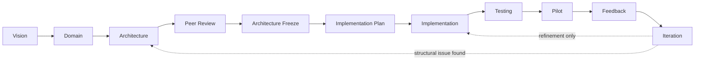

# Atlas Engineering Standards v1
### The Atlas Engineering Constitution

**Status:** Mandatory reading before implementing any future Atlas engine. This document defines *how* Atlas is engineered — naming, structure, testing, review, and process — not business logic, and not architecture (the Domain Model, Product Bible, and Commercial Foundation Engine specification remain authoritative for what Atlas is and does).

**Grounding:** every standard in this document is drawn from how Atlas is actually built today, verified directly against the current codebase, not invented. Where this document recommends something Atlas does not yet do consistently, it says so explicitly and gives the standard going forward — it does not silently claim consistency that doesn't exist.

---

## 1. Engineering Philosophy

Why Atlas exists, engineered the way it is engineered: a construction company betting its operational truth on a platform, and a client betting real money on what that platform tells them, are both trusting that Atlas's numbers are real and can be checked. Every engineering standard in this document exists to protect that trust structurally — through naming, testing, and review discipline — not just through good intentions at the moment code is written.

How engines should evolve. An engine grows by deepening its own domain, not by absorbing another engine's responsibility. When a new capability doesn't obviously belong to an existing engine, the default assumption should be a new engine with a narrow, well-named purpose — not an existing engine quietly expanding to cover it. Every engine in Atlas today (Reality, Memory, Timeline, Workflow, Knowledge, Operations, CRE) has grown within its original boundary across many implementation phases; none has needed to absorb another's.

Why deterministic systems are preferred. A deterministic calculation can be tested once and trusted forever: the same input always produces the same output, and a wrong output is a bug to fix, not a judgment call to argue about. This is not a stylistic preference — it is the property that makes Atlas's health scores, forecasts, and billing calculations something a business can build decisions on.

How AI should integrate. AI extracts structure and suggests values; it never calculates a number a business decision depends on, and it never bypasses a state machine. Every engine's design should make it structurally impossible for an AI-touching code path to write authoritative business state directly — the suggestion always passes through the same validation and human decision point a manually-entered value would.

What Atlas should never become. A platform where two different screens can show two different answers to the same question. A platform where "why does it say that" has no answer. A platform where a past decision is silently overwritten instead of superseded and recorded. A platform where an engine's boundary is whatever the last person who touched the code decided it should be, rather than what this document says it should be.

### Presentation Summary
- Every standard exists to protect one thing: that Atlas's numbers are real and can be checked, by anyone who asks.
- Engines grow within their own boundary; they do not absorb each other's responsibilities.
- Determinism is what makes a calculation testable once and trustable forever — not a style preference.
- AI structurally cannot bypass a state machine or write authoritative state directly, in any engine, ever.

---

## 2. Engine Standards

Every engine — existing or future — must define all thirteen of the following. No category may be silently omitted; where a category genuinely does not apply (e.g., an engine with no meaningful state machine), the engine's documentation must say so explicitly, not leave the section blank.

| Category | What it must specify |
|---|---|
| Purpose | One paragraph. What real-world problem this engine, and only this engine, solves. |
| Owned Entities | Every entity this engine is the sole writer of. Cross-reference the Domain Model / relevant architecture spec. |
| Owned Events | Every event kind this engine's ledger (if it has one) or Commercial-Event-style publication (§6) emits. |
| Consumed Events | Every event kind from other engines this engine reads, and why. |
| Published Events | The subset of Owned Events genuinely intended for other engines/Timeline Engine to consume — not every internal event needs to be published. |
| Dependencies | Every other engine this engine reads from. Must be a DAG — Atlas engines never have circular dependencies (§2.1 below makes this a hard rule, not a preference). |
| Public APIs | Every route this engine exposes, at the level of the API Standards (§7) — method, path, purpose, response shape. |
| Private Rules | Business logic internal to the engine that no other engine or route should ever need to know about directly. |
| State Machines | Every entity with a lifecycle: states, legal transitions, illegal transitions, and where the transition logic lives (§5). |
| Integration Points | Every place another engine or a future engine is expected to read this engine's data — the engine's own "how to integrate with me" section. |
| Health Outputs | If applicable: deterministic, evidenced indicators this engine publishes for CRE or a future reasoning layer to consume (the pattern the Commercial Foundation Engine's Commercial Health model, §8.4 of that specification, already establishes). Not every engine needs this — Memory Engine, for instance, has none — but every engine must state explicitly whether it does or doesn't, not leave it unaddressed. |
| Future AI Signals | What deterministic data this engine's own operation naturally produces that could become a future training signal — following the Commercial Foundation Engine's own §10 discipline: only data the engine needs to be correct anyway for its own operational purpose, never data captured solely to feed a model. |
| Documentation | Where this engine's own architecture, domain model, and decision records live (§9) — every engine must be independently readable without requiring institutional memory. |

### 2.1 The dependency-DAG rule

No engine may depend on another engine that (directly or transitively) depends back on it. This has held across every engine built so far — Workflow Engine's one-directional dependency on Knowledge Engine's calculation registry, CRE's read-only dependency on everything else, Commercial Foundation Engine's specified one-directional relationships with Workflow/Knowledge/Operations — and it must continue to hold for every future engine. A proposed engine dependency that would create a cycle is not a detail to work around; it is a signal the domain boundary is wrong, and the fix is re-examining which engine should own what, not adding a cycle-breaking workaround.

### Presentation Summary
- Every engine must define all thirteen categories — no silent omission, and "not applicable" must be stated explicitly, not left blank.
- Health Outputs and Future AI Signals are new, explicit categories this document adds — not every engine needs them, but every engine must say so directly.
- The dependency graph across all Atlas engines must remain a DAG, permanently — a proposed cycle means the domain boundary is wrong, not that a workaround is needed.

---

## 3. Folder Standards

The current, real convention — confirmed by direct inspection, not invented for this document — is flat-by-layer, not nested-by-engine:

```
backend/
  engines/        one module per engine: {engine_name}_engine.py
                  (a sibling module without the _engine suffix is
                  permitted for pure, stateless helper logic used by
                  an engine, e.g. reasoning_projections.py alongside
                  reasoning_engine.py — this is the one deliberate
                  exception, not a gap in the convention)
  routes/         one module per API surface, roughly aligned to
                  entity/concern, not strictly 1:1 with engines
  core/           shared infrastructure only — auth, db, settings —
                  never business logic
  tests/          one module per test concern, flat, not nested by
                  engine
  scripts/        one-off/maintenance scripts, never imported by
                  application code
```

This is the standard, adopted deliberately over the brief's own example (engine/domain/services/repositories/events/state_machine/validators/api/tests/docs/), and the reasoning matters: the nested-per-engine structure is a reasonable convention for a codebase where engines are large enough to need internal subdivision. Atlas's nine engines today are not — the largest engine module, reasoning_engine.py, is substantial but has grown within one file across many implementation phases without needing internal folders, and forcing every engine into a nine-subfolder structure now would mean restructuring working code for no functional benefit — precisely the kind of change this document's own principles (do not redesign, standardize practice) warn against making without justification.

The graduated rule for when an engine should split into a sub-package: when a single engine module exceeds roughly 1,500–2,000 lines and has genuinely separable internal concerns (its own state machine logic, its own validation, its own event handling, each substantial enough to be confusing when interleaved in one file), it should become a package: engines/{engine_name}/ containing __init__.py (the engine's public interface — the only thing other engines import), plus internal modules named for their concern (state_machine.py, validators.py, events.py) — never the brief's full nine-subfolder depth, which is more structure than even a large single engine needs. Commercial Foundation Engine, given its own frozen specification's scale (ten entities, multiple state machines, a dedicated event ledger), is the recommended first engine to use this graduated package structure from the start, rather than beginning flat and needing to migrate later.

### Presentation Summary
- Atlas's real convention is flat-by-layer (engines/, routes/, core/, tests/) — confirmed by inspection, not the brief's own suggested nested-per-engine structure.
- The nested structure is explicitly not adopted platform-wide: it would mean restructuring nine working engines for no functional benefit.
- A graduated rule is defined instead: an engine becomes a sub-package only once it's genuinely large enough to need internal subdivision — with a concrete size threshold, not a vague "when it feels right."
- Commercial Foundation Engine is recommended as the first engine to use the graduated package structure from day one, given its already-specified scale.

---

## 4. Entity Standards

Naming. Entity names are singular nouns in snake_case for fields, PascalCase in documentation/diagrams (matching this document's own and every prior architecture document's convention) — operational_item, not operational_items or OperationalItems, as a field/collection-adjacent name; Operational Item in prose.

ID conventions. Every entity's primary identifier is a prefixed UUID: {short_prefix}_{uuid4} — e.g. evt_... for Event, wfa_... for Workflow Activity, kn_... for Knowledge Item, matching the convention already used consistently across every existing engine. The prefix exists so an id is self-describing in a log or an error message without needing a lookup.

Human-readable codes. Where an entity corresponds to something referenced outside Atlas's own internal storage — a real document, a real measurement sheet, a real conversation — it must also carry a permanent, human-readable code, distinct from its internal id. BOQ Item's item_code (Commercial Foundation Engine, §5.0) is the reference pattern: assigned once, immutable, meaningful to a human without consulting Atlas. Not every entity needs one — an internal id is sufficient for something no one outside Atlas ever references directly — but where the real world already has a name for the thing, Atlas's entity must carry that name.

Audit fields. Every entity carries created_at, updated_at (ISO 8601, UTC), and — for entities with a decision-bearing actor — {action}_by_user_id/{action}_by_user_name pairs (e.g. assigned_by_user_id, decided_by_user_id), matching the pattern already established across Operational Item, Workflow Activity, and Knowledge Item. Storing both the id and the name is deliberate, not redundant: a human-readable audit trail must remain readable even if the referenced user is later deactivated.

Ownership. Every entity's owning engine must be named in that engine's own documentation (§2) and nowhere else — an entity's ownership is never split across two engines' documentation disagreeing about who's authoritative.

Lifecycle. Every entity with more than one meaningful state has an explicit state machine (§5) — no entity's "status" field is ever a freeform string with conventionally-agreed values; it is always validated against a defined transition table.

Relationships. A relationship between entities is either ownership (parent entity's sub-structure, like BOQ Item within BOQ) or reference (an id field pointing to another entity this one doesn't own) — never ambiguous. Where a relationship is many-to-many, it is modeled as an explicit list of ids on whichever side is the more natural query direction, matching Workflow Activity's own depends_on_activity_ids pattern, not a separate join-table entity unless the relationship itself needs its own attributes.

Deletion policy. No entity is ever hard-deleted while referenced. Atlas's platform-wide default is soft archival (a status/flag marking something inactive, permanently retained) — matching every existing engine's behavior (Knowledge Item's archive_item, Operational Item's terminal statuses, Contract's closed state). Hard deletion is reserved for genuinely erroneous data that was never real (e.g., a duplicate created by a client-side retry bug) and must be a deliberate, logged, rare action — never a routine one.

Versioning. Where an entity's definition changes over time in a way that matters for audit (Knowledge Item edits), the previous version is retained as an immutable snapshot (knowledge_versions, the existing precedent) — not overwritten. This is distinct from a state transition (§5); versioning is for when the content of a record changes, not its state.

Snapshots and Baselines. A Snapshot is a point-in-time, immutable capture of an entity's (or a related group of entities') full state, taken periodically or on-demand, for audit and future AI training signal — the Commercial Snapshot pattern. A Baseline is a flagged Snapshot, marked as the frozen reference point some later variance calculation compares against — never a separate entity from Snapshot (the Commercial Foundation Engine's own peer-reviewed resolution, §2.2 of that specification, is the standing precedent: one entity, a flag, not two).

### Presentation Summary
- Every entity has a prefixed-UUID internal id, plus a permanent human-readable code wherever the real world already names the thing (a BOQ item, a document).
- Audit fields always store both a user's id and their name — deliberately redundant, so the audit trail stays readable even after a user is deactivated.
- No entity is ever hard-deleted while referenced; soft archival is the platform-wide default, matching every existing engine's actual behavior.
- Snapshot and Baseline are one entity with a flag, not two — the standing precedent for any future "point in time vs. frozen reference" distinction.

---

## 5. State Machine Standards

Every entity's state machine must define, explicitly, in its owning engine's documentation:

- Allowed transitions — the complete, named list. Never "any status to any other status."
- Illegal transitions — implicitly everything not in the allowed list, but genuinely risky illegal transitions (ones a careless implementer might accidentally permit) should be named explicitly as a guard, not left to be caught only by omission.
- Events emitted — every transition emits exactly one ledger/ledger-style event (§6), never zero (a silent state change is not permitted) and never more than one per transition (a transition is one fact, not several).
- Side effects — anything a transition causes beyond updating the entity's own status field (e.g., a Workflow Activity's transition to in_progress auto-timestamping actual_start) must be documented at the transition, not discovered by reading the implementation.
- Validation — what must be true for a transition to be legal beyond "the states connect" (e.g., a client_approval item cannot transition to fulfilled if the actor isn't the client — a real, existing rule).
- Audit — every transition records who, when, and (where meaningful) why, matching the audit-field standard (§4).
- Reopen strategy — whether, and how, a terminal state can be reversed. Atlas's default is that terminal states are genuinely terminal (a closed Contract does not reopen) — where reopening is a real business need (few cases), it must be modeled as its own explicit, named transition, never as "just set the status field back."

No controller/route ever bypasses a state machine. A route handler calls the owning engine's transition function; it never sets a status field directly. This is not a style preference — every regression this platform has ever caught involving an invalid state (the reject-after-accept bug on AI Proposals, the missing terminal-state guard) traces back to exactly this discipline being incomplete somewhere, and every fix has been closing that specific gap. The standard, stated plainly: if a transition function doesn't exist for a state change, the state change is not implemented yet — a route never improvises one.

### Presentation Summary
- Every state machine defines transitions, illegal paths, emitted events, side effects, validation, audit, and reopen strategy — explicitly, not left to be inferred from code.
- Every transition emits exactly one event — never silent, never duplicated.
- Terminal states are genuinely terminal by default; reopening (rare) is its own named transition, never a direct field edit.
- The single most important rule in this section: a route never sets a status field directly — every real Atlas bug involving invalid state has traced back to this discipline being incomplete somewhere.

---

## 6. Event Standards

Naming: past tense, always. created, assigned, approved, variation_approved, retention_released — an event describes something that already happened. This is the intended convention today; it is not perfectly, consistently applied in the current codebase (operational_events' own kind values include the correctly-past-tense assigned, escalated, edited alongside the noun comment and the borderline clarification_requested) — stated here plainly rather than silently claimed as already-consistent. The standard going forward is strict past-tense for every new event kind; existing inconsistencies are not required to be retroactively renamed (a rename would itself be a breaking, disruptive change for no functional benefit), but no new event kind should repeat the inconsistency.

Payload shape. An event's payload carries the facts specific to that event — never a full copy of the entity's current state (which would immediately become a second, driftable copy of the entity itself). assigned carries who was assigned and by whom; it does not carry the entity's entire current field set.

Metadata. Every event carries, at minimum: id, the owning entity's id, kind, actor (id + name, matching §4's audit standard), created_at, and a payload object for kind-specific facts. This is the existing operational_events shape; it is the standard for every future engine's own event ledger.

Correlation IDs. Where an event is caused by another event (an Operational Item's duplicate_of event, for instance, or a future Commercial Event's Variation-Order-triggers-Budget-Revision chain), the causing event's id should be carried as a caused_by_event_id field — not required on every event, but available wherever a causal chain genuinely exists, so a future audit or AI signal can reconstruct why something happened, not just that it happened.

Versioning. An event's payload shape, once a kind is in use, is additive-only — new optional fields may be added; an existing field's meaning is never silently changed. If a kind's meaning must genuinely change, it becomes a new kind (invoice_raised_v2) rather than a redefinition of the old one, so a historical event's payload always means what it meant when it was written.

Replay safety. Every event handler (anything that reads the ledger to reconstruct or update a projection) must be safe to run twice on the same event without corrupting state — the same discipline Operations Engine's own CQRS projection already depends on. This is what makes a future rebuild-the-projection-from-the-ledger recovery path possible without needing to reason about exactly how many times each event was already processed.

Append-only philosophy. An event, once written, is never edited or deleted. A correction is a new event, never a mutation of the old one — the same principle that governs Event corrections platform-wide, applied identically to every engine's own internal ledger.

CQRS conventions. Where an engine maintains a read-model projection alongside its event ledger (Operations Engine's operational_items alongside operational_events is the reference implementation), the projection is always derivable from the ledger — if the projection and the ledger ever disagree, the ledger is authoritative, and the projection is rebuilt from it, never the reverse.

### Presentation Summary
- Event naming is past-tense by standard, honestly noted as not yet perfectly consistent in the existing codebase — the standard applies going forward, without requiring a disruptive retroactive rename.
- An event payload carries only the facts specific to that event, never a full copy of the entity's state — avoiding exactly the "second driftable copy" problem this document's principles exist to prevent.
- Events are append-only and replay-safe by requirement — the same discipline that already makes Operations Engine's CQRS projection trustworthy, generalized to every future engine's own ledger.
- Where a projection and its source ledger ever disagree, the ledger is always authoritative — never the other way around.

---

## 7. API Standards

Naming and REST conventions. Resource-oriented paths, plural nouns for collections: /operational-items, /workflow-activities, matching the existing convention exactly. An action that doesn't map cleanly to a REST verb on the resource itself is a sub-path verb: /operational-items/{id}/assign, /workflow-activities/{id}/production-inputs — the established Atlas pattern, not a REST purism about avoiding verbs entirely. This pattern works well in practice and is not being changed.

Filtering. Query parameters map directly to entity fields where possible (?status=open&priority=critical), matching every existing list endpoint. A filter that requires deriving a value not directly on the entity (exclude_terminal=true, the Pending Review Synchronization fix's own precedent) is acceptable and should be preferred over requiring the client to know and pass the full exclusion list itself.

Pagination. Not yet a consistent standard across existing endpoints — most currently return a bounded .to_list(N) result without an explicit pagination contract. This is named as a real gap, not silently glossed over: any future engine expecting list results that could reasonably exceed a few hundred items should implement cursor-based pagination (?after={id}&limit={n}) from the start, and existing high-volume endpoints should adopt the same contract when next touched — not a blocking requirement for this document's freeze, but a standard for what "done" means going forward.

Sorting. Default sort order must always be stated explicitly in an endpoint's own documentation (most-recent-first is Atlas's prevailing convention) — never left implicit as "whatever the database happens to return."

Versioning. Atlas does not currently version its API surface (no /v1/ prefix, no header-based versioning) because the API has had exactly one consumer (Atlas's own frontend) evolving in lockstep with it. The standard going forward: this remains acceptable only as long as that remains true. The moment a genuinely external consumer exists (a future ERP integration, §11 of the Commercial Foundation Engine specification), that integration point specifically must be versioned from day one — internal endpoints do not need to be.

Error responses. A consistent shape: HTTP status code reflects the error class (400 for validation, 403 for RBAC, 404 for not-found, 409 for a state-machine conflict), and the response body's detail field is always a specific, human-readable reason — never a generic "operation failed." This is already Atlas's practice (the Usability Sprint's own explicit fix, surfacing a specific login-failure reason instead of a generic message, is the standing precedent) and is now the codified standard.

Validation. Request-shape validation happens at the route's own request model (Pydantic) — a request field with no corresponding field in the request model is silently dropped by the framework itself, which has been the exact root cause of at least two real bugs caught in prior work (a field reaching an engine's own whitelist but never reaching the route's request model). Standard: whenever a new field is added to an engine's own accepted-updates whitelist, the corresponding route's request model must be updated in the same change — never as a separate, later fix.

Idempotency. A mutation that could plausibly be retried by a flaky client connection (payment recording, invoice raising) must be safe to receive twice — either by being naturally idempotent (setting a field to a specific value) or by accepting an idempotency key. Not yet a consistent standard across all mutating endpoints; required specifically for the Commercial Foundation Engine's financial mutations once implemented, given the real cost of a duplicated payment record.

### Presentation Summary
- REST conventions, filtering, and error-response shape are already consistent in practice — codified here, not invented.
- Pagination and idempotency are named honestly as real, current gaps — not glossed over — with a specific standard for what "done" means going forward, especially for the Commercial Foundation Engine's financial mutations.
- API versioning stays unnecessary only as long as Atlas's own frontend remains the sole consumer — the moment an external integration exists, that specific integration point must be versioned.
- The single most concrete standard in this section directly closes a bug pattern already caught twice: a new field must reach both an engine's whitelist and its route's request model in the same change, always.

---

## 8. Database Standards

Naming. Collections are snake_case plural nouns (operational_items, workflow_activities), matching the existing convention throughout.

Indexes. Every field a list endpoint filters or sorts on by default should be indexed — not yet formally audited across every existing collection, named here as a standard to apply at next-touch and mandatory for any new collection from day one.

Ownership. A collection is written to by exactly one engine, always — the database-level enforcement of the Engine Ownership principle. No future migration or quick-fix script should ever write directly to another engine's collection; if cross-engine data needs to change, it goes through that engine's own function.

Foreign keys. MongoDB enforces none natively; Atlas's standard is that a reference field (project_id, assigned_to_user_id) is validated at write time by the owning engine's own code, not assumed valid by the schema. A reference to a since-deleted entity should fail gracefully at read time (return null/omit), never crash a downstream calculation.

Immutable history. Ledger-style collections (operational_events, and any future engine's own event ledger per §6) are insert-only at the database level in practice — no engine's code path should ever call update_one/delete_one against a ledger collection.

Soft delete policy. Matches §4's entity-level standard: a status/archival flag, never a hard delete, except for the rare, deliberate, logged case of genuinely erroneous data.

Snapshots. A Snapshot-pattern collection (Commercial Snapshot, and CRE's own historical reasoning runs) is append-only, exactly like an event ledger, though it is not itself an event — the distinction is that a Snapshot captures state, an event captures a fact that happened; both share the same "never mutated once written" discipline.

Migration rules. A schema change is additive by default (a new optional field, defaulting to None/absent for every existing document) — the standard every architecture document in this engagement has already held to consistently (Production Model, Assignment, Approval Options all shipped this way). A genuinely breaking schema change (renaming or removing a field in active use) requires an explicit migration script, run and verified before the code that depends on the new shape is deployed — never a "the code assumes the new shape exists" deployment with no migration step.

### Presentation Summary
- Collection ownership is the database-level enforcement of Engine Ownership — no script or migration ever writes directly to another engine's collection.
- Ledger and Snapshot collections are insert-only in practice, at the code level, matching the append-only philosophy already established platform-wide.
- Schema changes are additive by default — the pattern every architecture document in this engagement has already consistently followed, now codified as the explicit standard.
- Index coverage is named as a real, not-yet-fully-audited gap — mandatory for new collections from day one, applied to existing ones at next touch.

---

## 9. Documentation Standards

Every engine must maintain, in its own documentation (not scattered across unrelated files):

- Architecture — how this engine fits the platform, matching the depth of the Commercial Foundation Engine specification's own §1.
- Domain Model — this engine's owned entities, matching the Domain Model's own per-entity format.
- Sequence diagrams — for any multi-step flow spanning more than two engines (Mermaid, matching the convention every architecture document in this engagement has already used).
- Lifecycle diagrams — every state machine, as an actual diagram, not prose alone — the standard the Domain Model review already held itself to.
- Integration Matrix — this engine's own row in the platform-wide matrix, and its own detailed view of every dependency.
- Entity Catalogue — matching the Commercial Foundation Engine's own §2 format, including entities considered and rejected, with reasoning — a documented "why not" is as valuable as a documented "why."
- Decision Records — this engine's own ADRs (§13).
- Implementation Notes — anything a future maintainer needs that doesn't fit the categories above (a known workaround, a deliberately deferred edge case).
- Release Notes — what changed, when, in plain language — the equivalent of this engagement's own commit messages, but living in the engine's documentation, not only in git history.

### Presentation Summary
- Every engine's documentation covers nine fixed categories — no engine's documentation is considered complete with any of them silently missing.
- Entity Catalogues must document rejected candidates with reasoning, not just adopted entities — a "why not" is as valuable as a "why."
- Lifecycle diagrams are mandatory as actual diagrams, not prose descriptions of states.

---

## 10. Testing Standards

The standing three-layer discipline, codified. Every capability implemented across this entire engagement has been verified at three layers, and this is now the formal standard for every future engine:

1. Pure unit tests — a deterministic calculation (a state machine transition, a Production Model calculation, a Commercial Health indicator) tested directly, with no database, no HTTP layer — fast, exhaustive, covering edge cases a full-stack test would be too slow to enumerate.
2. In-process integration tests — the full route-to-database path, exercised via an in-process ASGI transport against a real (mongomock-backed) database, no network — catching exactly the class of bug this engagement has repeatedly found (a field reaching an engine but not its route's request model; a genuine end-to-end behavior that only manifests when the layers are actually connected).
3. Live-instance regression tests — the same scenarios, run against a real running instance via HTTP, confirming the deployed system actually behaves as the first two layers predicted — the layer that catches an environment or deployment issue no amount of in-process testing would reveal.

State-machine tests. Every legal transition, every illegal transition attempted and confirmed rejected, every emitted event confirmed present — for every state machine, not a sample of them.

Event tests. Every event kind's payload shape confirmed, replay-safety confirmed (processing the same event twice produces the same projection state as processing it once).

Regression tests. Every fix for a real, found bug becomes a permanent regression test — not closed as "verified manually" and left untested. Every architecture document in this engagement that shipped a fix (the reject-after-accept guard, the pending-approval-does-not-disappear fix) added a test asserting the specific bug cannot recur; this is the standard, not an exception.

Performance tests. Not yet a formal, automated practice across the platform. Named as a real gap. Required specifically wherever this document's own standards flag a scaling risk (the RA Bill incremental-calculation concern, the Commercial Foundation Engine review's own §12/§16) — a performance test should exist before that code path is exercised at the scale the concern describes, not retrofitted after a real slowdown is reported.

Coverage expectations. Not a single blanket percentage target — coverage is expected to be complete for state machines and deterministic calculations (every transition, every branch) and representative for integration paths (the realistic scenarios a feature will actually see, not synthetic exhaustiveness for its own sake). A high percentage number achieved by testing trivial getters is not the goal; testing every state transition and every calculated value is.

Definition of green build. Every pure-unit test passes. Every existing regression test passes unchanged (a new feature never requires editing an old test to make it pass again, unless that old test's own assumption was genuinely wrong — and if so, that's a decision made explicitly, not a test quietly adjusted to match new behavior). tsc --noEmit (or the future equivalent for any new frontend surface) returns zero errors. No skipped test is left unexplained — a pytest.skip is acceptable only with a stated, genuine reason (an environment precondition not met), never as a way to avoid a test that's inconvenient to fix.

### Presentation Summary
- The three-layer testing discipline (pure unit, in-process integration, live-instance regression) already used consistently throughout this engagement is now the formal standard for every future engine.
- Every real bug fix becomes a permanent regression test, not a manually-verified, untested closure — this has already been this engagement's actual practice.
- Performance testing is named honestly as a current gap, with a concrete trigger: required wherever a scaling risk has already been flagged, before that code path is exercised at scale.
- Coverage is judged by completeness of state-machine and calculation testing, not by a single blanket percentage.

---

## 11. Code Review Standards

Every review must explicitly check each of the following — a review that only checks "does it work" is incomplete, even if the code is correct:

Architecture checklist. Does this change respect engine ownership (§2)? Does it introduce a dependency that would create a cycle (§2.1)? Does it duplicate an entity or a calculation that already exists elsewhere?

Naming checklist. Do new entities/fields/events follow §4/§6's conventions? Is a new event kind past-tense?

State machine checklist. Does every new transition go through the owning engine's transition function — never a route setting a status field directly (§5)? Is every transition's event, side effect, and validation documented, not just implemented?

Testing checklist. Does the change include tests at the appropriate layer(s) from §10? Does a bug fix include a regression test asserting the specific bug cannot recur?

Security checklist. Is RBAC enforced at the route level, consistently with the existing role model — never left to the frontend to enforce alone? Does a new field on an existing entity need its own visibility rule (should a client see this, per the Client Experience specification's own "translate, never expose internal vocabulary directly" principle)?

Performance checklist. Does this change introduce a query pattern that could scale poorly (an uncached full-collection scan on every request, the kind of concern already flagged for RA Bill calculation)? Is it flagged in documentation if so, even if not fixed in this change?

Documentation checklist. Is the owning engine's documentation (§9) updated in the same change — never a separate, later "add docs" pass? Does a new architectural decision get an ADR (§13) where one is warranted?

### Presentation Summary
- Code review checks seven explicit categories, every time — architecture, naming, state machines, testing, security, performance, and documentation — not just correctness.
- The single most load-bearing check: no route ever sets a status field directly, ever, reviewed as strictly as a security issue would be.
- Documentation updates happen in the same change as the code they document — never deferred to a later pass.

---

## 12. Definition of Done

No feature is complete unless every one of the following is true, checked explicitly, not assumed:

- Architecture documentation updated (§9), in the same change.
- The owning engine's own entity catalogue/domain model updated if a new entity or field was introduced.
- Tests written at every applicable layer from §10, including a regression test if the change was a bug fix.
- Every new event kind documented per §6's metadata standard.
- Every new/changed API endpoint documented per §7.
- Every new/changed state machine verified against §5's full checklist (transitions, events, side effects, validation, audit, reopen strategy).
- No TODOs left in shipped code — a genuine deferred decision becomes a named, dated note in the engine's Implementation Notes (§9), not a comment that will be forgotten.
- No duplicate logic — a calculation that already exists elsewhere is called, never reimplemented, even approximately.
- No hidden ownership — every new piece of state has an explicit, documented owning engine before the code that writes it ships, never inferred after the fact from which engine's folder it happened to land in.

### Presentation Summary
- "Done" is a fixed checklist, not a judgment call — nine explicit conditions, every one of them, every time.
- A TODO never ships silently — it becomes a named, dated, documented deferred decision, or the feature isn't done.
- Ownership is decided and documented before code ships, never inferred afterward from where the code happened to be written.

---

## 13. Architecture Decision Records (ADR)

Template.

```
ADR-{number}: {Title}
Status: Proposed | Accepted | Superseded by ADR-{n} | Deprecated | Rejected
Date: {date}
Context: What problem or question prompted this decision?
Decision: What was decided, stated plainly.
Reasoning: Why — including alternatives genuinely considered and why they were not chosen.
Consequences: What this decision makes easier, harder, or forecloses.
```

Naming. Sequential, platform-wide (not per-engine) — ADR-001, ADR-002, ... — so the numbering itself reflects the chronological order architectural decisions were actually made, across every engine.

Status lifecycle. Proposed while under discussion; Accepted once settled (the default state for most ADRs, immediately); Superseded by ADR-{n} when a later decision genuinely replaces this one (never silently — the newer ADR must name what it supersedes); Deprecated when a decision is no longer relevant but wasn't wrong when made (e.g., a decision about an entity that's since been removed); Rejected for a decision genuinely considered and explicitly decided against — valuable to record, not just to omit — because "we considered X and rejected it, here's why" prevents the same question being re-litigated from scratch by a future contributor who wasn't there for the original discussion.

When an ADR should be created. Any decision that: (a) chooses between two or more genuinely viable architectural approaches, (b) would be expensive to reverse once implemented, or (c) sets a precedent future engines are expected to follow. A routine implementation choice with one obvious answer does not need an ADR; a boundary decision (does this entity belong to Engine A or Engine B) always does.

Retroactive ADRs for decisions already made in this engagement, worth recording formally:
- ADR-001: Engine Ownership (the platform-wide single-owner principle, established from the Domain Model onward).
- ADR-002: Commercial Snapshot/Baseline resolved as one entity with a flag, not two (Commercial Foundation Engine peer review, §2.2).
- ADR-003: Quantity Ownership — Workflow Engine stores but never authoritatively owns a Production Model's resolved value (Commercial Foundation Engine peer review, §2.3).
- ADR-004: Commercial Events as a unified ledger, reusing Operations Engine's own CQRS pattern rather than inventing a new one (Commercial Foundation Engine peer review, §8.3).
- ADR-005: Work Package's lifecycle explicitly does not adopt mandatory Tendered/Awarded states (Commercial Foundation Engine peer review, §3) — a Rejected-status ADR, and a particularly valuable one to have on record precisely because it documents a recommendation that was considered and declined, with reasoning, rather than simply never discussed.

### Presentation Summary
- ADRs are numbered sequentially platform-wide, not per-engine, so numbering reflects the actual chronological order decisions were made.
- Rejected is a first-class status, not just Accepted/Superseded/Deprecated — recording what was considered and declined prevents the same question being re-litigated later.
- Five retroactive ADRs are named for decisions already made in this engagement, including one Rejected-status ADR for the Work Package lifecycle decision specifically.
- An ADR is required for boundary decisions and expensive-to-reverse choices — not for routine implementation with one obvious answer.

---

## 14. Architecture Freeze Process



No implementation begins before Architecture Freeze. This is not a formality — it is the discipline this entire engagement has demonstrated concretely: the Commercial Foundation Engine's specification went through an actual, independent peer-review pass, which found and fixed real gaps (BOQ Item Identity, Hierarchical Cost Codes) and explicitly rejected one recommendation (the richer Work Package lifecycle) before any implementation code existed to make those changes expensive.

Peer Review is a distinct, real step, not a formality folded into Architecture. The standard, drawn directly from how the Commercial Foundation Engine review was actually conducted: review every major decision explicitly (confirm or refine, with reasoning either way); evaluate proposed improvements on their merits, not by default agreement; and conduct at least one genuinely independent pass that sets aside the specification's own starting assumptions and asks what's missing.

What "Iteration" means, precisely. Feedback from a pilot either surfaces a structural issue (the domain model itself was wrong) — which returns to Architecture, requiring a new peer review pass before its own freeze — or a refinement within the existing structure (a validation rule was too strict, a field was missing a sensible default) — which stays within Implementation. Conflating these two is how architecture drift happens silently over time; every iteration must be explicitly classified as one or the other before work on it begins.

### Presentation Summary
- No implementation begins before Architecture Freeze — demonstrated concretely by the Commercial Foundation Engine's own actual peer-review pass, not just stated as a rule.
- Peer Review is its own distinct step: confirm-or-refine every major decision with reasoning, and include at least one genuinely independent pass.
- Post-pilot iteration is always classified explicitly as structural (returns to Architecture) or refinement (stays in Implementation) — conflating the two is how architecture drifts silently.

---

## 15. Independent Review — Recommendations Not Requested by This Brief

Set aside everything above; reviewed independently, as a mature engineering organization would review its own practices.

Missing standard: a deprecation policy for engines themselves, not just entities. This document defines how an entity is soft-deleted (§4) but says nothing about what happens if an entire engine is eventually superseded (unlikely soon, but a mature platform should have the answer before it's needed rather than improvising it under pressure). Recommendation: an engine is never deleted, only marked deprecated in its own documentation with a named successor and a migration note — the same soft-archival philosophy applied one level up.

Long-term risk: institutional knowledge concentrated in documents, not enforced by tooling. Every standard in this document (no route bypasses a state machine, every new field reaches both the engine whitelist and the route model, no cycle in the dependency graph) is currently enforced by discipline and code review, not by automated tooling. This is appropriate at Atlas's current scale, and rewriting this as a tooling problem now would be exactly the kind of premature infrastructure this document's own principles caution against — but it is worth naming as a real, growing risk: the more engines Atlas has, the more a violation of these standards can hide in a large diff a reviewer skims. Recommended for a future version, not now: a lightweight, automated architecture-boundary check (even a simple script confirming no engines/*.py module imports a route module, or that every route model's fields are a superset of its engine's accepted-updates whitelist) — not a rewrite of this document's standards, just automated enforcement of a handful of the highest-value ones.

What mature engineering organizations do that Atlas should adopt: a genuine, scheduled architecture review cadence, not only event-triggered ones. Every architectural review in this engagement so far has been triggered by a specific milestone (a domain being frozen, a new engine being specified). A mature organization also holds periodic reviews of already-shipped architecture, on a schedule, specifically to catch drift that accumulates gradually rather than arriving as one obvious violation. Recommended: an annual (not more frequent — this should not become overhead for its own sake) architecture health check across all live engines, following the same Strengths/Weaknesses/Risks/Technical-Debt format the Commercial Foundation Engine's own §16 already established, applied platform-wide rather than to one engine at a time.

Practical, not recommended yet: a shared "engine scaffold" generator. Given every engine follows the same thirteen-category documentation shape (§2) and the same flat-file convention (§3), a scaffold script that generates a new engine's skeleton (module file, test file, documentation stub with all thirteen sections pre-headed) would reduce the chance of a category being silently skipped when a new engine is started. Not recommended as an immediate priority — Atlas has specified far more future engines than it has built recently, and a scaffold tool is worth building once a second or third engine is actually being implemented from this document, not before there's a real pattern of repetition to automate.

### Presentation Summary
- An engine-level deprecation policy is a genuine missing standard — not urgent, but worth having before it's ever actually needed.
- The growing risk of standards enforced by discipline alone, not tooling, is named honestly — with a recommendation for lightweight automated checks, not a disproportionate tooling rewrite.
- A scheduled (not just milestone-triggered) architecture review cadence is recommended, following the same health-assessment format already proven on the Commercial Foundation Engine.
- An engine scaffold generator is a genuinely useful future idea, explicitly not recommended yet — there isn't enough real repetition to justify building it before a second or third engine is actually implemented from this document.

---

## Executive Summary

Atlas Engineering Standards v1 is the permanent rulebook for how every future Atlas engine is built — naming, structure, testing, review, and process — deliberately separate from the Domain Model, Product Bible, and Commercial Foundation Engine specification, which remain the authority on what Atlas is and does. Every standard in this document is grounded in how Atlas is actually engineered today, verified directly against the real codebase rather than invented for the occasion: the folder structure this document codifies is Atlas's real, current flat-by-layer convention, deliberately chosen over the brief's own suggested nested-per-engine structure, because restructuring nine working engines for a structural convention with no functional benefit is precisely the kind of change this document's own principles exist to prevent. Where the codebase does not yet fully live up to a standard this document sets — event-naming consistency, API pagination, performance testing — that gap is stated plainly, not glossed over, with a specific standard for what changes going forward rather than a false claim of existing consistency.

Every engine must document all thirteen required categories, with no silent omissions; state machines are governed by a single, absolute rule — no route ever sets a status field directly, a discipline every real regression this platform has caught traces back to being incomplete somewhere. Events follow a strict, append-only, replay-safe, past-tense convention, and a ledger is always authoritative over any projection built from it. The three-layer testing discipline — pure unit, in-process integration, live-instance regression — used consistently across every capability built in this engagement is now the formal standard for every future engine, alongside a firm rule that every real bug fix ships with a permanent regression test, not a manual verification and no lasting test coverage.

Architecture Decision Records are formalized with a genuine Rejected status as a first-class outcome, not an afterthought — because recording what was considered and explicitly declined, with reasoning, is what prevents a future contributor from re-litigating a question that was already carefully answered. Five retroactive ADRs are named from decisions already made in this engagement, including the Commercial Foundation Engine peer review's explicit rejection of a mandatory tender-and-award Work Package lifecycle — the clearest existing example of Atlas's engineering process actually working as this document describes it should.

The Architecture Freeze process this document codifies is not aspirational — it is a direct description of how the Commercial Foundation Engine specification was actually built and then actually, independently reviewed before being frozen, catching real gaps and rejecting at least one real recommendation before any implementation code existed to make either change expensive. That is the standard every future engine is now expected to meet: architecture, then genuine peer review, then freeze — in that order, every time, with the reasoning for every confirmed and every rejected decision recorded, not just the final answer.
