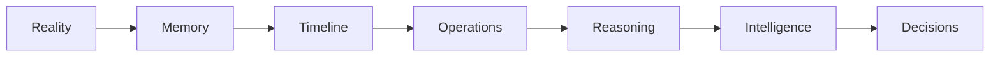
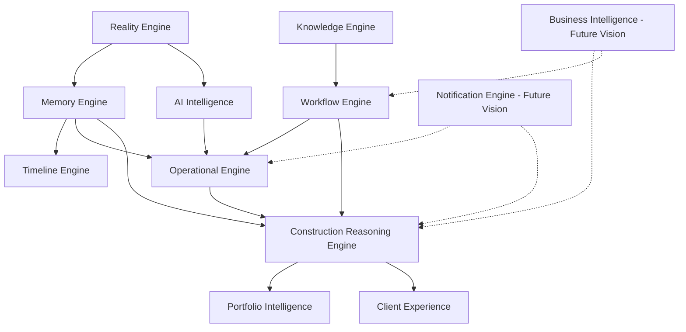
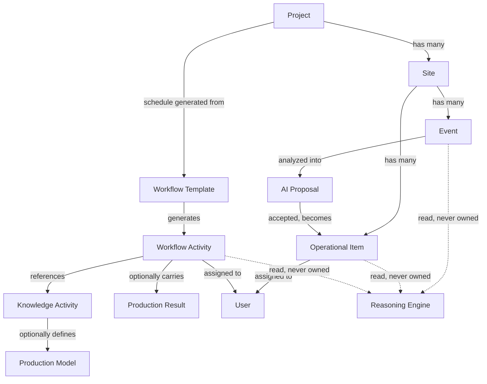
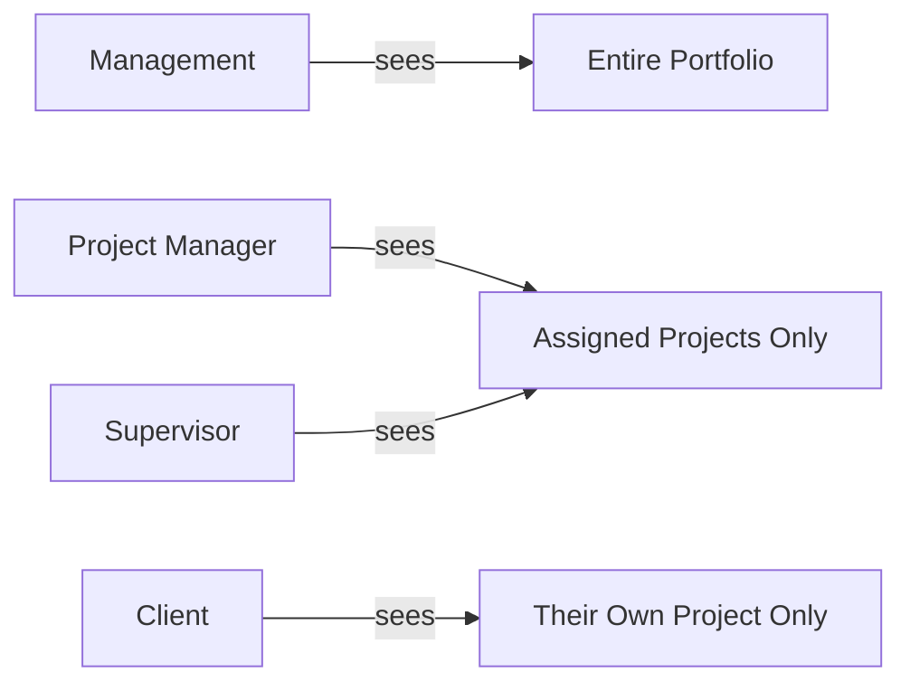
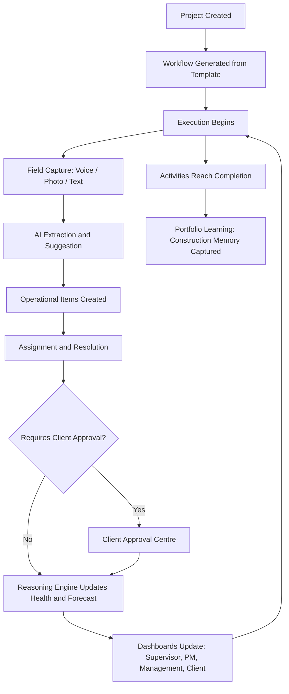

# The Atlas Product Bible

### The Definitive Reference for Project Atlas

---

## 1. Vision

### Construction runs on memory that disappears.

A construction site produces more real information per day than almost any other kind of business — decisions, measurements, instructions, approvals, problems, and fixes — and nearly all of it is spoken once, on a phone call or in person, and never written down anywhere a project can later consult. A supervisor tells a mason to change a wall's thickness. A client approves a tile choice over WhatsApp. A delay gets explained verbally to whoever happens to ask. Three weeks later, none of that is retrievable. The work happened; the memory of why it happened did not survive it.

This is not a discipline problem. Site teams are not careless — they are running physical operations under time pressure, in a language and format (voice, in person, on the move) that has never matched the tools built to manage them. Every piece of software the construction industry has been offered assumes someone will sit down and type. Nobody on a live site has that kind of time.

### The tools built for construction were built for something else.

Generic project management software assumes a desk-based team working from a shared board. Generic CRM software assumes a sales pipeline with a handful of large decisions per deal. Generic ERP software assumes a finance department reconciling numbers after the fact. None of them assume the thing that actually defines construction: physical, distributed work, captured in fragments, by people who are not going to type a status update.

The result is a familiar pattern across the industry: software gets bought, a few screens get used for a few weeks, and then the real coordination quietly moves back to phone calls and WhatsApp — because that is the only channel that matches how construction actually communicates. The software becomes a record of what someone remembered to log, not a record of what happened.

### Atlas starts from a different premise.

Atlas is built around the belief that the way information is captured determines whether it is ever trustworthy again. If capture requires typing, most of what happens on a site will never be captured. If capture happens the way construction people already communicate — a voice note, a photo, a quick line of text, taken on the spot — the record has a chance of being complete. Everything Atlas does after that point exists to turn that raw, in-the-moment capture into something a project manager can act on, a client can trust, and a company can learn from over time.

This is the Atlas philosophy in one sentence: capture reality as it happens, and let structure, reasoning, and intelligence be built on top of an honest record — never in place of one.

### Presentation Summary
- Construction's real coordination already happens by voice and WhatsApp — because that's the only channel that matches how site work is actually done.
- Existing PM/CRM/ERP tools assume desk-based, typed input; they fail on site and coordination silently reverts to informal channels.
- Atlas is built around capture-first design: reality is recorded the way it happens, not the way software wants it recorded.
- Every other Atlas capability — memory, reasoning, intelligence — is built on top of that honest record, never as a substitute for it.

---

## 2. Product Introduction

### What Atlas is

Atlas is a Construction Intelligence Platform: a system that captures what actually happens on a construction site — in the field's own language of voice, photo, and short text — and turns it into a structured, trustworthy, continuously reasoned-over record of the project. On top of that record, Atlas gives every person involved in a project — a site supervisor, a project manager, company management, and the client funding the work — the specific view of the project they actually need, derived from the same single source of truth.

Atlas is not a place where people manually update a status. It is a place where the status is derived from what was actually captured and decided.

### What Atlas is not

- Atlas is not a task manager. A task manager tracks what someone said they'd do. Atlas tracks what actually happened, and reasons about what that means for the project.
- Atlas is not a site diary. A site diary is a passive log someone fills in at the end of the day. Atlas is a live system that reasons over the record continuously — health, delay, risk, and next actions are computed, not manually summarized.
- Atlas is not a chat application. Structured communication — approvals, clarifications, decisions — is preserved permanently and tied to the project record. It is never allowed to dissolve into an unsearchable message thread.
- Atlas is not a generic ERP retrofitted for construction. Atlas's entities — Projects, Sites, Workflow Activities, Operational Items, Events — are construction-native from the ground up, not generic "tasks" and "records" relabeled.

### Who Atlas is for

- Construction companies running multiple live projects who need a single, trustworthy view of where every project actually stands — not what the last status meeting said.
- Project managers and site supervisors who need the system to meet them where they already are: on their phone, on the site, with their hands full.
- Clients investing significant capital into a build who want to understand progress, approve decisions, and build genuine confidence in their contractor — without needing construction training to read a dashboard.
- Management teams who need to see, at a glance, across an entire portfolio, which projects need their attention today and why.

### Who should not use Atlas

Atlas assumes a project has a real workflow — activities, dependencies, a team executing physical work over time. A single-day job, a purely design-phase engagement with no site execution, or a business with no recurring field coordination problem to solve will find Atlas's structure is more than they need. Atlas is built for the coordination problem that comes from real, ongoing, distributed construction execution — not for projects that don't have that problem yet.

### Presentation Summary
- Atlas captures construction the way it actually happens — voice, photo, short text — and reasons over that record; it does not ask people to manually maintain a status.
- Atlas is not a task manager, not a site diary, not a chat app, not a relabeled generic ERP — its entities are construction-native from the ground up.
- Built for construction companies, PMs, supervisors, and clients who need one trustworthy source of truth, each seeing the view relevant to them.
- Best fit: real, ongoing, distributed construction execution with an actual coordination problem to solve.

---

## 3. The Construction Intelligence Philosophy

Atlas is built as a deliberate pipeline, where each layer only does one thing and hands a clean result to the next:

Reality is where a fact enters Atlas — a voice note, a photo, a typed observation, captured on-site at the moment it happens. Reality's only responsibility is capturing what occurred, exactly as it occurred, as fast as possible, with nothing lost.

Memory is where that fact becomes permanent. Once something is captured, it is never silently altered or deleted. Corrections are recorded as their own permanent addition to the record, not as an edit that erases what was originally said. This is what makes Atlas's record trustworthy months or years later — the project's memory is append-only, the same principle a financial ledger or an audit trail relies on.

Timeline is where memory becomes a chronological story. Every event, correction, and piece of context is composed — never duplicated — into the continuous narrative of the project, in the order it actually happened.

Operations is where memory becomes actionable work. A captured observation — "we're low on cement," "the client needs to approve this tile" — becomes a tracked operational item: assigned, prioritized, and carried through to a real resolution, with a complete, permanent history of how it got there.

Reasoning is where operational reality becomes understanding. The Construction Reasoning Engine looks across the whole live record — workflow, operations, events — and deterministically computes what it means: is this project healthy, is it going to be late, what needs attention today. This layer never guesses; every conclusion it reaches is traceable back to the specific evidence that produced it.

Intelligence is where Atlas becomes easier to use than the underlying reality is easy to describe. AI is used here specifically to reduce friction — extracting structure from a voice note, suggesting values a person can accept or correct — never to make a determination that reasoning should be making instead.

Decisions is the layer every other layer exists to serve: a person — a supervisor, a PM, a client, a director — looking at Atlas and knowing, without guessing, what to do next.

### Presentation Summary
- Atlas is a deliberate seven-layer pipeline: Reality -> Memory -> Timeline -> Operations -> Reasoning -> Intelligence -> Decisions.
- Each layer has exactly one job and hands a clean, trustworthy result to the next — nothing is duplicated, nothing is silently overwritten.
- Reasoning is deterministic and explainable by design; Intelligence (AI) reduces friction but never replaces reasoning.
- The entire pipeline exists to serve one outcome: a person knowing what to do next, without guessing.

---

## 4. Design Principles

Reality first. Nothing enters Atlas as an assumption. Every piece of structured data — a health score, a forecast, a milestone — is ultimately traceable back to something that was actually captured on site.

Deterministic before AI. Every number Atlas shows a project manager or a client — a health percentage, a forecast completion date, a schedule variance — is produced by an explicit, auditable, rule-based calculation. AI is never in the path of a number a business decision depends on.

AI augments — it never replaces. AI's role in Atlas is specific and bounded: transcribing a voice note, extracting structured values from it, suggesting a value a person can accept or override. AI never calculates a production duration, a health score, or a forecast — those are deterministic, by design, permanently.

Everything is traceable. A health score is never just a number — it comes with the reasons behind it. A forecast is never just a date — it comes with the calculation that produced it. Atlas is built so that "why does it say that" always has a concrete, inspectable answer.

No duplicate truth. Every fact in Atlas has exactly one place it lives and exactly one system responsible for it. A project's current construction stage is never separately maintained in two places that could someday disagree — it is computed, once, from the underlying workflow, and every view that needs it reads the same calculation.

Evidence over opinion. A construction reasoning conclusion is never "the system thinks this project is at risk" without a specific, named reason — a schedule variance of a specific number of days, a specific count of overdue approvals, a specific critical item. Every finding cites its evidence.

Construction knowledge compounds. What Atlas learns building one project is retained and reusable on the next — an activity's production model, once defined, produces correct, different durations for a small house and a large villa from the same reusable template, rather than being redefined by hand for every project.

Every decision must be explainable. Whether it is a client approving a material choice or the system reporting a project's health, the reasoning behind it is always available in plain language, not hidden behind a score.

### Presentation Summary
- Reality first: nothing in Atlas is assumed — everything traces back to something actually captured.
- Deterministic before AI: every number a business decision depends on comes from explainable, rule-based logic, never a model's guess.
- No duplicate truth: every fact has exactly one owner and one calculation, never two systems that could quietly disagree.
- Every conclusion — a health score, a forecast, an approval — is explainable in plain language, always.

---

## 5. Platform Architecture

Atlas is organized as a set of engines, each with a single, non-overlapping responsibility. No engine writes another engine's data; engines that need another engine's information read it, they never duplicate it.

### Reality Engine
Responsibility: capturing a construction event — voice, photo, or text, with location and timestamp — the instant it happens, and persisting it before anything else touches it. Input: raw capture from the field. Output: an immutable event record. Boundary: Reality Engine never interprets what was captured — that belongs to Intelligence and Reasoning, downstream. Its only job is to make sure nothing is lost between the moment something happens and the moment it is permanently recorded.

### Memory Engine
Responsibility: being the single, exclusive writer of Atlas's foundational records — projects, sites, users, events, and every correction ever made to them. Input: writes from every other engine that needs to persist a foundational fact. Output: the permanent, queryable record, and the identity/visibility rules (who can see which project) every other engine relies on. Boundary: Memory Engine holds no business logic of its own — it is deliberately thin, so that "is this data trustworthy" never depends on which engine happened to write it last.

### Timeline Engine
Responsibility: composing events, their analyses, and their corrections into one continuous, chronological project narrative. Input: Memory Engine's records. Output: a read-only, always-current timeline view. Boundary: Timeline Engine owns no data of its own — it is a pure composition layer, guaranteeing there is never a second, separately-maintained copy of a project's history.

### Workflow Engine
Responsibility: generating and tracking a project's actual schedule of work — the activities a project consists of, their dependencies, their status, their planned and actual dates, and who owns each one. Input: a Knowledge Engine template, applied once to a new project. Output: the live, project-specific schedule every other engine reads to understand where a project stands. Boundary: Workflow Engine owns the instance of a schedule; it does not own the reusable definition an activity is built from — that is Knowledge Engine's.

### Knowledge Engine
Responsibility: owning construction's reusable definitions — activity templates, checklists, categories, phases, and the parametric production models that let a single activity template produce a correct, different duration for a small project and a large one. Input: definitions authored by management, refined over time. Output: the templates Workflow Engine builds real schedules from. Boundary: Knowledge Engine defines what an activity is and how its duration is calculated; it never touches a specific project's live schedule.

### Operational Engine
Responsibility: turning a captured observation into tracked, resolvable work — material and labour needs, quality and safety observations, client approvals — each with a full lifecycle, an owner, and a permanent history that survives resolution. Input: captured events, accepted AI suggestions, and direct entries from the field. Output: the operational record every dashboard, health calculation, and client view reads from. Boundary: Operational Engine owns the work that results from what happened; it does not own the schedule that work happens within — that remains Workflow Engine's.

### Construction Reasoning Engine (CRE)
Responsibility: looking across a project's entire live record — schedule, operations, events — and deterministically computing what it means: health, forecast, risk, what needs attention. Input: every other engine's current state, read fresh on every calculation. Output: health scores, forecasts, findings, and the client- and executive-facing summaries built on top of them. Boundary: CRE reads everything and owns nothing but its own findings — it never writes to another engine's data, and every conclusion it produces is deterministic and explainable, never an AI guess.

### AI Intelligence Layer
Responsibility: transcribing and structurally extracting what a captured voice note or photo actually contains, and suggesting the operational work it implies. Input: raw captures from Reality Engine. Output: suggested operational items, presented for a human to accept, edit, or reject — never silently applied. Boundary: Intelligence never calculates a duration, a health score, or a forecast. It only ever proposes; a deterministic engine or a human always makes the final call.

### Portfolio Intelligence
Responsibility: giving management the one view they actually need — every active project, prioritized by what needs intervention, with the reasons stated in plain language. Input: CRE's own per-project outputs, composed across the whole portfolio. Output: a single, worst-first-ranked management view. Boundary: Portfolio Intelligence computes nothing CRE hasn't already computed — it composes and prioritizes, it never recalculates.

### Notification Engine — Future Vision
Not yet part of the live platform. Designed to observe state changes across every other engine — an approval created, an activity overdue, a critical finding raised — and deliver a targeted, prioritized alert to the right person, without ever becoming a second place where "is this actually overdue" gets decided. That determination will always continue to come from the engine that owns it.

### Future Business Intelligence — Future Vision
Not yet part of the live platform. Envisioned as the layer that turns Atlas's accumulating cross-project record into portfolio-level learning — benchmarking, productivity trends, and predictive insight built on top of the same deterministic reasoning foundation CRE already establishes, never a separate, competing calculation.

### Presentation Summary
- Atlas is organized as single-responsibility engines: capture, memory, timeline, schedule, knowledge, operations, reasoning, and (in the future) notification and business intelligence.
- No engine ever writes another engine's data — every cross-engine relationship is a read, never a duplication.
- The Construction Reasoning Engine is the platform's deterministic core: it reads everything, computes health/forecast/risk, and owns nothing but its own explainable findings.
- Notification and Business Intelligence are clearly labeled future engines, designed to observe and compose — never to become second, competing sources of truth.

---

## 6. Canonical Domain Model

Atlas's business entities are deliberately few, each with exactly one owning engine, and no entity is ever jointly maintained by two systems.

Project and Site are the top-level containers everything else exists within — a project may have several sites, and every piece of work, every event, and every operational item is ultimately scoped to one of them.

Event is Atlas's primary unit of construction memory — a captured, immutable fact. Every subsequent piece of structured understanding in Atlas ultimately traces back to events.

Workflow Activity is a project's actual, live piece of scheduled work — generated once from a reusable Knowledge Engine template, carrying its own status, dependencies, ownership, and (where defined) a parametric production calculation for its expected duration.

Operational Item is a unit of trackable, resolvable work — a material need, a safety observation, a client approval — with a complete, permanent lifecycle from creation to resolution.

Knowledge Item is Atlas's reusable construction vocabulary — activity definitions, checklists, categories, and the parametric production models that let one activity definition serve every project it's used on correctly, at whatever scale that project actually is.

Two entities are deliberately not stored anywhere in Atlas, by design: Timeline and Milestone are both computed, on demand, from the underlying record — a stored copy of either would create a second version of the truth that could someday silently disagree with the record it's supposed to summarize. This is not an omission; it is one of Atlas's core design principles applied directly to the schema.

A small number of entities central to a mature commercial platform — Contract, Payment, Variation, Document, Notification, and a first-class Decision — are defined architecturally but not yet part of the live system. They are addressed fully in the Product Roadmap (Section 15) as clearly labeled Future Vision, each with a specific, deliberate trigger condition for when it should be introduced — never speculative, never added ahead of a real need.

### Presentation Summary
- Atlas's domain model is deliberately small: every entity has exactly one owner, and nothing is ever jointly maintained.
- Event is the foundational unit — every downstream structure traces back to something actually captured.
- Timeline and Milestone are intentionally not stored — they are always computed fresh, so they can never drift from the record they summarize.
- Commercial, Document, Notification, and Decision entities are deliberately deferred, each with a named, specific trigger for when to build them — not spec'd ahead of real need.

---

## 7. Identity Model

Atlas has four roles, each seeing the same underlying project record through a purpose-built lens — never a separate copy of it.

Management sees the entire portfolio — every active project, ranked by what needs intervention first, with the reason stated in plain language, not just a colour.

Project Manager is scoped to the specific projects they've been assigned to, with the authority to assign work, approve schedule changes, and manage their team within those projects — but no visibility into projects outside their assignment, and no access to platform-wide administration.

Site Supervisor sees the work assigned to them specifically, ranked by urgency — what's ready to start, what's in progress, what's blocked — and has the authority to execute and report on that work, but not to reassign it or alter planning.

Client sees their own project, translated entirely into the language a non-technical investor understands — progress, decisions needed, timeline, health explained in plain English — with zero exposure to the internal operational vocabulary the rest of the platform uses.

Ownership and visibility are two separate, deliberately distinct concepts throughout Atlas: project visibility determines who can see a project at all; assignment determines who owns a specific piece of work within it. A supervisor can be scoped to a project without being assigned every activity on it — and being assigned a piece of work always implies visibility into it, never the reverse.

### Presentation Summary
- Four roles, one underlying record — every role sees a purpose-built lens on the same data, never a separately maintained copy.
- Management sees the portfolio; PMs and Supervisors see their assigned projects; Clients see only their own project, in plain language.
- Visibility (can you see it) and ownership (do you own it) are deliberately separate concepts, enforced consistently platform-wide.
- No internal operational vocabulary is ever exposed to a client — every client-facing view is a translation, never a raw feed.

---

## 8. Construction Workflow

How a project actually moves through Atlas, end to end:

A project begins with its schedule generated once from a reusable Knowledge Engine template — the same template producing a correctly different schedule for a small project and a large one, because the underlying production models are parametric, not fixed.

Execution then becomes a continuous loop: the field captures reality as it happens; Atlas extracts and suggests the operational work that capture implies; a human accepts, edits, or rejects that suggestion; the resulting operational item is tracked to resolution, through a client approval where one is genuinely required; and the Reasoning Engine recomputes the project's health and forecast from the updated record. Every dashboard — supervisor, project manager, management, client — reflects that same recomputed truth immediately, because every dashboard reads the same underlying calculation rather than maintaining its own.

As activities complete, what was learned executing them — the actual durations, the actual issues encountered — becomes part of Atlas's accumulating construction memory, available to inform the next project that uses the same activity definitions.

### Presentation Summary
- A project's schedule is generated once, from a reusable template, correctly adapted to that project's actual scale.
- Execution is a continuous loop: capture -> extraction -> human decision -> tracked resolution -> recomputed health — never a manually maintained status.
- Every role's dashboard reflects the same recomputed truth immediately; there is no lag between what happened and what the system shows.
- Completed work becomes permanent construction memory, compounding what the next project can benefit from.

---

## 9. AI Architecture

### Current AI usage

Atlas uses AI for exactly one class of problem today: turning unstructured field capture — a voice note, a photo with a caption — into structured, reviewable suggestions. A voice note describing a material shortage is transcribed and its structured content (what material, how much, how urgent) is extracted, with a confidence level attached to each extracted value. Where confidence is high, Atlas pre-fills the suggestion; where it is low, Atlas presents it for review rather than silently guessing. Nothing extracted by AI is ever applied to the project record without becoming a proposal a human decides on.

### Why this architecture exists

Two failure modes are equally unacceptable in a system clients trust with real financial decisions: an AI system that quietly gets something wrong and is trusted anyway, and an AI system so heavily guard-railed that it adds friction instead of removing it. Atlas resolves this by drawing the boundary at calculation rather than at suggestion: AI may suggest, at any confidence level, as long as the suggestion is always visibly a suggestion — but AI is never in the path of an actual calculation a business decision depends on. A forecast completion date, a health score, a production duration — all of these remain fully deterministic, regardless of how good AI extraction becomes over time. This is not a limitation to be engineered away later; it is a permanent architectural boundary.

### Future Vision: AI Gateway, Context Builder, and shared intelligence

As Atlas's use of AI grows — more extraction points, more suggestion types — a shared AI Gateway is the natural next evolution: a single, consistent layer that every AI-touching feature routes through, rather than each feature independently deciding how to call a model. A Context Builder would assemble exactly the project context a given AI call actually needs — enough for a good suggestion, never more than necessary — which both improves suggestion quality and directly controls cost through token optimization: sending a model only the relevant slice of a project's history rather than an ever-growing, expensive full context.

Shared intelligence — AI capability reused consistently across every feature that needs it, rather than reimplemented per feature — is the long-term direction this points toward, but is not yet built. It is named here so that when it is built, it is built once, correctly, rather than accumulating as several inconsistent implementations of the same idea.

### Presentation Summary
- AI's current role is narrow and precise: turn unstructured field capture into structured, human-reviewed suggestions — never a silent, applied decision.
- The permanent architectural boundary is at calculation, not suggestion: forecasts, health scores, and durations remain deterministic regardless of how AI improves.
- An AI Gateway and Context Builder are the planned next evolution — a consistent, cost-controlled layer every AI feature will route through.
- This boundary is not a current limitation to be removed later — it is a permanent design decision, stated plainly as such.

---

## 10. Construction Reasoning Engine

The Construction Reasoning Engine (CRE) is the layer that turns a project's raw operational reality into genuine understanding — and it is the clearest expression of Atlas's core commitment to explainable, deterministic intelligence.

### How it works

CRE builds a complete snapshot of a project's current state — its schedule, its operational items, its recent events — and evaluates that snapshot against a fixed set of deterministic rules. Each rule either fires or it doesn't; when it fires, it produces a finding: a specific, evidenced statement about the project, tagged with a domain (schedule, quality, safety, procurement, communication) and a severity.

### Evidence and confidence

Every finding CRE produces is backed by the specific data that triggered it — an activity's actual overdue duration, a specific count of unresolved approvals, a specific stale operational item and how long it has been stale. CRE never produces a conclusion without the evidence for it attached; "why does it say this project needs attention" always has a precise, inspectable answer, never a black-box score.

### Health

A project's health is not a single opaque colour. It is a score, derived transparently from the findings above it, paired with a plain-language explanation of exactly what is driving it — "8 days behind schedule," "3 overdue client approvals" — so that a management view showing twelve projects at a glance still tells a director why each one is in the state it's in, not just that it is.

### Delay prediction and risk detection

CRE forecasts a project's completion by comparing its planned schedule against its actual execution pace to date — a deterministic calculation, never a model's guess — and surfaces risk the same way health is surfaced: as specific, evidenced findings, not an unexplained flag.

### Client summaries and executive briefings

The same underlying findings that drive an internal health score are also the source for two very different audiences: a client-facing summary written in plain, non-technical language with zero internal vocabulary exposed, and an executive briefing built for a director managing many projects who needs to know, in seconds, what needs their attention today across the whole portfolio. Both are compositions of the same underlying reasoning — never two separately maintained explanations of the same project that could someday disagree.

### Why deterministic reasoning matters

A client deciding whether to trust a contractor with several crore of their money, and a company deciding whether to trust Atlas with the operational truth of every project it runs, are both making the same bet: that what the system tells them is real, and can be checked. An AI-generated health score that occasionally can't explain itself is not a platform a serious business — or a serious investor — can build on. Determinism is not a technical preference in Atlas; it is the foundation the platform's entire claim to trustworthiness rests on.

### Presentation Summary
- CRE evaluates a project's full live state against deterministic rules, producing evidenced findings — never opinions.
- Health, forecast, and risk are all explainable: every score comes with the specific reasons behind it, in plain language.
- Client summaries and executive briefings are compositions of the same underlying findings — never two separately maintained truths.
- Determinism is the foundation of trust: a system a client or investor can rely on must always be able to explain itself.

---

## 11. Knowledge Engine

### How construction memory works

Knowledge Engine is where Atlas stores what construction is — the reusable definitions of activities, checklists, and categories that every project's schedule is built from. This is deliberately separate from any single project's live schedule: an activity definition is written once, and every project that uses it benefits from refinements made to it, without needing to be individually updated.

### How Atlas learns

The clearest expression of this is Atlas's parametric production model architecture: an activity like wall masonry does not carry a single fixed duration. It carries a calculation — duration derived from wall area, crew size, and productivity — so that the same reusable activity definition produces a correct three-day estimate for a small house and a correct six-day estimate for a large villa, from the identical template. Productivity itself is a value an organisation can refine as it learns what its own crews actually achieve, and every project's estimate immediately reflects that refinement. This is what "construction knowledge compounds" means concretely, not just as a phrase: the system gets more accurate the more it is used, without anyone needing to manually update every project.

### Portfolio memory and cross-project intelligence

As projects complete, what was actually learned executing them becomes part of Atlas's permanent construction memory — a record available to inform future estimates and future risk detection, not just a historical archive.

### Future Vision: benchmarking

Not yet part of the live platform: as Atlas's cross-project memory accumulates, a natural future capability is benchmarking — comparing a project's actual productivity, duration, and cost patterns against the portfolio's own historical performance, turning accumulated memory into a genuinely predictive advantage rather than only a record.

### Presentation Summary
- Knowledge Engine owns construction's reusable definitions, deliberately separate from any one project's live schedule.
- Parametric production models mean one activity definition correctly scales to any project size — no manual redefinition per project.
- Productivity values are refinable by the organisation, and every project immediately benefits from the refinement.
- Benchmarking against accumulated cross-project memory is a named future capability, not yet built — built on the same deterministic foundation, never a separate calculation.

---

## 12. Operational Intelligence

An Operational Item is Atlas's unit of trackable, resolvable work — and its lifecycle is designed around one non-negotiable principle: nothing that was ever raised disappears from the record, regardless of how it was resolved.

Assignment gives every item and every scheduled activity an explicit owner, with a complete, permanent history of every reassignment — so "who is responsible for this" is always answerable, and always was.

Verification allows completed work to be confirmed, not just marked done — a distinct step from completion itself, for the categories of work where confirmation genuinely matters.

Escalation is expressed through priority, not a separate mechanism — a critical item is visible as critical everywhere it appears, consistently, rather than requiring a second, parallel "this is now escalated" system.

Approvals — material selections, drawing sign-offs, cost decisions — follow a strict, permanent lifecycle: raised, decided, and retained visibly as history regardless of the decision. An approved item does not vanish once approved; it remains a permanent part of the project's record, exactly the way a real project's paper trail would.

Commenting keeps discussion tied directly to the work it concerns, never split off into a separate, disconnected conversation thread.

Voice updates are first-class — a supervisor can raise, update, or respond to operational work by voice on-site, exactly the way the Reality layer captures everything else.

Traceability runs through the entire lifecycle: every operational item can be traced back to the specific event that raised it, and every consuming system — health scoring, portfolio views, client dashboards — reads the same live record, never a summarized copy that could drift from it.

### Presentation Summary
- Operational items have one non-negotiable rule: nothing raised ever disappears from the record, however it was resolved.
- Assignment, verification, and escalation are all explicit, permanent, and consistently visible everywhere an item appears.
- Approvals remain permanently visible after decision — an approved item is history, not a vanished record.
- Every operational item is traceable back to the exact captured moment that raised it.

---

## 13. User Experience

Each role's daily experience is built around a single question, answered immediately on landing:

| Role | The question their view answers | What they see |
|---|---|---|
| Management | "Which of my projects need me today, and why?" | Portfolio health, ranked worst-first, with plain-language reasons — never a wall of green dots requiring investigation to find the one that isn't |
| Project Manager | "What needs my intervention across my projects today?" | Delayed activities, pending approvals, high-priority work, escalations — scoped to their assigned projects only |
| Site Supervisor | "What should I actually do today?" | Ready-to-start work, in-progress work, what's due today, what's blocked — assigned specifically to them, ranked by urgency |
| Client | "Is my project on track, and does anything need my decision?" | Overall progress, current phase, plain-language health, and — always visible, never buried — anything genuinely awaiting their decision |

The design principle underneath all four views is the same: the system tells you what to do, you do not have to go looking for it. No role's dashboard requires interpretation to find the thing that matters most — it is always the first thing shown.

### Presentation Summary
- Every role's landing view answers one specific question immediately, without requiring the user to go looking.
- Management sees portfolio-wide priority; PMs and Supervisors see their own scoped, ranked work; Clients see progress and pending decisions.
- The unifying design principle: the system surfaces what needs attention — the user never has to hunt for it.
- All four views are compositions of the same underlying record, never four separately maintained truths.

---

## 14. Competitive Positioning

Atlas does not compete inside any existing software category — it exists because every adjacent category solves a different problem than the one construction actually has.

Atlas is not an ERP. An ERP assumes structured transactions entered by someone at a desk. Construction's real information is unstructured, physical, and captured in the field — an ERP has no answer for how that information gets in at all.

Atlas is not a CRM. A CRM tracks a sales relationship through a small number of large, discrete decisions. A construction project is the opposite: hundreds of small, continuous operational decisions, every day, for months.

Atlas is not a task manager. A task manager tracks what someone said they would do. It has no mechanism for capturing what actually happened, and no way to reason about what that means for a project's real health.

Atlas is not a site diary. A site diary is a passive record, written after the fact, read by almost no one. Atlas is a live system, reasoning continuously over what's captured, the moment it's captured.

Atlas is not a chat application. Chat is unstructured, unsearchable, and has no memory beyond the scroll. Atlas takes the same immediacy chat offers — capture on the spot, in natural language — and gives it permanent structure, ownership, and traceability that a message thread never can.

### The category Atlas creates

Atlas is a Construction Intelligence Platform — the first system built around the actual shape of construction's information problem: unstructured, physical, field-first capture, turned into a structured, reasoned-over, permanently trustworthy record, translated into exactly the view each stakeholder needs. This is why the category is difficult to replicate quickly: it requires getting capture right first (which most software never attempts), building a genuinely deterministic reasoning layer on top of it (which most AI-first competitors skip in favor of an opaque model), and holding that discipline consistently across every engine as the platform grows. Each piece individually looks achievable; the combination, held to the same standard throughout, is what is actually hard to copy.

### Presentation Summary
- Atlas does not compete inside ERP, CRM, task management, site diary, or chat categories — each solves a different problem than construction actually has.
- The common failure across all of them: none are built for unstructured, physical, field-first information capture.
- Atlas's category is Construction Intelligence: capture-first, deterministic-reasoning-second, translated per stakeholder.
- What's hard to replicate is not any one piece — it's holding the same deterministic, traceable discipline consistently across an entire growing platform.

---

## 15. Product Roadmap

### Current maturity

Atlas today is a working, tested Construction Operating System: capture, memory, timeline, workflow, operations, knowledge (including parametric production models), and construction reasoning are all live, integrated, and in continuous use across real projects — not a prototype of these capabilities, a working implementation of them.

### Future Vision: the next evolution

The following domains are architecturally defined but deliberately not yet built — each with a specific, named trigger for when building it is the right decision, not a speculative roadmap item:

- Document Domain — a structured library for contracts, approved drawings, invoices, and certificates, distinct from the field media Atlas already captures. The most immediately buildable of the future domains, with no dependency on any other future capability.
- Commercial Layer — contract value, BOQ, payments, variations, forecasts, and retention. The foundation the Client Experience's financial views depend on, deliberately not built ahead of the real data model it requires — Atlas does not display a number it cannot back with a real calculation.
- Decision Domain — a formal decision entity for cases (cost variations, payment approvals) that need properties the existing approval mechanism doesn't have. The right moment to introduce this is precisely when the Commercial Layer exists, not before.
- Notification Engine — proactive alerts across payments, approvals, and milestones. Deliberately sequenced last among the future engines, so that its triggers come from real, already-existing state changes rather than being designed speculatively ahead of the systems that would generate them.

### Future Vision: Portfolio Intelligence, Predictive Construction, and the Autonomous Project Assistant

Looking further out, three directions extend naturally from what Atlas already does, without requiring a different architecture to get there:

Portfolio Intelligence, already live in an early form today, extends toward genuine cross-project benchmarking as Atlas's construction memory accumulates.

Predictive Construction extends CRE's existing deterministic forecasting from "where is this project heading, based on its own history" toward "based on everything Atlas has learned across every project like it" — still deterministic and explainable at its core, never a replacement for that discipline.

An Autonomous Project Assistant is the long-horizon direction all of this points toward: a system that does not just tell a project manager what needs attention, but increasingly handles the routine parts of getting it resolved — always within the same permanent boundary this document states throughout: AI suggests, a human or a deterministic rule decides, and everything remains traceable. This is a genuine, considered direction, not a promise of a specific timeline — it is stated here so that everything built between now and then is built consistently toward it, rather than needing to be rearchitected to reach it.

### Presentation Summary
- Atlas today is a live, working Construction Operating System — not a prototype of the capabilities described in this document.
- Document, Commercial, Decision, and Notification domains are architecturally specified, deliberately sequenced, and clearly labeled as not yet built.
- Each future domain has a specific, named trigger condition — nothing is on the roadmap speculatively.
- The long-term direction — Predictive Construction, an Autonomous Project Assistant — extends today's architecture; it does not require replacing it.

---

## 16. Engineering Philosophy

State machines govern every entity that has a lifecycle. A project, an activity, an operational item — each moves through an explicit, enforced set of states. Invalid transitions are rejected at the system level, not left to convention.

Events are immutable. Once a piece of field reality is captured, it is permanent. Corrections are recorded as their own addition to the record, never as a silent overwrite — the same discipline a financial audit trail requires, applied to construction memory.

Every consequential fact carries an evidence chain. A health score traces to specific findings; a finding traces to specific data; the data traces to a specific captured event. Nothing important in Atlas is asserted without a path back to where it came from.

Reasoning is deterministic by rule, not by model. Atlas's reasoning layer is built from explicit, testable rules — the same input always produces the same output, and every output can be independently verified against the rule that produced it.

Testing is systemic, not incidental. Every capability is verified end-to-end against a real, running instance of the platform before it is considered complete — not only tested in isolation, disconnected from how it will actually be used.

Regression is a first-class discipline. Every change to the platform is verified against the full existing behavior of the system, not just the behavior it was intended to add — because a platform businesses run their operations on cannot afford to quietly break yesterday's guarantee while adding today's feature.

Security and boundaries are structural, not incidental. Role-based access is enforced at the point data leaves the system, consistently, not left to each screen to individually remember to check. Engine boundaries are held the same way: no engine reaches into another engine's data directly — every cross-engine need is a defined read, never a shortcut.

### Presentation Summary
- Every entity with a lifecycle is governed by an explicit, enforced state machine — invalid transitions are structurally rejected.
- Events are immutable; corrections are additions to the record, never silent overwrites.
- Every consequential fact carries a traceable evidence chain back to its source.
- Testing and regression discipline are systemic — the whole platform's existing behavior is protected on every change, not just the new feature being added.

---

## 17. Founder Vision

### How Atlas changes construction

Construction is one of the largest industries in the world and one of the least digitally served, not because the people running it resist technology, but because the technology on offer has never matched how the work actually happens. Atlas's bet is specific: meet construction where it already is — voice, photo, the pace of a live site — and the industry will adopt a system that finally captures its reality, in a way it has never adopted software that asked it to type.

### How it scales

Atlas scales the way its architecture is built to scale: each engine has one job, reads what it needs from the others, and owns nothing that belongs elsewhere. A platform built this way grows by adding capability at the edges — a new engine, a new future domain — without requiring the foundation underneath it to be rebuilt. The same discipline that makes any single project trustworthy today is what lets the platform support a portfolio of a hundred projects tomorrow without a different architecture.

### Long-term vision (5-10 years)

Atlas's long-term direction is a platform that does not just record construction — it understands it, at the scale of an entire portfolio, with enough accumulated memory to tell a construction company things about its own operation it could not have known from any single project alone: which activities consistently run over, which risk patterns recur, where the next delay is likely before it happens. Every step toward that future holds the same non-negotiable discipline this document describes throughout: deterministic, explainable, evidence-backed — AI extending what the platform can see, never replacing the reasoning a business, a client, or an investor needs to be able to trust.

### What success looks like

Success is not Atlas being used. Success is a construction company's coordination genuinely moving off WhatsApp and onto Atlas — because Atlas earned that migration by being faster and more trustworthy than the informal channel it replaced, not by mandating the switch. Success is a client, three months into a build they've never managed before, opening Atlas and feeling calmer about their investment than they did the week before — because the platform gave them a real, explainable answer, not a reassuring color. Success is a project manager running five live sites from their phone, trusting what Atlas tells them enough to act on it immediately, because every time they've checked it against reality, it was right — and it could always show them why.

### Presentation Summary
- Atlas's core bet: meet construction where it already is (voice, photo, live-site pace), and adoption follows naturally.
- The architecture is built to scale without rebuilding — one project's discipline is the same discipline that supports a hundred.
- The long-term vision is portfolio-scale construction understanding, built on the same deterministic, explainable foundation throughout.
- Success is measured by trust earned, not usage mandated: coordination genuinely migrating off informal channels because Atlas is better, not because it's required.

---

## Executive Summary

Atlas is a Construction Intelligence Platform built on a simple, structural observation: construction's real coordination happens by voice and photo, on-site, in the moment — and no software built for construction has ever been designed to capture information that way first. Every other project management, CRM, and ERP tool available to construction assumes a desk-based user who will type a status update. On real sites, that assumption fails, and coordination quietly reverts to phone calls and WhatsApp — informal, untraceable, and invisible to whatever system was supposed to be managing the project.

Atlas is built around the opposite assumption. A supervisor captures what's happening the way they already communicate — a voice note, a photo, a short line of text — and Atlas turns that capture into a permanent, structured, continuously reasoned-over record of the project. Nothing is ever silently lost or overwritten: once something is captured, it becomes part of the project's permanent memory, and any later correction is itself recorded, never a silent edit.

On top of that record, Atlas runs a deterministic reasoning engine — the Construction Reasoning Engine — that evaluates a project's live schedule, operational work, and recent activity against an explicit set of rules, and produces health scores, delay forecasts, and risk findings that are never opaque. Every conclusion Atlas reaches comes with the specific evidence behind it: not "this project is at risk," but "8 days behind schedule, 3 overdue client approvals" — stated in exactly those terms whether the audience is an internal project manager or the client who funded the build. This determinism is a permanent architectural commitment, not a current limitation: Atlas uses AI specifically to extract structure from unstructured field capture — transcribing a voice note, suggesting the operational work it implies — but AI is never in the calculation path of a number a business or a client's financial decision depends on. That boundary is what makes Atlas a platform a serious enterprise client, and a serious investor, can actually build trust in over time, rather than a system whose explanations run out the moment someone asks a harder question.

Atlas's domain model is intentionally small and disciplined: every business entity — Project, Site, Event, Workflow Activity, Operational Item, Knowledge Item — has exactly one owning engine, and no entity is ever jointly maintained by two systems that could someday quietly disagree. Two entities that might seem obvious to store — Timeline and Milestone — are deliberately not stored anywhere; both are computed fresh from the underlying record every time they're needed, specifically so they can never drift from the truth they're supposed to represent. This same discipline extends to the platform's forward-looking design: a Commercial Layer, a Document library, a Notification engine, and a formal Decision entity are all architecturally specified, each with a precise, named trigger condition for when building it becomes the right decision — never spec'd or built ahead of a genuine, demonstrated need. Atlas does not display a number it cannot back with a real calculation, and it does not build a domain ahead of the evidence that it's needed.

The platform serves four distinct audiences from one single source of truth, each seeing a purpose-built lens rather than a separate copy of the data: management sees an entire portfolio ranked by what needs intervention first, with plain-language reasons attached to every ranking; project managers and site supervisors each see exactly the scoped, prioritized work relevant to them, on their phone, in the field; and clients — the audience Atlas treats with the most deliberate care — see their project translated entirely into the language of a non-technical investor: progress, decisions needed, plain-English health, and a permanent, honest record of every approval ever raised, whether it was approved or not. Atlas does not expose internal operational vocabulary to a client, and it does not let an approved decision quietly vanish from the record the way informal coordination always does.

This combination — capture designed for how construction actually works, memory that is genuinely permanent and traceable, reasoning that is deterministic and always explainable, and a domain model disciplined enough to hold that standard as the platform grows — is what makes Atlas difficult to replicate quickly, even though no individual piece of it looks exotic in isolation. Competitors can add a chat feature, or a dashboard, or even an AI assistant, without adopting the underlying discipline that makes Atlas's numbers trustworthy in the first place. That discipline, held consistently across an entire growing platform, is the actual product.

Atlas exists to change one thing: whether the enormous amount of real information a construction site generates every day survives long enough to be useful. Everything else the platform does — reasoning, dashboards, client confidence, portfolio intelligence, and everything still ahead of it — is built on the answer to that one question being yes.
