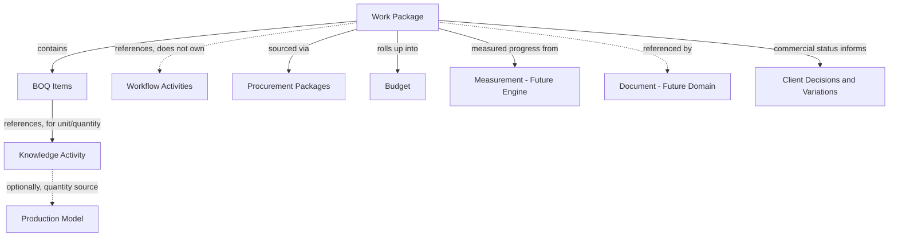
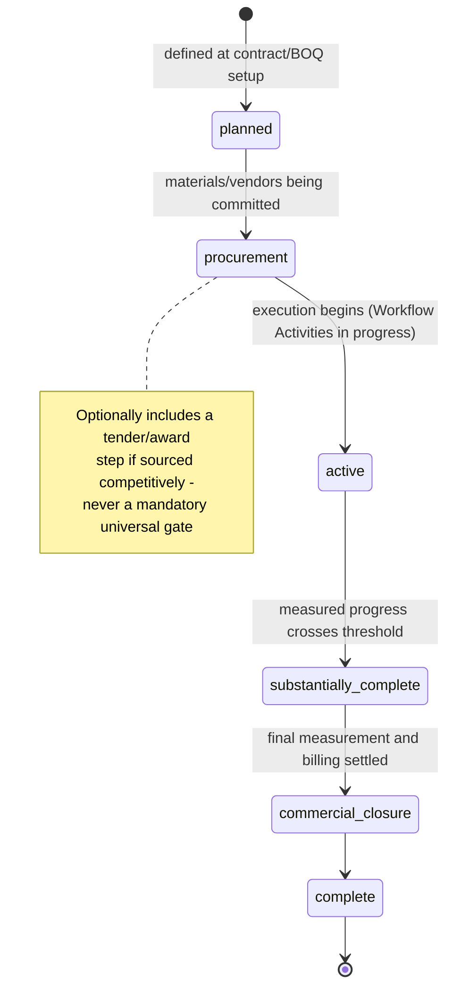
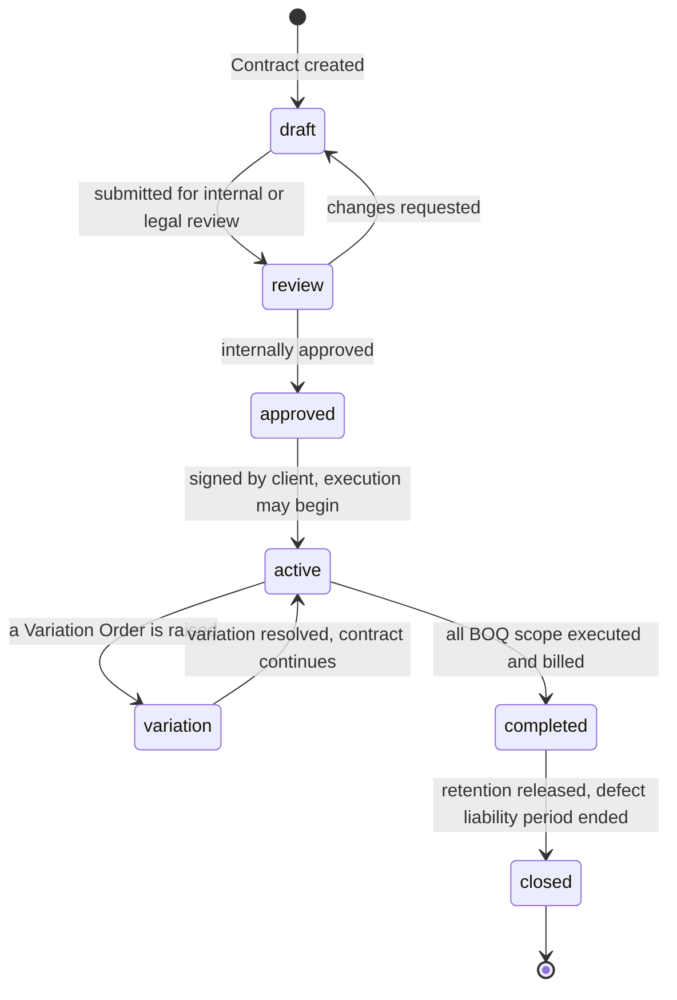
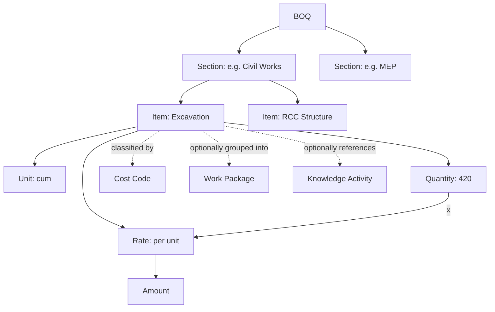
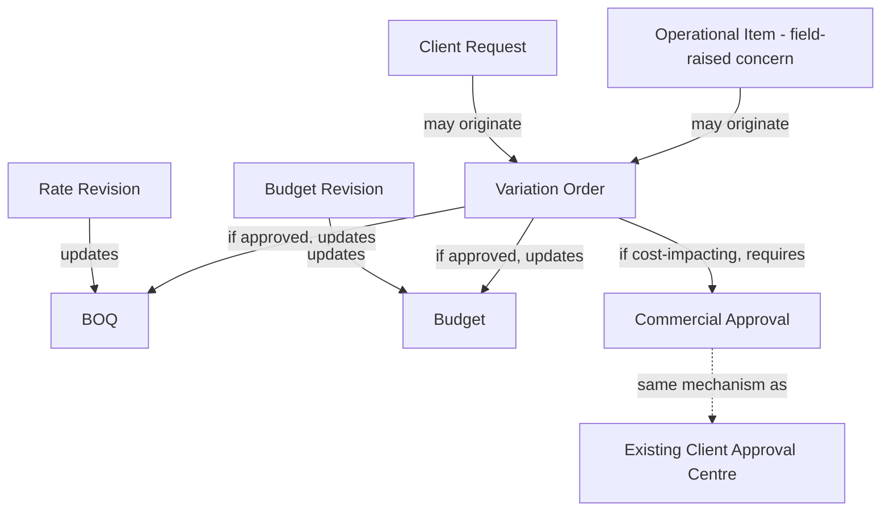

# Atlas Commercial Foundation Engine
### Architecture & Domain Specification

**Status: Architecture Frozen (post peer review).** No implementation, no frontend, no APIs, no database changes. Every recommendation below is written to be implementable confidently in focused, sequential sprints — not implemented here. This document has been through an independent architectural peer review (see the Peer Review Log immediately below) and is now considered stable: no further structural redesign should be necessary before implementation begins.

**Grounding:** this specification is written from how real construction projects are commercially managed — BOQs, RA bills, work packages, retention, variations, milestone billing, procurement packages — not from how generic project-management software models "budget" and "invoice." Where a generic-software concept (Payment Request, Client Agreement, Scope, Tax) does not correspond to a distinct real-world commercial artifact, this document says so and recommends against giving it independent existence, per the brief's own instruction not to assume every candidate deserves an entity.

**Continuity:** this document extends, and does not contradict, the Commercial Layer sketch in the Atlas Domain Model (§6) and the Future Vision framing in the Atlas Product Bible. Where this document reaches a more specific conclusion than that earlier sketch (Work Package's role, Retention's exact shape, Tax's placement), the more specific conclusion here supersedes the sketch — the sketch was written before this domain had been studied in depth; this document is that study.

---

## Peer Review Log

This document was written once, then independently reviewed as a distinct pass before being frozen — a real peer-review discipline, not a formality. The review confirmed most original decisions unchanged, refined several with genuine improvements, and **explicitly rejected one recommendation it was asked to evaluate**, with reasoning given in §3. Every change below is a refinement of the original architecture, not a redesign of it — the entity boundaries, ownership model, and integration matrix from the original specification all stand.

**Confirmed unchanged, after scrutiny:** Contract lifecycle, Budget/Contract separation, Invoice's dual-billing-method model, the Retention ledger shape, the Decision-entity trigger scoping, and the core Integration Matrix.

**Refined with genuine improvements:** BOQ Item now carries a permanent, human-readable identity code (§5) — a real gap in the original, not a stylistic change. Cost Codes are now hierarchical rather than flat (§5), matching real cost-accounting practice. Commercial Snapshot and the newly-proposed "Commercial Baseline" are resolved as one entity with a flag, not two competing ones (§2.2). A Quantity Ownership Matrix was added (§2.3) to make explicit what was previously only implied. Commercial Events are now a unified, append-only ledger — reusing Operations Engine's own proven CQRS pattern — rather than scattered per-entity events (§8). A deterministic Commercial Health model is defined, scoped precisely to avoid duplicating CRE (§8.4). Procurement's future extraction path is now documented explicitly (§11).

**Rejected, with reasoning:** the brief's proposed richer Work Package lifecycle (Planned → Tendered → Awarded → Procurement → Execution → Measurement → Commercial Closure → Closed) was evaluated and **not adopted as the universal model** — see §3 for why forcing every Work Package through a competitive-tender gate would misrepresent how Atlas's own established smaller-residential customer base actually operates, and what was adopted instead.

---

## 1. Purpose

### What the Commercial Foundation Engine owns

The complete commercial lifecycle of a construction project, from priced scope to final settlement: the Contract itself, the Bill of Quantities that prices the work, Work Packages that bridge scope to execution, the internal Budget a company tracks against, Variation Orders that formally change scope or price after signing, Procurement Packages for vendor-facing purchasing, and the billing chain — RA Bills and milestone-based Invoices, Payments received against them, and the Retention withheld and eventually released. It is the single, authoritative place Atlas answers three questions for any project: what did we agree to build, for how much; what has actually been billed and paid against that; and what do we now expect the final cost and revenue to be, given everything that's happened since signing.

### What it deliberately does not own

- General ledger accounting — double-entry bookkeeping, chart of accounts, tax filing, bank reconciliation. Atlas's Commercial Foundation Engine produces the commercial facts (an invoice was raised for this amount, on this date, against this contract) that an accounting system consumes; it does not become a second accounting system.
- Payroll or vendor payment execution — Atlas tracks that a Procurement Package exists and what it commits the project to spend; it does not run the actual vendor payment process, which belongs to whatever finance system a company already uses.
- Construction execution itself — activities, dependencies, status, and schedule remain Workflow Engine's, unmodified. The Commercial Foundation Engine reads execution state; it never becomes a second place execution is tracked.
- Physical measurement capture — the record of a measurement (what quantity of an item was executed, verified) is a Commercial Foundation Engine concern because RA billing depends on it, but the tooling to capture a measurement in the field is properly a future Measurement Engine's concern (§11). This document defines the data shape Measurement will populate; it does not build the capture mechanism.

### How this differs from ERP and Accounting software

Generic ERP and accounting software start from the transaction — a journal entry, an invoice line — and construction has to be forced into that shape after the fact (a BOQ item becomes a generic "product," a Work Package becomes a generic "project code"). The Commercial Foundation Engine starts from the opposite direction: it models a construction contract's own real structure — priced scope broken into billable quantities, work grouped the way a site actually organizes and procures it, billing tied to measured progress or reached milestones, retention withheld and released against a defect liability period — and only produces accounting-shaped output (an invoice, a payment record) at the boundary where it hands data to a system that genuinely is an accounting system. Atlas is the source of truth for what was agreed and what has happened on the project; an accounting system remains the source of truth for the company's books. The two are related, never merged.

### Integration with existing engines

- Workflow Engine — the Commercial Foundation Engine reads Workflow Activity status and the already-established STAGE_ORDER construction-lifecycle vocabulary as the trigger source for progress-based billing (RA bills, milestone bills). It never writes to a Workflow Activity, and it never maintains its own, second copy of "how far along is this project."
- Knowledge Engine — a BOQ item referencing a Knowledge Activity inherits that activity's unit of measure, and — where a Production Model exists for that activity — can read the same parametric quantity (e.g., a project's actual wall area) the Production Model already calculates from, rather than the Commercial Foundation Engine maintaining a separate copy of project-scale data.
- Operations Engine — a cost-impact conversation that starts in the field (a supervisor flags something, a client raises a concern) originates as an Operational Item, exactly as it does today; the Commercial Foundation Engine consumes that as the natural starting point for a formal Variation Order, rather than requiring a second, parallel "raise a commercial concern" mechanism.
- Timeline Engine — commercial events (an invoice raised, a payment received, a variation approved) become entries in a project's composed chronological view, read by Timeline Engine exactly the way an Event or a Correction already is — the Commercial Foundation Engine publishes into that composition, it does not maintain a competing timeline.
- Client Experience — every client-facing financial view this engine will eventually make possible (contract value, amount paid, upcoming payment, pending variation) is a read over Commercial Foundation Engine data, translated into client language exactly the way today's Client Experience Dashboard already translates CRE's health data — never a second, independently maintained "client financial summary."

### Presentation Summary
- The Commercial Foundation Engine owns a project's complete commercial lifecycle: Contract, BOQ, Work Packages, Budget, Variations, Procurement, billing, and Retention.
- It deliberately does not become a second accounting system, does not run vendor payments, and does not duplicate Workflow Engine's execution tracking or a future Measurement Engine's capture tooling.
- Unlike generic ERP/accounting software, it is modeled from construction's own real commercial structure first — BOQs, RA bills, retention — producing accounting-shaped output only at the handoff boundary.
- Every existing engine relationship is a read, never a duplication — the same "no duplicate truth" discipline the rest of Atlas already holds.

---

## 2. Core Commercial Domain — Entity Evaluation

### 2.0 Ownership Matrix

Every entity recommended as independent in this specification has exactly one owner: the Commercial Foundation Engine itself. This is worth stating as its own explicit table, not left implicit across the sections that follow — the value of doing so is confirming plainly that no entity in this domain has an ambiguous or split owner, the same discipline the Atlas Domain Model already holds for every existing engine's entities.

| Entity | Owning Engine | Notes |
|---|---|---|
| Contract | Commercial Foundation Engine | Sole writer of contract state and lifecycle transitions |
| Work Package | Commercial Foundation Engine | References, never owns, Workflow Activities (§3) |
| BOQ (Section, Item) | Commercial Foundation Engine | Sections/Items have no identity independent of their owning BOQ |
| Cost Code | Commercial Foundation Engine | Shared classification vocabulary, reused by BOQ Items and Budget lines — owned once, referenced twice |
| Budget | Commercial Foundation Engine | Internal-only; never co-owned with, or derived from, Contract/BOQ (§6, §12) |
| Variation Order | Commercial Foundation Engine | Absorbs Change Request and Rate Revision as states/subtypes, not separate owners |
| Procurement Package | Commercial Foundation Engine | Vendor-facing; distinct ownership from BOQ despite both eventually referencing Cost Code |
| Invoice | Commercial Foundation Engine | Single entity for both RA Bill and Milestone Bill billing methods |
| Payment | Commercial Foundation Engine | Distinct from Invoice specifically so partial payment is representable |
| Commercial Snapshot | Commercial Foundation Engine | Immutable, point-in-time; append-only, matching Atlas's platform-wide permanence discipline |

No entity in this domain is owned by Workflow Engine, Knowledge Engine, Operations Engine, Timeline Engine, or CRE — every relationship those engines have to commercial data is a read or a publish-into, never ownership, confirmed exhaustively in the Integration Matrix (§9).

### 2.1 Entity Catalogue

Evaluated against the brief's candidate list. Each verdict states whether independent existence is warranted, and if not, what the concept actually is.

| Candidate | Verdict | Reasoning |
|---|---|---|
| Contract | Independent entity. | The commercial agreement itself — value, terms, retention policy, defect liability period. |
| Client Agreement | Not independent — absorbed into Contract. | In construction practice, the agreement with the client is the contract; there is no genuine second artifact. Modeling them separately would create two records of the same commitment that could disagree. |
| Scope | Not stored — derived. | "Current scope" is the BOQ plus every accepted Variation Order to date. Storing it separately would duplicate what BOQ + Variation history already represents, and risk drifting from it — the same reasoning that keeps Timeline and Milestone unstored elsewhere in Atlas. |
| Work Package | Independent entity. | Evaluated in full in §3 — a genuine construction-native grouping concept, distinct from both BOQ and Workflow Activity. |
| BOQ | Independent entity, with Sections and Items as owned sub-structures (not separate top-level entities). | The priced backbone of the contract. Sections/Items only ever exist inside a BOQ; they have no identity independent of it. |
| BOQ Item | Sub-structure of BOQ (see above). | |
| Cost Code | Independent entity, **hierarchical** (refined at peer review — see §5.1). | Internal cost classification (labour/material/equipment/overhead), reused across Budget lines and BOQ items — genuinely a shared vocabulary, not owned by either. A flat list was the original design; hierarchy is a genuine improvement, not cosmetic — see §5.1 for why. |
| Budget | Independent entity. | Internal cost planning, deliberately distinct from the client-facing Contract/BOQ value. See §6. |
| Variation Order | Independent entity. | A formal, approved change to contract scope or price. |
| Change Request | Not independent — absorbed into Variation Order as its draft/pending state. | A Change Request and an approved Variation Order are the same underlying thing at two different lifecycle stages, not two different entities. Modeling them separately would duplicate exactly what a state machine already exists to represent. |
| Procurement Package | Independent entity. | Vendor-facing purchasing, genuinely distinct from BOQ (client-facing pricing) — what a project buys is not the same record as what it charges. |
| Milestone | Not stored — reused from existing Workflow/STAGE_ORDER concepts. | A billing "milestone" is a reference to a Workflow Activity or a construction stage already tracked elsewhere — not a new stored entity, consistent with the Domain Model's existing position that Milestone is always derived. |
| Invoice | Independent entity, generalized to represent both of construction's two real billing methods (RA Bill and Milestone Bill) as one entity with a billing_method field — not two separate entities. | See §5 and §8 — an RA Bill and a milestone-triggered bill differ in what determines the amount, not in what they fundamentally are (a billing document raised against a contract). |
| Payment Request | Not independent. | The closest real analogue — an advance or milestone payment ask before formal billing — is adequately represented by an Invoice in an early lifecycle state (see §4's lifecycle), not a second entity. |
| Payment | Independent entity. | Money actually received — deliberately distinct from Invoice, since an invoice can be partially paid over time. |
| Retention | Not an independent top-level entity — modeled as a Contract-level policy plus a running ledger of withheld/released amounts tied to Invoices. | See §8.1 — retention is genuinely stateful (withheld per bill, released in tranches after the defect liability period) but that state is naturally a ledger of Invoice-linked entries, not a freestanding entity with its own top-level lifecycle independent of the bills it was withheld from. |
| Tax | Not independent — a computed component of Invoice (and, where rates vary by item, of BOQ Item). | Tax has no identity or lifecycle of its own; it is always a calculated attribute of something else. |
| Forecast | Not independent — a component of the Budget Model. | See §6 — Forecast Budget is one of Budget's own tracked values, not a competing calculation the way a separate Forecast entity would risk becoming. |
| Commercial Snapshot | Independent entity, **with Baseline as a flag on it, not a second entity** (resolved at peer review — see §2.2). | A point-in-time, immutable capture of a project's full commercial state — mirroring the same pattern Construction Reasoning already uses for its own historical runs. Genuinely useful for audit, reporting, and — critically — the AI training signal described in §10, which needs comparable snapshots over time, not just current state. |

### 2.2 Commercial Snapshot vs. Commercial Baseline — resolved

Peer review raised a specific question: should the entity originally called Commercial Snapshot instead be called Commercial Baseline, or should both exist as distinct concepts? Neither renaming nor two competing entities is correct — the two ideas serve genuinely different purposes, and the right resolution is one entity with a flag, not two.

A **Snapshot** (the general case) is a periodic or on-demand, immutable capture of a project's full commercial state — taken as often as is useful, purely for historical record and the AI training signal in §10.

A **Baseline** is a *specific kind* of snapshot: one deliberately marked as the frozen reference point variance is measured against — the original baseline at contract activation, and, in real construction practice, a **new** baseline re-established after each major approved Variation Order (standard earned-value management practice: you do not measure variance against a plan that no longer reflects the agreed scope). This is not a different entity with a different lifecycle — it is the same Commercial Snapshot record, with an `is_baseline` flag and a `baseline_reason` field (`contract_activation`, `major_variation_approved`, `manual`).

**Recommendation: one entity, Commercial Snapshot, with the baseline flag.** Introducing Commercial Baseline as a second entity would mean two records could exist for the same point in time with no structural link between them — precisely the "no duplicate truth" violation this entire specification exists to avoid. The flag captures everything the distinction needs without paying that cost.

### 2.3 Quantity Ownership Matrix

Atlas tracks the "same" real-world quantity — how much of something exists or was built — through several genuinely different lenses, at different points in a project's life, owned by different engines. Peer review asked for this to be made explicit rather than left implicit across several documents; it is a real gap worth closing precisely, because a quantity silently conflated across these rows is one of the most likely sources of a serious, hard-to-detect error in this entire domain.

| Quantity | What it represents | Owning engine | Notes |
|---|---|---|---|
| **Contract Quantity** | What was agreed to be built, priced in the BOQ. | Commercial Foundation Engine | The BOQ Item's own `quantity` field (§5). Changes only through an approved Variation Order. |
| **Calculated Quantity** | A quantity *derived* from a parametric definition (e.g., a project's actual wall area, computed from its own dimensions). | Knowledge Engine (the calculation/definition) | The per-project *resolved value* is stored on the Workflow Activity instance today — but storage location is not the same as ownership. Knowledge Engine's `CALCULATION_REGISTRY` remains the sole authority on *how* this number is derived; Workflow Engine is correctly just where a specific project's resolved result happens to live. |
| **Executed Quantity** | What has actually been physically built, as measured on site. | Future Measurement Engine | Distinct from Contract Quantity by design — an RA Bill is computed from this number, never the contracted one (§5). |
| **Verified Quantity** | Executed Quantity after joint or engineer certification. | Future Measurement Engine | Usually equal to Executed Quantity; occasionally corrected during verification. Modeled as a status on the same measurement record, not a second, separately-tracked number, unless a real discrepancy is recorded — in which case the correction itself is the auditable fact worth keeping, matching Atlas's platform-wide "corrections are additions, not overwrites" principle. |

**Explicit principle, stated plainly because it is easy to violate by accident: Workflow Engine never owns a quantity's *definition or authoritative value* — only, where a Production Model input happens to already be stored there today, its *resolved value for one project instance*.** The distinction matters because it is exactly the kind of boundary that erodes silently if not stated: a future engineer extending Workflow Activity with a new field that looks like "the amount of X" is the specific mistake this row exists to prevent.

### Presentation Summary
- Nine candidate concepts were evaluated and correctly not given independent existence: Client Agreement (= Contract), Scope (derived from BOQ + Variations), Change Request (= Variation Order's draft state), Milestone (reused from Workflow/STAGE_ORDER), Payment Request (= an early-state Invoice), Tax (a computed attribute), and Forecast (a Budget component).
- Nine concepts were confirmed as genuinely independent entities: Contract, Work Package, BOQ, Cost Code, Budget, Variation Order, Procurement Package, Invoice, Payment, plus Commercial Snapshot.
- Every "not independent" verdict follows the same principle already established elsewhere in Atlas: no duplicate truth, no two records of the same real-world fact.
- Invoice is deliberately generalized to cover both RA billing and milestone billing as one entity — they differ in how the amount is determined, not in what they fundamentally are.
- Peer review resolved two open questions precisely: Baseline is a flag on Snapshot, not a second entity; and every quantity in this domain now has an explicit, single owner, with storage location and authoritative ownership deliberately distinguished.

---

## 3. Work Package Model

### Should Work Package become a first-class Atlas entity?

Yes — as a commercial-and-procurement aggregation layer, not as a replacement for Workflow Activity.

This is the most consequential judgment call in this document, so it is worth being precise about what is and is not being recommended. Real construction projects — particularly anything beyond a small residential build — are commercially organized around Work Packages: "Structural Work Package," "MEP Work Package," "Finishes Work Package," each bundling a portion of the BOQ, a group of vendors procured against it, and a subset of the project's activities, for the specific purpose of tracking cost and progress at a granularity a full BOQ (hundreds of line items) or a full activity list is too fine to report on directly. This is a genuine, distinct commercial-reporting need that neither Workflow Activity nor BOQ currently serves.

What Work Package should not become: the primary planning abstraction, replacing Workflow Activity as the thing a schedule is built from. Workflow Engine's activity-and-dependency model is a working, tested planning engine — introducing Work Package as a competing planning primitive would be exactly the kind of engine redesign this sprint's own principles forbid, and would risk two systems disagreeing about what a project's actual schedule is. Work Package instead references Workflow Activities (many-to-many: a Work Package typically groups several activities; a large activity could in principle span two work packages, though this should be rare in practice) — it aggregates and reports on execution, it does not schedule it.

### Purpose
A commercial-and-procurement grouping of BOQ items, referenced Workflow Activities, and Procurement Packages, existing specifically to let a project be reported on, budgeted, and procured at a coarser, more useful granularity than either the full BOQ or the full activity list individually provide.

### Ownership
Commercial Foundation Engine. Work Package is a genuinely commercial concept (it exists to answer "how is this piece of the project doing, cost-wise") — it should not be owned by Workflow Engine, which correctly stays focused on execution scheduling, not cost aggregation.

### Relationships

This directly matches, and confirms, the brief's own worked diagram: Work Package -> BOQ -> Activities -> Production Models -> Resources -> Measurements -> Documents -> Commercial -> Client Decisions — with one clarification this document adds precisely: the Activities link is a reference, not ownership, and Resources (labour/material/equipment allocation) is itself a future capability (§11), represented here as Procurement Package for the purchasing side of "resources" that already has a clear place in this architecture today.

### Lifecycle — evaluated and refined, not wholesale-adopted

The original lifecycle (Planned → Active → Complete) was reviewed against a proposed richer alternative: Planned → Tendered → Awarded → Procurement → Execution → Measurement → Commercial Closure → Closed. **The richer lifecycle is not adopted as the universal model, and it is worth being precise about why, because the reasoning matters more than the conclusion.**

"Tendered" and "Awarded" describe competitive sub-contracting — a Work Package put out for bid among multiple vendors, then formally awarded to one. This is real, common practice on large EPC-style projects. It is **not** how Atlas's own established customer base — smaller residential builds, the ₹50 lakh–5 crore projects the Client Experience specification is written for — typically operates: a Work Package there is usually executed directly by the contractor's own crew, procured from a known vendor, with no competitive tender step at all. Making Tendered/Awarded **mandatory** states every Work Package must pass through would force EPC-scale formality onto every project Atlas serves, including the ones that will never see a competitive tender — which is precisely the mistake the original specification's own grounding principle warns against: adapting construction to fit the software's assumptions, rather than the reverse.

**What is adopted instead:** the lifecycle gains one genuinely universal stage — **Procurement** — because every Work Package, tendered or not, genuinely does need its materials/vendors committed before execution can begin; this is true on a small residential build exactly as it is on an EPC project, so it belongs in the universal backbone. Tendered/Awarded are **not** added as mandatory gates. Instead, they are supported as an **optional path within Procurement**: a Work Package whose linked Procurement Package genuinely went through a competitive RFQ process (the future Procurement Engine's own capability, §11) can record that its Procurement stage included a tender — without every other Work Package being forced through a state that never applied to it.

This also folds in "Measurement" and "Commercial Closure" from the proposed richer lifecycle — both genuinely useful, unlike Tendered/Awarded, because every Work Package (regardless of project scale) does need its final quantities measured and its billing formally settled before it can be considered complete. The distinction that matters: **Measurement and Commercial Closure describe something every Work Package goes through; Tendered/Awarded describe something only some do.** A universal lifecycle should only mandate the former.

### Consumers
Budget (cost roll-up), Client Experience (a future "progress by work package" view, more digestible than either raw BOQ or raw activity list), Portfolio Intelligence (a future cross-project "which category of work typically overruns" signal — directly feeding §10's AI readiness goals), and Procurement (which vendors/packages are tied to which piece of scope).

### Presentation Summary
- Work Package is recommended as a genuine, independent entity — but as a commercial and procurement aggregation layer, not a replacement for Workflow Engine's planning model.
- It references Workflow Activities rather than owning or replacing them, preserving the existing, working execution engine unmodified.
- It bundles BOQ items and Procurement Packages at a granularity useful for cost reporting — finer-grained than "whole project," coarser than "every BOQ line."
- This directly confirms the brief's own Work Package diagram, with one precision added: the Activities relationship is explicitly a reference, never ownership.

---

## 4. Contract Lifecycle

draft — Contract terms and initial BOQ are being assembled; owned exclusively by whoever is preparing the commercial proposal (Management/PM, per Atlas's existing role model).

review — Internal sign-off before the contract is presented to the client; can cycle back to draft.

approved — Internally approved, not yet signed; the contract is not yet commercially binding within Atlas.

active — Signed and binding. This is the state a project's Workflow Engine schedule generation should be gated on (a project should not begin formal, billable execution against a contract that isn't active) — a boundary condition worth stating explicitly here even though implementing that gate is not part of this sprint.

variation is not a separate persistent state so much as a transient marker — a contract in active state with one or more Variation Orders currently pending; the diagram shows it as a distinct node because the brief's own example does, but the more precise model is: active remains the contract's actual state throughout a variation's lifecycle, and the variation itself carries its own state machine (§7). A contract does not leave active merely because a variation is being discussed.

completed — All BOQ scope (as amended by every accepted Variation Order) has been executed and fully billed. The contract's commercial obligations are substantively finished, but retention has not yet been released.

closed — Retention released (fully or per whatever partial-release policy the contract specifies) at the end of the defect liability period. This is the true terminal state — a closed contract remains a permanent historical record, never deleted, matching Atlas's platform-wide permanence discipline.

Ownership: Commercial Foundation Engine exclusively, for every state transition. Transitions requiring approval (draft->review->approved, and the accept/reject decision within a Variation Order's own lifecycle) should reuse Atlas's existing RBAC model (management/PM-level actions) rather than introducing a parallel permission system.

### Presentation Summary
- Contract lifecycle: draft -> review -> approved -> active -> completed -> closed, with Variation Orders as a state within active, not a detour out of it.
- Active is the state that should gate whether formal, billable execution is permitted to begin — a real boundary condition for future implementation.
- Closed (after retention release) is the true terminal state; contracts are never deleted, matching Atlas's platform-wide permanence principle.
- All transitions are Commercial Foundation Engine's exclusively, reusing Atlas's existing RBAC model rather than a parallel one.

---

## 5. BOQ Architecture

BOQ belongs to exactly one Contract. Section is a pure organizational grouping within a BOQ (matching how a real BOQ document is structured — Civil, MEP, Finishes, etc.) with no commercial meaning of its own beyond grouping. Item is the actual priced line: description, unit, quantity, rate, and the computed amount (quantity × rate) — the one place in this entire domain model where a number is genuinely calculated, and it should be calculated the same deterministic way every other calculated value in Atlas is (see the Production Model precedent — a plain, explicit, testable calculation, never a stored formula string).

Cost Code classifies a BOQ Item for internal reporting (labour/material/equipment/overhead) independently of which Section it's organizationally filed under — the same item can be "in the Civil Works section" and "classified as Material cost" simultaneously; these are two different groupings serving two different purposes (client-facing organization vs. internal cost analysis), and Cost Code is what makes Budget's cost-type breakdown (§6) possible at all. **Cost Code and Work Package are easy to confuse and worth distinguishing explicitly: Cost Code groups by the *nature* of the cost (what kind of expense), Work Package groups by the *scope* of the work (what physical piece of the project). They are orthogonal axes — a single Work Package spans many Cost Codes, and a single Cost Code appears across many Work Packages — not two names for the same grouping.**

### 5.0 BOQ Item Identity — a genuine gap, closed at peer review

The original specification gave BOQ Item a database identity but never a **permanent, human-readable code** — the "CW-001" style reference a real BOQ document, a real measurement sheet, and a real vendor invoice all already use in practice. This was a real omission, not a stylistic one: a database ID is opaque and internal; a site engineer writing up a measurement, a vendor referencing a purchase order, and an AI system extracting structure from a voice note describing "item CW-001" all need a *stable, meaningful* identifier that exists independently of Atlas's own internal storage. Every future consumer of a BOQ Item — Measurement, Billing, Procurement, Production Models, Cost Tracking, AI Analysis — should reference this code, not the database id, wherever a human or an external document is the origin of the reference.

**Recommendation:** every BOQ Item carries a permanent `item_code` (e.g., `CW-001`), assigned once at BOQ creation, immutable thereafter, unique within its BOQ. This code — not the internal id — becomes the field an RA Bill line item cites, a Procurement Package's material request references, and an AI extraction from a field voice note ("we're short on item CW-001") resolves against.

### 5.1 Hierarchical Cost Codes — a genuine improvement, adopted

The original specification modeled Cost Code as a flat classification list. Peer review recommended expanding this to a hierarchy — e.g., `1000 Civil → 1100 Concrete → 1110 PCC → 1120 RCC → 1200 Masonry` — matching how construction cost accounting is actually done in practice (the same structural idea behind established standards like CSI MasterFormat). **This is adopted.**

The long-term reporting benefit is specific and real: a flat list forces a choice between granularity (many flat codes, hard to summarize) and usefulness (few flat codes, too coarse to analyze). A hierarchy removes the tradeoff — a report can roll up to "total Civil cost" or drill into "just RCC" from the identical underlying data, with no second classification scheme required for the coarser view. This directly strengthens §10's AI-readiness signals too: "Cost Overruns by Cost Code" becomes meaningful at whatever level of granularity a future analysis needs, from broad trade category down to a specific sub-classification, without the data model changing.

### Integration with Production Models

This is where BOQ Architecture and Knowledge Base v2's parametric Production Models meet directly, and it is worth stating precisely because it is one of the clearest wins available once this layer is built: a BOQ Item for "Wall Masonry" can reference the same Knowledge Activity a project's Workflow Activity already references — which means its quantity does not need to be entered a second time. The Production Model already calculates (and stores, per-project-instance) the actual wall area a specific project needs; the BOQ Item reads that same value rather than a commercial team re-measuring or re-entering something Atlas already knows. This is a direct, concrete instance of "no duplicate truth" applied to the commercial layer specifically — the quantity a client is billed for and the quantity a Production Model calculated a duration from are, correctly, the exact same number, read once from one place.

### Integration with the future Measurement Engine

A BOQ Item's contracted quantity (what was agreed) and its executed quantity (what has actually been measured and verified as complete) are deliberately two different numbers, tracked separately — an RA Bill is computed from the executed quantity, never the contracted one. This document defines the shape that distinction requires (a BOQ Item must be able to carry both an original quantity and an accumulating measured-to-date quantity) without building the Measurement Engine itself; the measured-to-date figure is populated by whatever future capture mechanism that engine provides, and this architecture is designed so that populating it is additive — it does not require restructuring the BOQ Item itself.

### Presentation Summary
- BOQ -> Section (organizational grouping) -> Item (the actual priced line) -> Cost Code (independent internal cost classification, orthogonal to Section, orthogonal to Work Package too).
- Every BOQ Item now carries a permanent, human-readable item_code (e.g. CW-001) — the real, stable reference every downstream consumer (Measurement, Procurement, AI) should use, not an opaque internal id.
- Cost Codes are now hierarchical, matching real construction cost-accounting practice — enabling roll-up reporting at any level from the same underlying data, with no second classification scheme needed.
- Amount is always calculated deterministically (quantity x rate) — the same explicit-calculation discipline the Production Model registry already established.
- A BOQ Item can share its quantity directly with an existing Production Model calculation, rather than re-entering a number Atlas already knows — a direct, concrete "no duplicate truth" win.
- BOQ Items are designed to carry both contracted and measured-to-date quantities from day one, so a future Measurement Engine can populate the latter additively, without restructuring this layer.

---

## 6. Budget Model

Budget is deliberately internal-only — distinct from the client-facing Contract/BOQ value, and never exposed through Client Experience the way Contract, Invoice, and Payment eventually will be (Client Experience Sprint's own explicit reasoning for deferring a Financial Summary was that no real data existed yet to back one; this section is where that real data will come from, once implemented, but Budget itself remains an internal management concern, not a client-facing one — a client sees what they agreed to pay, not what it costs the contractor to deliver it).

| Value | Definition | Update rule |
|---|---|---|
| Original Budget | The internal cost plan at contract signing — what the company expects to spend to deliver the contracted scope. | Set once, at contract activation. Immutable thereafter — a historical baseline, never edited. |
| Approved Budget | Original Budget adjusted for every internally-approved budget revision (distinct from a client-facing Variation Order — an internal cost re-plan doesn't necessarily change what the client is billed). | Updated only by an explicit, approved Budget Revision — never silently. |
| Committed Cost | The sum of everything the project is contractually obligated to spend, whether or not it's been invoiced by a vendor yet — driven directly by Procurement Package commitments. | Increases the moment a Procurement Package is committed; does not wait for an invoice. |
| Current Cost | Actual, incurred cost to date — money genuinely spent, not merely committed. | Increases as vendor invoices/payments are recorded against Procurement Packages. |
| Forecast Budget | The project's own best current projection of final total cost, given Approved Budget, Committed Cost, Current Cost, and remaining scope. | Recomputed, not manually maintained — the same "computed, not stored as a second opinion" principle that governs Timeline and Milestone elsewhere in Atlas. This is why Forecast is a component of the Budget Model (§2) rather than an independent entity: it is one more field this model produces, not a competing calculation. |
| Remaining Budget | Approved Budget minus Current Cost. | Purely computed, always, from the two values above — never itself independently editable. |

### Why Budget and Contract are deliberately separate numbers

A construction company's internal cost to deliver a scope of work and the price it charges a client for that scope are never the same number, and conflating them would be a serious architectural error — it would mean a client-facing view (Contract value) and an internal management view (Budget) could only ever be read from the same underlying data, when in reality a company's margin is the difference between them. Keeping Budget and Contract as genuinely separate entities, related only through the BOQ/Work Package structure both reference, is what makes it possible to correctly answer "are we making money on this project" without that calculation ever touching, or risking exposure through, the client-facing side of the platform.

### Presentation Summary
- Budget is deliberately internal-only, structurally separate from client-facing Contract value — this is what makes margin analysis possible without any risk of exposing it to a client.
- Original Budget is an immutable baseline; Approved Budget only changes through an explicit, approved revision — never silently.
- Committed Cost and Current Cost are tracked as two genuinely different numbers (obligated vs. actually spent), both driven by Procurement Package activity.
- Forecast Budget and Remaining Budget are always computed, never independently stored — the same "no duplicate truth" discipline applied to internal cost tracking.

---

## 7. Commercial Change Management

Variation Order is the single entity governing every commercial change to scope or price, whatever prompted it — it may originate from a field-raised Operational Item (a supervisor identifies unforeseen ground conditions), a direct client request (the client wants an additional room), or an internal re-plan. A Variation Order's own lifecycle (proposed -> under_review -> approved | rejected) governs whether and how it actually updates the BOQ and Budget — nothing about scope or price changes until a Variation Order reaches approved.

Rate Revision is a narrower kind of change — the unit rate for a BOQ Item changes (a material cost increase is passed through) without necessarily changing quantity or scope. This is modeled as a specific kind of Variation Order (a variation_type field distinguishing rate-only changes from scope-adding/removing ones), not a separate entity — the approval and history-tracking needs are identical, only the effect differs.

Budget Revision is Budget's own, purely internal analogue — an internal cost re-plan that does not necessarily correspond to any client-facing Variation Order at all (e.g., a company revises its own labour cost assumption). It updates Approved Budget directly and requires only internal approval, never Commercial Approval in the client-facing sense.

### Commercial Approvals

A cost-impacting Variation Order is precisely the trigger condition this document's own predecessor (the Domain Model) named for finally introducing a first-class Decision entity — recommended there as not yet warranted, with the explicit condition that Commercial Layer implementation would be the right moment. This document confirms that condition is now met by this specification's own existence, and gives the specific reason precisely: unlike a material or design approval (well served today by an Operational Item's client_approval category), a cost-impacting Variation Order genuinely needs properties client_approval doesn't have — a monetary magnitude, a potential multi-step approval chain (site -> PM -> client, for larger amounts), and an outcome that formally modifies a different entity (the BOQ/Budget) rather than simply closing itself out. Recommendation carried forward from the Domain Model, now made concrete: implement Decision as the Commercial Foundation Engine's own approval mechanism for Variation Orders specifically, in the same implementation phase as Variation Order itself — not a platform-wide generalization of client_approval, and not built ahead of this specific, now-real need.

### Presentation Summary
- Variation Order is the single entity for every commercial change, whatever originated it — field-raised, client-requested, or internal — with nothing taking effect until it's formally approved.
- Rate Revision is a Variation Order subtype, not a separate entity; Budget Revision is Budget's purely internal analogue, requiring only internal approval.
- This document confirms the exact trigger condition the Domain Model named for introducing a first-class Decision entity: a cost-impacting Variation Order, specifically.
- Recommendation: implement Decision alongside Variation Order in the same phase, scoped to commercial approvals — not as a platform-wide generalization of the existing, and still correctly separate, client_approval mechanism.

---

## 8. Commercial Timeline

Commercial events are not a separate timeline — they are entries in the same composed, chronological project narrative Timeline Engine already produces from Events, Analyses, and Corrections. A construction project's commercial story, told this way:

```mermaid
graph LR
    A[Contract Signed] --> B[Advance Payment Invoice Raised]
    B --> C[Foundation Complete - Workflow Stage]
    C --> D[Milestone Bill Raised]
    D --> E[RA Bill 1 - Measured Progress]
    E --> F[Variation Order Approved]
    F --> G[RA Bill 2 - Includes Variation]
    G --> H[Final Bill]
    H --> I[Retention Release]
    I --> J[Project Closeout]
```

Contract Signed transitions the Contract to active (§4) — the point from which formal billing becomes possible.

Advance Payment is an early-lifecycle Invoice (§2's resolution of "Payment Request") — typically a fixed percentage, not yet tied to any measured progress.

Milestone-triggered billing (Foundation Complete -> Milestone Bill) reads a Workflow Activity's status or a project's STAGE_ORDER position directly — exactly the mechanism the Client Experience Sprint's own Project Timeline already uses to translate internal stage data into client-facing milestones, now reused as a billing trigger rather than only a display one. This is the same derived-data principle applied a second time, to a second consumer, without inventing a second way to determine "has this stage been reached."

RA Bills are the recurring, measurement-driven billing method — each one computed from the BOQ Items' measured-to-date quantities (§5), cumulative, with the previous bill's amount deducted so each RA Bill represents only the new progress since the last one, and retention withheld per the Contract's policy (§8.1 below expands this).

Variation Orders, once approved, modify the BOQ that subsequent RA Bills are computed from — a variation approved between RA Bill 1 and RA Bill 2 is reflected automatically in RA Bill 2's calculation, because RA Bill always reads the BOQ's current state, never a snapshot frozen at contract signing.

Final Bill settles all remaining measured quantity once execution is complete. Retention Release follows the defect liability period, per Contract policy — the point the Contract itself reaches closed.

### 8.1 — Retention, precisely

Retention is withheld as a percentage of each RA Bill (and typically the Final Bill), not deducted once at the end — meaning the correct model is a running ledger: each Invoice of billing_method=ra_bill carries a retention_withheld amount (computed from the Contract's retention percentage), and the Contract's total retention balance is the sum of every such entry across every invoice raised, minus every release recorded against it. Release itself may happen in tranches (a partial release at practical completion, a final release at the end of the defect liability period) — modeled as its own small entry type (a Retention Release record, linked to the Contract, with an amount and a date) rather than a single "release" flag, because real contracts genuinely do release retention in more than one step.

### 8.2 — Advance Payment recovery (independent addition — see §13)

The original specification named Advance Payment as an early-lifecycle Invoice but did not address how it is actually recovered. In real practice, an advance is not simply given — it is *recovered* proportionally against subsequent RA Bills (a fixed percentage deducted from each RA Bill until the advance is fully offset), structurally the same shape as Retention's own withholding: a running ledger of deductions against a known total, tracked to zero. **This is modeled using the identical ledger pattern already established for Retention** (§8.1) — an `advance_recovered` amount on each RA Bill, with the Contract's outstanding advance balance being the original advance minus the cumulative recovery — rather than inventing a second mechanism for what is structurally the same problem.

### 8.3 Commercial Events — a unified ledger, not scattered per-entity events

The original specification implied commercial events (an invoice raised, a payment received, a variation approved) reach Timeline Engine as individual notifications from whichever entity produced them. Peer review evaluated introducing a single, generic **Commercial Event** abstraction instead — and this is adopted, for a specific reason: **it is not a new pattern for Atlas, it is the direct reuse of one that already works.** Operations Engine's own `operational_events` collection is exactly this — an append-only ledger every mutation writes to, which downstream consumers read from as a single feed rather than needing to understand every operational item's own internal update logic. Commercial Foundation Engine should adopt the identical shape: a `commercial_events` ledger, with entries like `contract_activated`, `invoice_raised`, `invoice_paid`, `variation_approved`, `budget_revised`, `retention_released`, each carrying a reference to the entity that produced it and a snapshot of the relevant facts at that moment.

This simplifies Timeline Engine's own job — one feed to compose from, not an ever-growing list of entity-specific event types it needs to know about individually — and gives the Commercial Foundation Engine its own audit trail for free, in the same CQRS shape Operations Engine has already proven at scale within Atlas.

### 8.4 Commercial Health — deterministic indicators, not a second reasoning engine

Peer review asked whether Commercial Foundation Engine should publish deterministic commercial health indicators, explicitly *without* building CRE-style reasoning logic into this specification. The answer is yes, scoped precisely: Commercial Foundation Engine computes and publishes plain, auditable indicators, directly from its own data — it does not evaluate rules, does not produce findings with severity, and does not decide what a project's overall health *means*. That synthesis remains CRE's job, exactly as the original Integration Matrix (§9) already described as a future, optional, one-directional read.

| Indicator | Deterministic definition |
|---|---|
| Budget Risk | Current Cost trending toward or exceeding Approved Budget, at the current burn rate. |
| Cash Flow Risk | Outstanding (raised but unpaid) Invoice value as a proportion of recent Payment inflow. |
| Payment Delay | Days between an Invoice's due date and actual Payment date, for currently-overdue invoices. |
| Variation Exposure | Cumulative approved Variation value as a percentage of original Contract value. |
| Margin Risk | Forecast Budget approaching or exceeding Contract value (the gap that represents profit narrowing). |

**These five indicators are Commercial Foundation Engine's own published output — not a CRE finding.** A future CRE integration would *consume* them the same way it consumes Workflow/Operations data today, potentially producing a genuine finding like "this project's margin risk and schedule variance are both worsening together" — but that synthesis, and the judgment about what it means for overall project health, stays CRE's, never duplicated here.

### Presentation Summary
- Commercial events are entries in Atlas's existing composed Timeline, never a separate, competing project history — now formalized as a unified Commercial Event ledger, directly reusing Operations Engine's own proven CQRS pattern rather than inventing a new one.
- Milestone billing reuses the exact same Workflow-stage-derived mechanism the Client Experience Sprint's Project Timeline already established for display — now reused for billing, without a second way of determining "has this stage been reached."
- RA Bills always compute from the BOQ's current state, so an approved Variation Order is reflected automatically in the next bill, with no manual reconciliation step.
- Retention and Advance Payment recovery are both modeled as running ledgers with the identical shape — two real construction mechanics, one proven pattern, not two.
- Five deterministic Commercial Health indicators are defined as this engine's own published output — explicitly not a second reasoning engine; synthesis into an overall judgment remains CRE's job alone.

---

## 9. Integration Matrix

| Engine | Consumes from Commercial Foundation Engine | Publishes to Commercial Foundation Engine | Dependency direction |
|---|---|---|---|
| Workflow Engine | Nothing. | Activity status, STAGE_ORDER position (billing triggers), Production Model quantities (BOQ quantity source). | Commercial depends on Workflow; Workflow has zero dependency on Commercial — preserves Workflow Engine's existing independence completely. |
| Knowledge Engine | Nothing. | Activity unit-of-measure, Production Model definitions and calculated quantities (BOQ Item quantity/unit source). | Commercial depends on Knowledge; one-directional, matching the precedent already set by Workflow Engine's own existing dependency on Knowledge Engine's calculation registry. |
| Operations Engine | Variation Order origination point (a cost-impacting Operational Item may become a Variation Order). | Nothing (Operations Engine does not read Commercial data). | Commercial depends on Operations for origination only; no reverse dependency. |
| Timeline Engine | Nothing (Timeline Engine is a pure composition layer with no entities of its own to publish). | Commercial events (invoice raised, payment received, variation approved) as timeline entries. | Timeline composes Commercial's published events, exactly as it already composes Events/Analyses/Corrections. |
| Construction Reasoning Engine (CRE) | Nothing today; future — cost-overrun and cash-flow findings could become new CRE finding types, reading Commercial data the same way CRE reads Workflow/Operations data today. | Nothing (CRE does not write). | A future, optional read dependency — CRE would depend on Commercial, never the reverse, preserving CRE's existing "reads everything, owns nothing but its own findings" boundary. |
| Client Experience | Contract value, Invoice/Payment history, pending Variation Orders (client-approval-relevant ones), retention position — everything the Client Experience Sprint's deferred Financial Summary and Payment Centre would need. | Nothing (Client Experience is a pure translation layer). | Client Experience depends on Commercial; one-directional, exactly matching how it already depends on CRE for health/progress data today. |

No duplicated responsibility was found or introduced across this matrix. Every dependency is one-directional; no engine both consumes from and publishes to the Commercial Foundation Engine in a way that could create a cycle.

### Presentation Summary
- Every integration in this matrix is one-directional — no engine both consumes from and publishes to Commercial Foundation Engine, so no circular dependency is possible.
- Workflow and Knowledge Engines remain completely independent of Commercial — Commercial depends on them, never the reverse, preserving their existing boundaries unmodified.
- Client Experience's dependency on Commercial exactly mirrors its existing dependency on CRE — a pure translation layer, reading, never maintaining its own copy.
- CRE's future relationship to Commercial (cost-overrun findings) would be additive and optional, preserving CRE's "reads everything, owns nothing but its findings" boundary unchanged.

---

## 10. AI Readiness — Future Training Signals

This section designs deterministic data, per the brief's own instruction — not an AI feature. Every signal below is a plain, auditable calculation over Commercial Foundation Engine data; none of them require AI to produce, and all of them become genuinely valuable training signal only once accumulated across many completed projects.

| Signal | Deterministic definition | Why it matters |
|---|---|---|
| Budget Accuracy | Final Current Cost divided by Original Budget, per project and per Cost Code, at project closure. | The clearest possible measure of whether the company's own cost estimation is improving over time — and, per Cost Code, exactly which kind of work is hardest to estimate accurately. |
| Variation Frequency | Count and cumulative value of approved Variation Orders as a percentage of original Contract value, per project. | A high-variation project is a specific, nameable risk pattern — this signal is what would eventually let Atlas flag "projects like this one tend to see significant scope growth" as an evidenced finding, not a guess. |
| Cash Flow Patterns | Time-series of Invoice raised vs. Payment received, per project, showing the actual lag between billing and collection. | Directly informs future cash-flow forecasting — a genuinely valuable capability, buildable only once this data exists to learn from. |
| Cost Overruns | Current Cost exceeding Approved Budget, by Cost Code and by Work Package, with the specific point in the project timeline it occurred. | The Work Package-level granularity here is exactly why Work Package was worth making a first-class entity (§3) — "structural work overruns more often than finishes work" is a pattern only visible at that granularity. |
| Payment Delays | Actual payment date minus Invoice due date, per client, per project. | A deterministic, evidenced basis for future risk-scoring of payment reliability — never a subjective assessment. |
| Scope Growth | Cumulative approved Variation value over time, as a project progresses through STAGE_ORDER. | Distinguishes "scope grew steadily throughout" from "scope grew suddenly near completion" — genuinely different risk patterns, both fully derivable from data this architecture already captures. |
| Productivity vs. Cost | Production Model's calculated duration (Knowledge Base v2) cross-referenced against that same Work Package's actual cost — the direct bridge between Atlas's existing parametric duration calculations and this document's new cost data. | This is the single clearest example of two previously separate parts of Atlas becoming more valuable together than either was alone — a capability this architecture makes possible but does not itself build. |

Design principle held throughout this section: every signal is defined as a calculation over data this architecture already captures for its own operational purposes (billing, budgeting, procurement) — nothing here proposes capturing new data solely for the sake of a future AI feature. This is deliberate: data captured only to feed a model, with no operational purpose of its own, tends to be low-quality, because no one is actually relying on it day to day. Every signal above is a byproduct of data that has to be correct anyway for the Commercial Foundation Engine to do its actual job.

### Presentation Summary
- Every AI-readiness signal is a plain, deterministic calculation over commercial data — no AI is designed or required to produce any of them.
- Every signal is a byproduct of data this engine needs to be correct anyway for its own operational purpose — nothing is captured solely to feed a future model.
- Work Package's existence as a first-class entity is what makes Cost Overrun signals meaningful at a genuinely useful granularity.
- Productivity vs. Cost is the clearest example of this architecture and Knowledge Base v2's existing Production Models becoming more valuable together than either is alone.

---

## 11. Future Integration

How the Commercial Foundation Engine should relate to capabilities that don't exist yet, and to external systems, without becoming tightly coupled to any of them:

**Procurement Engine (the clearest, most concrete future extraction).** Procurement Package remains inside the Commercial Foundation Engine for Version 1 — it is not yet complex enough to justify a dedicated engine, and vendor-facing purchasing genuinely is a commercial concern this engine should own at V1's scale. But the boundary for a future, dedicated Procurement Engine is worth naming precisely now, so V1's model doesn't have to be restructured to support the extraction later: a future Procurement Engine would own **RFQs, Vendor Quotations, Quote Comparison, Purchase Orders, Delivery Tracking, Material Receipts, and Vendor Performance** — the full purchasing lifecycle Procurement Package today only summarizes as a single commitment. V1's Procurement Package should therefore be scoped narrowly and deliberately — vendor, amount committed, linked Work Package/Cost Code, status — so that when the fuller engine is built, Procurement Package becomes that engine's *summary record* (what a Work Package needs to know: total committed, current status) while the new engine owns the detailed process underneath it, rather than V1's Procurement Package needing to be torn apart and rebuilt.

Measurement Engine — the Commercial Foundation Engine defines the data shape (BOQ Item's contracted vs. measured-to-date quantity, §5) that a future Measurement Engine populates. The relationship is additive by design: Measurement Engine's job is to get a verified quantity into that field; it never needs to restructure BOQ itself to do so.

Decision Engine — as established in §7, the Commercial Foundation Engine is precisely the trigger condition the Domain Model named for finally building a first-class Decision entity, scoped specifically to commercial approvals (Variation Orders, and eventually Payment approvals) in the same implementation phase as this engine.

**Resource Engine — a genuinely adjacent, not overlapping, future concern.** A future Resource Engine would own labour/crew and equipment *allocation* — assigning a resource to a piece of work — which is a different concern from Procurement Package's scope (vendor-sourced purchasing). The two relate without requiring any change to the Commercial model: Resource Engine would *reference* a Procurement Package where a resource was vendor-sourced (e.g., "this excavator was procured via Procurement Package X, now allocated to Work Package Y") — a one-directional read, exactly like every other future integration in this section. Commercial Foundation Engine never needs to know about allocation; Resource Engine never needs to duplicate procurement data.

Document Engine — every Contract, Invoice, and Variation Order will eventually need to reference a real, uploaded document (the signed contract PDF, the invoice document, supporting photos for a variation). The Commercial Foundation Engine should reference Document Engine's future entities for file storage, never reimplement document storage itself — this specification's entities should carry a document_ids reference field where relevant, ready for that future engine to populate, rather than needing modification when Document Engine arrives.

Notification Engine — payments due, variations pending approval, and milestones reached are natural, high-value notification triggers, exactly the pattern the Domain Model's own Notification specification already describes: Commercial Foundation Engine publishes the state change (now concretely, via the Commercial Event ledger, §8.3); Notification Engine observes and decides how and to whom to alert; Commercial Foundation Engine never becomes a second place "should this person be notified" gets decided.

Business Intelligence — the AI-readiness signals in §10 are precisely Business Intelligence's future raw material — this section is written to be that future engine's direct input, without Business Intelligence needing its own copy of the same commercial data.

**Future Tender Engine — Atlas currently begins at Contract Award, and this is a deliberate, acknowledged boundary, not an oversight.** A future Tender Engine would own the pre-contract process — RFP issuance, bid submission, bid comparison, award decision — entirely upstream of anything this specification models. The integration point is already natural and requires no change to what's specified here: a Tender Engine's awarded bid becomes a Contract entering `draft` (§4) — the exact same entry point a Contract assembled without any tender process would use. No structural accommodation is needed now; the boundary is simply worth stating explicitly, so a future Tender Engine's implementer knows precisely where their engine's output is expected to hand off, rather than needing to discover it by reading Contract's lifecycle from scratch.

ERP Systems and Accounting Software — the correct integration boundary is a defined export/sync interface, not deep coupling: Atlas publishes commercial facts (invoices raised, payments recorded, budget positions) in a well-defined shape; an external accounting system consumes them into its own books. Atlas should never attempt to become an accounting system, and should never require an external ERP's data model to shape Atlas's own entities. The specific integration mechanism (API, scheduled export, webhook) is implementation detail for whichever future sprint builds this bridge — the architectural commitment made here is only the boundary: one-directional publication of facts outward, never a live, bidirectional dependency on an external system's own data model.

### Presentation Summary
- Every future integration point is designed as an additive, one-directional relationship — Commercial Foundation Engine publishes facts; other engines and systems consume, observe, or store against them.
- Procurement Package's V1 scope is deliberately narrow so a future Procurement Engine can absorb the full RFQ-to-Vendor-Performance lifecycle without V1's model needing to be rebuilt — Procurement Package becomes that engine's summary record, not a discarded one.
- Resource Engine and Procurement Package are adjacent, not overlapping — allocation vs. purchasing — related only by a one-directional reference.
- A future Tender Engine's natural handoff point (an awarded bid becomes a Contract entering draft) already exists in this specification's Contract lifecycle — named explicitly now so it doesn't need rediscovering later.
- ERP/Accounting integration is explicitly scoped as fact-publication outward, never a live, bidirectional dependency on an external system's data model — Atlas never becomes, or is shaped by, an accounting system.
- This section confirms, concretely, that the Decision Engine's build trigger (named in the Domain Model) is met by this specification.

---

## 12. Architecture Review

Potential duplication — none introduced, one guarded against explicitly. The single highest-risk duplication this domain invites is a BOQ Item's quantity being entered independently of a Production Model's already-calculated quantity for the same real-world measurement. §5 addresses this directly by design, not as an afterthought: the architecture is written so that reading the Production Model's value is the natural, easier path, not a discipline someone has to remember to follow.

Scaling risks. RA Bill calculation reads a BOQ's full item list and its cumulative measured-to-date quantities on every bill generation — for a very large BOQ (hundreds of items) on a long-running project, this is a real computational cost worth flagging now, the same way the Domain Model already flagged CRE's uncached per-project snapshot computation as a future-scale concern rather than a current one. Not urgent at today's likely project sizes; worth designing the RA Bill calculation to be incremental (computing only the delta since the last bill, not re-deriving the full cumulative position from scratch every time) when it is actually built.

Missing abstractions. This document deliberately does not invent a generic "Commercial Approval" abstraction distinct from the Decision entity recommended in §7 — a second, parallel approval mechanism alongside Decision would itself be the kind of duplication this review is checking for. If a future need arises for an approval type that doesn't fit Decision's shape, the correct move is extending Decision, not inventing an alternative.

Recommended boundaries. The single boundary most worth stating explicitly, because it will be tempting to blur under implementation pressure: Budget must never be computed from Contract/BOQ, and Contract/BOQ must never be computed from Budget. They are related only through the Work Package and Cost Code structures both reference. The moment one starts being derived from the other, margin analysis becomes structurally impossible to trust — this is the single most important boundary in this entire specification to hold precisely.

Technical debt. None yet — this is a pure specification with no implementation behind it to accumulate debt. The one debt-shaped risk worth naming preemptively: if implementation proceeds in the "multiple focused sprints" the brief anticipates, the greatest risk is a later sprint quietly reintroducing one of the entities this document recommended against (a standalone Tax entity, a separate Payment Request) because the person implementing that sprint didn't have this document's reasoning in front of them. Recommendation: each implementation sprint should explicitly re-read §2's table before adding any new commercial entity, not just before adding the entities this document already named.

### Presentation Summary
- No duplication currently exists to find (this is architecture only) — the one duplication risk actively designed against is a BOQ quantity being re-entered instead of read from an existing Production Model calculation.
- RA Bill calculation cost at scale is flagged as a future concern, the same way CRE's uncached snapshot computation already was in the Domain Model — not urgent, worth designing for incrementally when built.
- The single most important boundary in this entire specification: Budget and Contract/BOQ must never be derived from each other, only related through shared structure — this is what makes margin analysis trustworthy.
- The main technical-debt risk is procedural, not architectural: future implementation sprints should re-check this document's entity table before adding anything new, so a "not independent" verdict here doesn't get silently reversed later.

---

## 13. Independent Architectural Review

This section deliberately sets aside every recommendation evaluated above and asks: reviewing this architecture as if it were my own company's, what would I add, question, or challenge that hasn't come up yet?

### Missing abstraction: client-facing BOQ granularity is unaddressed

The original specification says Client Experience reads "Contract value, Invoice/Payment history, pending Variation Orders" but never states *how much BOQ detail* a client actually sees. This matters more than it first appears: real practice is that a client typically sees a **summarized** view — by Work Package or Section — not the full line-item BOQ with individual rates, because a contractor's item-level rate breakdown is commonly treated as their own pricing detail, not something owned jointly with the client the way the total contract value is. This specification should say so explicitly rather than leaving it to be decided ad hoc when Client Experience's financial views are eventually built: **Client Experience should read BOQ data aggregated to Work Package or Section level by default; item-level detail is not assumed client-visible.** This is a genuine gap, not a nitpick — get it wrong and either a client is confused by a hundred-line BOQ, or a contractor's internal pricing detail is exposed to a client who never should have seen it.

### Construction industry practice not yet modeled: price escalation

Longer-duration contracts commonly include price escalation clauses — a formula-driven rate adjustment tied to a material cost index, protecting both parties from long-duration price risk. Nothing in this specification, including this review, models it. This is named explicitly as a **known gap**, not a silent omission: BOQ Item rates today are treated as fixed for the contract's duration, and a genuinely long-running project with an escalation clause would need this specification extended before it could be modeled correctly. Recommended for a future version, not V1 — Atlas's established project durations (residential builds, months not years) make this a real but lower-priority gap than the ones already addressed above.

### Data relationship valuable for AI, correctly out of this engine's scope

Construction delay is heavily weather- and season-influenced, and a future correlation between commercial variance (cost overruns, schedule slippage reflected in billing patterns) and weather/seasonal data would be a genuinely valuable Business Intelligence signal. This is named here deliberately as an **observation, not a recommendation for this engine** — weather/season data has no natural home in Commercial Foundation Engine, and forcing it in would violate this document's own "no data captured without an operational purpose" principle (§10). The correct home, if this is ever pursued, is a future Business Intelligence capability correlating Commercial Foundation Engine's own data (already collected for real operational reasons) against an external weather data source — never a field this engine itself needs to own.

### Presentation Summary
- Client-facing BOQ granularity was an unaddressed gap: resolved here as Work-Package/Section-level by default, never item-level rate detail, protecting both client clarity and contractor pricing confidentiality.
- Price escalation clauses are named as a known, real gap — not modeled in this specification, correctly deferred rather than silently ignored.
- A weather/seasonal correlation with commercial variance is named as a genuinely interesting future BI signal, explicitly kept out of this engine's own scope, consistent with §10's own data-capture discipline.

---

## 14. Long-Term Construction Intelligence (5–10 years)

What will construction companies wish they had captured from day one, a decade from now? Three answers, each already achievable within this specification's existing fields — no speculative new capability required, only discipline in capturing what's already modeled, consistently, from the start:

**Which BOQ items, by Cost Code, are consistently under- or over-priced relative to what they actually cost to deliver** — directly answerable from §10's Budget Accuracy signal, cross-referenced against the hierarchical Cost Code structure adopted in §5.1, *if* every project consistently populates Cost Code from day one rather than treating it as optional. The long-term value here is entirely contingent on present-day discipline, not on any future capability.

**Which Work Package types, on which kind of project (by scale — directly available via Knowledge Base v2's own Production Model inputs, e.g. a project's total built-up area), reliably see the most Variation Order activity** — a genuinely predictive signal ("villas over a certain size in this region consistently see 15%+ scope growth in MEP work") only available because Work Package (§3), Variation Order (§7), and Production Model quantities (§5's integration) were all kept as clean, separately-owned entities related through shared structure rather than merged for short-term convenience.

**The true, fully-loaded cost of a client relationship**, not just a project — a future capability, once a client's data spans multiple contracts, of aggregating Payment Delay and Variation Frequency (§10) *by client* rather than only by project. Nothing in this specification prevents this today (Contract already relates to a client User, per the Domain Model's identity model) — it is named here specifically so a future implementer doesn't discard client-level rollup as out of scope, when the underlying data relationship already exists.

### Presentation Summary
- The highest long-term value is not a new field to add now — it is disciplined, consistent use of Cost Code and Work Package from day one, since both already unlock powerful future analysis if populated faithfully.
- Cross-referencing Work Package variation activity against Knowledge Base v2's own project-scale data is a genuinely predictive signal, available only because these entities were kept cleanly separate and related, not merged.
- Client-level (not just project-level) commercial rollup is already possible from this specification's existing relationships — named explicitly so it isn't overlooked later.

---

## 15. Future Engine Readiness — confirmed

Reviewed against every future engine named in this sprint's brief. Improvements were made where a genuine gap existed (Procurement, Resource, Tender — all addressed in §11); the remainder were already sound and are confirmed, not re-litigated:

| Future Engine | Integration boundary | Status |
|---|---|---|
| Resource Engine | References Procurement Package for vendor-sourced resources; Commercial model unchanged. | Clarified this review (§11). |
| Measurement Engine | Populates BOQ Item's measured-to-date quantity field. | Sound in the original specification; unchanged. |
| Decision Engine | Built alongside Variation Order, scoped to commercial approvals. | Confirmed, now concretely triggered (§7, §11). |
| Procurement Engine | Absorbs the full RFQ-to-Vendor-Performance lifecycle; V1 Procurement Package becomes its summary record. | Clarified this review (§11). |
| Document Engine | Referenced via document_ids, never reimplemented. | Sound in the original specification; unchanged. |
| Communication Engine | Not separately named in the original specification — but this document's own structured client communication concept (from the Client Experience specification's Communication Centre) already establishes the pattern any future Communication Engine should extend, not replace. | Confirmed via existing precedent; no new boundary needed. |
| Notification Engine | Observes the Commercial Event ledger (§8.3); never decides commercial state. | Strengthened this review — a concrete ledger to observe, not an implied one. |
| Business Intelligence | Consumes §10's deterministic signals directly. | Sound in the original specification; unchanged. |
| AI Layer | Consumes deterministic outputs only (§10's signals, §8.4's health indicators) — never a path for AI to write commercial state. | Confirmed and strengthened — §8.2's Commercial Health indicators are an additional, concrete deterministic surface AI can safely read. |

### Presentation Summary
- Every future engine named in the brief has a confirmed, one-directional integration boundary — three were genuinely strengthened this review (Resource, Procurement, Notification), the rest were already sound.
- Communication Engine has no dedicated boundary of its own yet, but the Client Experience specification's existing Communication Centre already establishes the pattern a future engine should extend.
- The AI Layer boundary is now stronger, not just preserved — §8.4 gives it a second, genuinely deterministic surface (Commercial Health) to read from, on top of §10's original signals.

---

## 16. Architecture Health Assessment

**Strengths.** Every entity has exactly one owner, confirmed explicitly (§2.0). No duplicate truth was found or introduced anywhere in this domain, including after this review's own additions. Retention and Advance Recovery — two genuinely different real-world mechanics — are modeled with one proven ledger pattern, not two. The Commercial Event ledger reuses Operations Engine's own proven CQRS shape rather than inventing a new one. Every integration with existing Atlas engines remains strictly one-directional even after this review's additions.

**Weaknesses.** Price escalation is a named, real gap (§13) — a genuinely long-duration contract cannot yet be fully modeled. Client-facing BOQ granularity was underspecified until this review; it is resolved now, but its absence in the original specification is a fair criticism of the first pass. This specification, even after review, remains unimplemented — its actual soundness under real data volume and real edge cases can only be confirmed once building begins.

**Risks.** The RA Bill incremental-calculation performance risk named in the original §12 review stands, unchanged and unresolved by this pass — worth flagging again rather than assuming it was addressed simply because this document has been reviewed. The procedural risk named in the original §12 (a future sprint silently reintroducing an entity this document recommended against) is now joined by a second, similar risk: a future sprint building Work Package's lifecycle could quietly reintroduce Tendered/Awaited as mandatory states, exactly the mistake §3 explains at length why to avoid — worth the same explicit re-read discipline recommended for §2's entity table.

**Technical Debt.** None yet, consistent with the original assessment — this remains a pure specification.

**Future Flexibility.** High, and deliberately strengthened this review: the Procurement extraction boundary (§11), the Resource Engine's one-directional reference, and the Decision Engine's now-concrete trigger all mean the next several engines this platform will need can be built without touching this specification's core entities.

**Complexity.** Deliberately moderate, not minimal — nine independent entities plus their sub-structures is real complexity, but every piece of it corresponds to a genuine, named real-world construction concept (this review's own §1 grounding), not an abstraction invented for the software's convenience. The one place complexity was actively resisted rather than added: Work Package's lifecycle (§3), where the fuller, more complex option was explicitly rejected in favor of a simpler universal backbone with an optional richer path.

**Scalability.** Sound at the entity/relationship level; the one named concern (RA Bill calculation cost at large BOQ scale) is a computation-pattern concern, not a schema concern, and doesn't require any structural change to address when it's actually built.

**Construction Fidelity.** This review's single greatest contribution to fidelity: BOQ Item Identity (§5.0), Hierarchical Cost Codes (§5.1), Advance Recovery (§8.2), and the rejected Work Package lifecycle (§3) all directly reflect actually going back to real construction practice rather than accepting the brief's own suggestions uncritically — including one case (§3) where a suggestion from the brief itself was evaluated and found to reduce fidelity for Atlas's actual customer base, not increase it.

**Maintainability.** Strong — the Peer Review Log at the top of this document, and the explicit "re-read §2/§3 before adding an entity" procedural recommendations, are themselves maintainability investments: they make it harder for a future implementer to accidentally undo a deliberate decision without realizing one was made.

**Innovation.** The genuinely novel contribution of this specification, confirmed by this review, is not any single entity — it is the discipline of connecting a construction-specific commercial layer directly to Atlas's existing parametric Production Models (§5's Production Model integration) and existing derived-milestone infrastructure (§8's billing-trigger reuse), producing commercial data that is correct *because* it's connected to execution reality, not maintained as a parallel, potentially-drifting commercial fiction.

---

## Executive Summary

The Atlas Commercial Foundation Engine is the architecture for how Atlas will become the authoritative source of truth for a construction project's complete commercial lifecycle — from a priced Bill of Quantities through Variation Orders, procurement, progress billing, and retention, to final settlement — without becoming, or depending on, an accounting system.

This specification is grounded in how construction projects are actually commercially run, not in how generic project-management or ERP software happens to model "budget" and "invoice." That grounding produces several conclusions that would not be obvious from a generic-software starting point: Invoice is deliberately one entity representing both of construction's two real billing methods — RA Bills, driven by measured progress, and Milestone Bills, driven by reaching a construction stage — because they differ only in how the amount is determined, not in what they fundamentally are. Retention is modeled as a running ledger tied to every bill it was withheld from, with release supporting multiple tranches, because that is how retention genuinely works on real contracts, not as a single end-of-project flag. Work Package is recommended as a genuine, new, first-class entity — but explicitly as a commercial and procurement reporting layer that references Workflow Engine's existing, working execution model, never as a competing planning abstraction that would require redesigning it.

Nine entities are recommended as genuinely independent — Contract, Work Package, BOQ, Cost Code, Budget, Variation Order, Procurement Package, Invoice, Payment, and Commercial Snapshot — while nine other candidate concepts from the brief's own list are recommended against independent existence, each with a specific reason: Client Agreement is the same thing as Contract; Scope is always derivable from BOQ plus accepted Variations, the same way Timeline and Milestone are already derived elsewhere in Atlas rather than stored; Change Request is a Variation Order's own draft state, not a second entity; Tax and Forecast are computed attributes of Invoice and Budget respectively, not entities with their own identity; and Payment Request is adequately represented by an Invoice in an early lifecycle state. Every one of these decisions follows the same principle already established across Atlas's existing domain: no fact is ever recorded in two places that could someday disagree.

Budget and Contract are held as deliberately, structurally separate numbers — what a company spends to deliver a project and what it charges a client for it are never the same figure, and the single most important architectural boundary in this specification is that neither is ever computed from the other. This is what makes it possible to answer "is this project profitable" with confidence, and it is the boundary most worth protecting carefully once implementation begins.

This architecture also resolves a question the Domain Model deliberately left open: whether Atlas should introduce a first-class Decision entity. The Domain Model's own recommendation was to wait for a specific, concrete trigger — Commercial Layer implementation, because cost-impacting approvals genuinely need properties the existing client-approval mechanism doesn't have. This specification confirms that trigger is now met, and scopes Decision precisely: implemented alongside Variation Order, for commercial approvals specifically, not as a platform-wide replacement for the approval mechanism that already works well for material and design decisions.

Every integration this architecture defines with Atlas's existing engines is one-directional: Commercial Foundation Engine reads Workflow and Knowledge Engine data, and never the reverse; Operations Engine remains the natural origination point for a cost-impacting concern without needing a second, parallel mechanism; Timeline Engine composes commercial events exactly as it already composes everything else; and Client Experience will eventually read Commercial data the same way it already reads Construction Reasoning data today — as a pure translation layer, never a second copy. No engine both publishes to and consumes from the Commercial Foundation Engine, so no circular dependency is possible anywhere in this design.

Looking outward, this specification defines every future integration point — Measurement Engine, Decision Engine, Document Engine, Notification Engine, Business Intelligence, and external ERP/accounting systems — as additive and one-directional, never a live, bidirectional dependency that would let an external system's data model shape Atlas's own. And it defines the deterministic data foundation — budget accuracy, variation frequency, cash flow patterns, cost overruns by Work Package, payment delays, scope growth, and the direct bridge between Knowledge Base v2's existing production-duration calculations and this document's new cost data — that a future, genuinely valuable Business Intelligence capability will eventually be built on, without designing that capability itself, and without capturing a single field of data that doesn't already need to be correct for the Commercial Foundation Engine's own operational purpose.

**This specification has since been through an independent architectural peer review**, applying genuine scrutiny rather than rubber-stamping every suggestion put to it. Most of the original architecture was confirmed unchanged. Several genuine gaps were closed: BOQ Items now carry the permanent, human-readable identity codes real construction documents already use; Cost Codes are now hierarchical, matching real cost-accounting practice; a Quantity Ownership Matrix makes explicit what was previously only implied, closing off a real class of future confusion; and Commercial Events are now a single, unified ledger, directly reusing a pattern Atlas has already proven at scale in Operations Engine, rather than a new one invented for this layer. One recommendation put to this review — adopting a fuller, tender-and-award-oriented Work Package lifecycle — was evaluated and explicitly not adopted as the universal model, because it would misrepresent how Atlas's own established smaller-residential customer base actually operates; a narrower, genuinely universal refinement was adopted instead. The architecture is now considered frozen: implementation-ready, and not expected to need further structural redesign.

## Success Criteria

This sprint succeeds if, and only if, the following are true of the document above, checkable directly against it:

- Every commercial entity's existence is justified, not assumed — §2's table gives an explicit reasoned verdict for all eighteen candidates from the brief, including the nine recommended against independent existence.
- Every entity has exactly one owner — stated explicitly throughout §§3-8 and confirmed structurally in the Integration Matrix (§9) and the dedicated Ownership Matrix (§2.0), where no engine both consumes from and publishes to the Commercial Foundation Engine.
- Every entity relationship is diagrammed — Mermaid relationship diagrams appear in §§3, 5, 7, 8, and 9's matrix is itself a relationship specification in tabular form.
- Every entity with a real lifecycle has a state diagram — Contract (§4) and Work Package (§3, now reflecting the peer-reviewed lifecycle); entities without a genuine multi-state lifecycle (Cost Code, Commercial Snapshot) are correctly not forced into one.
- The specification integrates with, and does not redesign, every existing Atlas engine — confirmed explicitly in §1 and exhaustively in §9's Integration Matrix, re-confirmed after this review's additions in §15.
- The Work Package question is answered directly, not deferred — §3 states plainly that it should exist, precisely what it should and should not become, and — after review — precisely which of the brief's own suggested lifecycle refinements to adopt and which to reject, with reasoning for both.
- AI readiness is deterministic data, not a designed AI feature — every signal in §10 is a stated calculation, with the design principle (no data captured solely for AI) made explicit and reinforced by §8.4's Commercial Health indicators.
- Future integrations are scoped without coupling Atlas to systems that don't exist yet — §11 addresses all named future integration points (Procurement, Measurement, Decision, Resource, Document, Notification, Business Intelligence, Tender, and external ERP/Accounting), each as an additive, one-directional relationship.
- **This review did not optimize for agreement with its own brief** — §3 documents one explicit rejection, with reasoning, exactly as the brief's own Final Instruction required.
- The document is detailed enough to implement confidently in focused sprints — every entity's ownership, lifecycle, and relationships are specified precisely enough that "what does this sprint need to build" has a clear, unambiguous answer at every point in this document, without requiring the implementer to make a domain-modeling decision this document should have already made.
- **Architecture Frozen is justified**: no open question remains in this document that would require a structural (as opposed to additive) change to resolve — every remaining gap named (price escalation, §13) is explicitly scoped as a future version, not a blocking omission for V1.

A future implementer reading only this document, with no other context, should be able to answer every one of the five questions this sprint set out to answer — what commercial entities exist, who owns them, how they relate, how they integrate with existing Atlas engines, and how future engines can build on this without architectural drift — directly from what is written above.

---

## Independent Architectural Recommendations

Recommendations that emerged from this review's own reasoning, not requested by either the original specification brief or this review's own brief — offered because they strengthen the architecture, not because they were asked for. Split explicitly by urgency, per this review's own deliverables requirement.

### Recommended for Version 1

- **BOQ Item Identity, Hierarchical Cost Codes, and the Quantity Ownership Matrix** (§5.0, §5.1, §2.3) — already folded into the main specification above rather than listed separately here, because they are corrections to genuine V1 gaps, not optional enhancements. Restated here only to be explicit that they are V1-recommended, not deferred.
- **Client-facing BOQ granularity rule** (§13) — Work-Package/Section-level by default for Client Experience, never item-level rate detail. This should be treated as a V1 constraint on the future Client Experience financial views, not a nice-to-have, because getting it wrong risks exposing contractor pricing detail to a client by default rather than by deliberate choice.

### Recommended for Future Versions

- **Procurement Engine extraction** (§11) — the boundary is defined now; the extraction itself is correctly future work, once Procurement Package's V1 scope proves the summary-record shape is right.
- **Resource Engine** — allocation of labour/crew/equipment, referencing Procurement Package where resources are vendor-sourced.
- **Price escalation clauses** (§13) — a real gap, correctly deferred given Atlas's current project-duration profile, but should not be forgotten when longer-duration or larger-scale projects become a real part of Atlas's customer base.
- **Client-level (not just project-level) commercial rollup** (§14) — the relationship already exists in this data model; the aggregation itself is a future reporting capability, not a schema change.

### Interesting Ideas (not recommended yet)

- **Weather/seasonal correlation with commercial variance** (§13) — genuinely interesting as a future Business Intelligence signal, explicitly not recommended as anything this engine should own, and not yet justified as a priority against the other future work already queued above.
- **A Work Package "template" concept** (by analogy with Knowledge Engine's own reusable Activity templates) — if a construction company repeatedly runs the same kind of Work Package (e.g., "Standard MEP Package" for a repeated house design), a reusable Work Package template, mirroring how Knowledge Engine's Activity templates already work, could reduce repetitive setup. Not recommended now: there is no evidence yet that Work Package composition is repetitive enough across real projects to justify it, and introducing it speculatively would risk exactly the kind of premature abstraction this specification has otherwise been careful to avoid throughout. Worth revisiting once real usage data exists to confirm the pattern.

