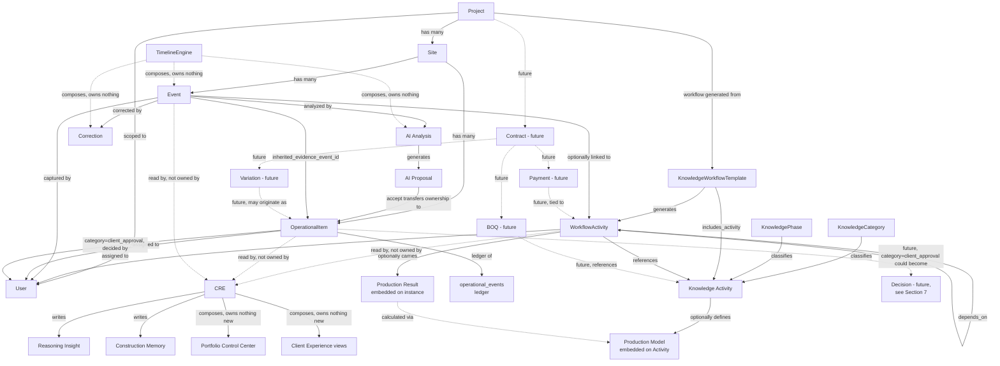
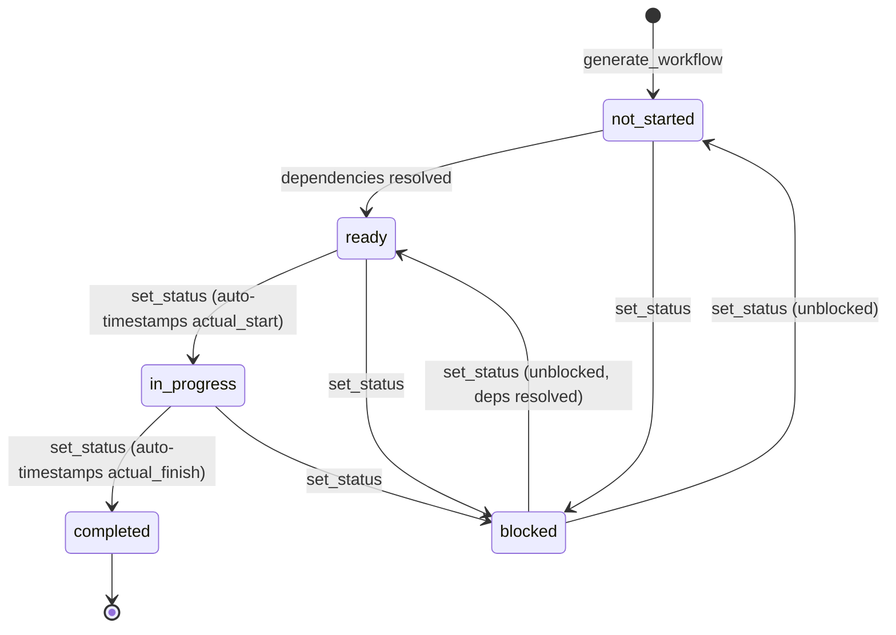
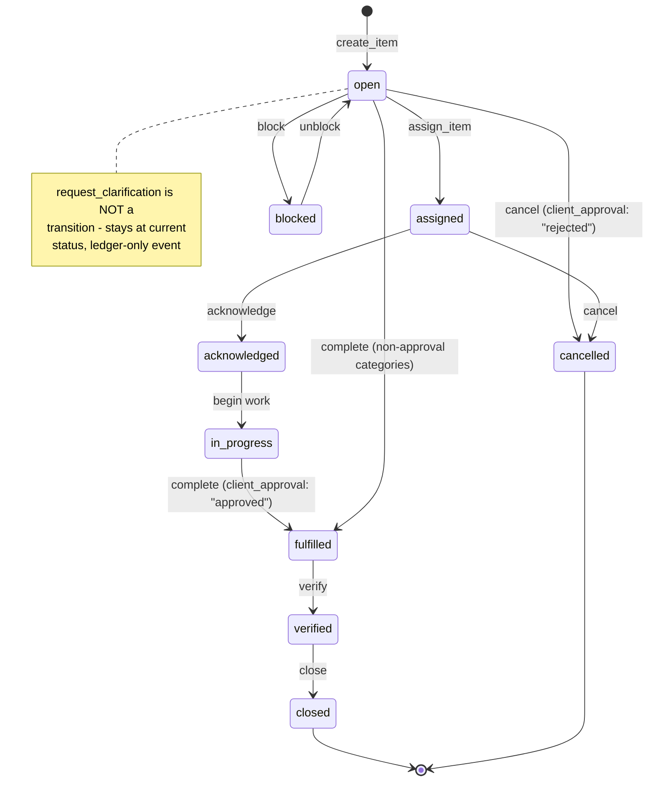
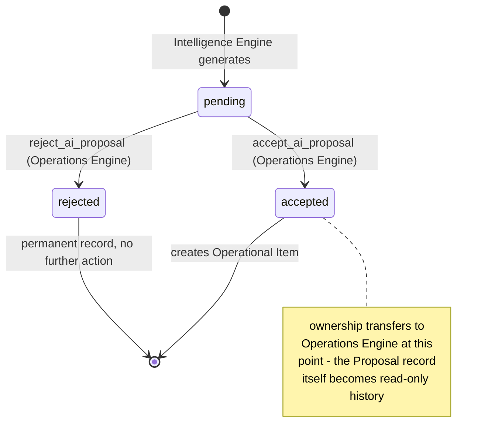

# Atlas Domain Model v1

**Status:** Architecture reference. No code changed to produce this document — every claim below is grounded in the actual current implementation (file and function named where it matters), not aspiration.

**Scope discipline:** this document defines architecture only. Sections 6–9 (Commercial, Decision, Document, Notification) are specifications for domains that do not exist in code yet — they are written so a future sprint can implement them without redesigning, not as a preview of work already done.

---

## 0. How to read this document

Atlas today is not a blank slate being designed from scratch — it is a working system with nine sprints of real, tested behavior behind it. This document's job is to name what already exists precisely, identify what's genuinely missing, and give future work a single reference so entities don't get redefined differently in different sprints. Where an entity or boundary is already correct, this document says so and moves on. Where something is ambiguous, overlapping, or missing, it says that too, explicitly.

---

## 1. Entity Catalogue

For each candidate entity in the brief: does it exist today, as what, and does it deserve independent existence.

| Entity | Status | Verdict |
|---|---|---|
| Project | Exists — `projects` collection | Core entity, correctly independent |
| Site | Exists — `sites` collection | Core entity, correctly independent |
| Phase | Exists — Knowledge Item `type="phase"` | Correctly modeled as Knowledge Core vocabulary, not a project-scoped instance (see §1.3) |
| Milestone | **Does not exist as a stored entity** | Correctly a *derived view* (§1.4) — should stay that way |
| Workflow Activity | Exists — `workflow_activities` collection | Core entity, correctly independent |
| Operational Item | Exists — `operational_items` collection (CQRS projection over `operational_events`) | Core entity, correctly independent |
| Event | Exists — `events` collection | Core entity, correctly independent — Atlas's primary construction memory object |
| Timeline | **Does not exist as a stored entity** | Correctly a *derived view* over Events/Analyses/Corrections (§1.5) |
| Knowledge Item | Exists — `knowledge_items` collection (polymorphic: category/phase/activity/checklist_template/required_document/workflow_template) | Core entity, correctly independent |
| Production Model | Exists — a field (`production_model`) on an Activity Knowledge Item | Correctly a *component* of Activity, not a separate entity (§1.6) |
| Production Result | Exists — fields (`production_model_inputs`, `production_model_result`) on a Workflow Activity | Correctly a *component* of Workflow Activity instance data, not a separate entity |
| User | Exists — `users` collection | Core entity, correctly independent |
| Team | **Does not exist** | Correctly absent — see §1.7; do not add prematurely |
| Assignment | Exists — but as **two separate, deliberately-mirrored field sets**, not one entity (§1.8) | Correctly not unified into a shared entity — see reasoning |
| Client | **Does not exist as a separate entity** — a `role` value on User | Correct — see §1.9 |
| Vendor | **Does not exist** | Not yet warranted — see §1.10 |
| Material | **Does not exist as an entity** — a relationship-type label and freeform text on operational items | Not yet warranted — see §1.10 |
| Equipment | **Does not exist as an entity** — same as Material | Not yet warranted |
| Decision | **Does not exist** | Evaluated in full in §7 — recommendation: not yet, with a specific trigger for when it would be |
| Contract | Does not exist | Future Commercial Layer, §6 |
| BOQ | Does not exist | Future Commercial Layer, §6 |
| Payment | Does not exist | Future Commercial Layer, §6 |
| Variation | Does not exist | Future Commercial Layer, §6 |
| Document | Does not exist as a library entity (only event-attached media exists) | Future Document domain, §8 |
| Notification | Does not exist (explicitly out of scope per an existing code comment in `workflow_engine.py`) | Future Notification domain, §9 |

### 1.1 Why Phase is Knowledge Core vocabulary, not a project entity

A Phase (`type="phase"` Knowledge Item) is a reusable classification — "Foundation," "Structure," "Finishes" — shared across every project, exactly like an Activity template. A Workflow Activity references a phase via `phase_id`; there is no per-project Phase *instance*. This is correct: a project's "Foundation phase" isn't a distinct row anywhere, it's the aggregate of that project's workflow activities whose `phase_id` matches. Creating a project-scoped Phase instance would duplicate what `STAGE_ORDER`/`infer_project_stage()` already derive.

### 1.2 Why Milestone is a derived view, not a stored entity

Two things already produce milestone-shaped output without a `milestones` collection:
- `reasoning_projections.STAGE_ORDER`/`STAGE_LABELS` — the ten-stage construction lifecycle vocabulary (Pre-construction → Handover), with a project's current position derived by `infer_project_stage()` from its workflow activities' own statuses.
- `project_lookahead()`'s `upcoming` frontier — the next activities expected to start, derived from the dependency graph.

The Client Experience Sprint's `client_project_timeline()` (`reasoning_engine.py`) is a worked example of the correct pattern: it reads `STAGE_ORDER` and classifies each stage completed/in_progress/upcoming relative to the project's current stage index — computed on every read, never stored. **A stored Milestone entity would immediately risk drifting from the workflow activities it's supposed to summarize.** Keep this derived.

### 1.3 Why Timeline is a derived view, not a stored entity

`timeline_engine.single()`/`for_site()` compose Events + AI Analyses + Corrections + resolved approval status + resolved planning timeline into one chronological read. There is no `timeline` collection — "Timeline" is Atlas's name for a *query*, not a *record*. This is correct and should stay correct: a stored timeline would be a second, driftable copy of data that already lives on Events.

### 1.4 Why Production Model/Production Result are components, not entities

A Production Model has no independent identity or lifecycle outside the Activity it belongs to — it cannot be created, referenced, or queried without its owning Activity. Same for a Production Result: it only ever exists as `production_model_inputs`/`production_model_result` on a specific Workflow Activity instance. Both are correctly modeled as embedded data, matching Atlas's established convention (Sprint history includes at least three other examples of this exact pattern: assignment history embedded on Workflow Activity, feedback history embedded on a Reasoning Insight, correction history append-only against an Event) rather than given their own collection with a foreign key back. This keeps the calculation's actual data (`CALCULATION_REGISTRY` in `knowledge_engine.py`) and its result physically next to the thing it describes.

### 1.5 Why Team does not exist, and shouldn't yet

"Team" in Atlas today is fully implicit: a User has `assigned_project_ids`; "the team on Project X" is just `{u for u in users if X in u.assigned_project_ids}`. This works because Atlas's current scoping question is always "can this user see/act on this project," never "what is this group of people called, and does it have its own properties" (a lead, a budget, a chat channel, cross-project membership rules). Introducing a Team entity now would be speculative — there's no current feature that needs a Team to have identity independent of its member list. **Recommendation: do not add.** Revisit only if a future feature needs to reference "the team" as a thing (e.g., team-level notification preferences, team-level reporting) rather than just iterating its members.

### 1.6 Why Assignment is two field sets, not one entity — and why that's correct, not an oversight

This is the entity most likely to look like a missed unification at first glance, so it's worth explaining precisely why it isn't one.

Two different things are called "assignment" in Atlas:
- **Operational Item assignment** — `assigned_to_user_id`/`assigned_to_user_name`/`assigned_at` on an Operational Item, set via `operations_engine.assign_item()`.
- **Workflow Activity assignment** (Execution Experience Sprint 02) — `assigned_to_user_id`/`assigned_to_user_name`/`assigned_at`/`assignment_history` on a Workflow Activity, set via `workflow_engine.assign_activity()`.

These were built as a **deliberate mirror**, not an accident: the Sprint 02 implementation report states directly that `assign_activity()` was built to copy `assign_item()`'s existing RBAC allowlist and eligibility check precisely, specifically so the two concepts of "assignment" behave identically from a user's point of view. A genuinely unified `Assignment` entity (its own collection, `{assignable_type, assignable_id, user_id, history}`) was considered implicitly and rejected at the time — introducing one now would mean:
- A migration of two working, already-shipped fields on two different collections.
- An indirection layer (`assignable_type` discriminator) for exactly two current cases, with no third assignable entity yet in sight.

**Recommendation: do not unify yet.** The two field sets are small, mirror each other precisely by convention (not by shared code), and unification has a concrete trigger: **the moment a third entity needs "assigned to a user" (a Decision, if introduced — see §7 — is the most likely candidate), extract a shared `assignment` embedding pattern (a helper that both write to, still two field-sets, not one collection) rather than a fully separate Assignment collection.** A separate collection only becomes justified if assignment history needs to be queried *across* entity types (“show me everything ever assigned to this user, of any kind”) — no current feature needs that.

### 1.7 Why Client is a role, not an entity

`client` is one value of `User.role` (alongside `management`, `project_manager`, `site_supervisor`). A client user has the exact same `User` document shape as every other role — scoped to their project(s) via `assigned_project_ids`, exactly like a supervisor or PM. There is no additional client-specific data (billing contact, communication preference, etc.) stored anywhere today. This is correct: nothing in the current system needs a client to be more than "a user whose role is client," and RBAC already treats it that way uniformly (`_forbid_client()` throughout the reasoning/operations routes). **If the Future Commercial Layer (§6) introduces client-specific billing data** (a billing address distinct from a site address, multiple client contacts on one project, etc.), that is the trigger to introduce a genuine `Client` entity distinct from `User` — not before.

### 1.8 Why Vendor/Material/Equipment are not entities yet

All three appear today only as:
- Free-text fields (an operational item's `title`/`description` for a material requirement; `ai_details` extracted from voice notes — see the AI Structured Extraction work).
- Relationship-type labels on Knowledge Items (`linked_material`, `linked_equipment`, `linked_labour` — edges pointing at freeform `target_id`, not at a Material/Equipment entity with its own attributes).

None of the three currently need independent identity: nothing queries "show me every project using Vendor X" or "what's our total spend with Vendor X across sites" — the moment either of those becomes a real feature request, that's the trigger to promote Vendor to a first-class entity (owned by, most naturally, a Future Commercial Engine, since vendor relationships are fundamentally a commercial concern — payment terms, performance history — not an operational one). Material and Equipment are lower priority still: even a Vendor-aware Commercial Layer doesn't strictly need Material/Equipment as entities if a Variation/BOQ line item can just carry a description string, the same way an operational item does today. **Recommendation: do not add speculatively; Vendor is the more likely of the three to be needed first, and only alongside genuine Commercial Layer work.**

---

## 2. Ownership Matrix

One row per entity, one owning engine, no joint ownership.

| Entity | Owning Engine | Notes |
|---|---|---|
| Project | Memory Engine | The only writer to `projects` |
| Site | Memory Engine | The only writer to `sites` |
| User | Memory Engine | The only writer to `users`; also owns identity/auth-adjacent concerns (`is_eligible_assignee`, `set_user_projects`) |
| Event | Reality Engine | Capture-time creation only; immutable once written |
| AI Analysis | Intelligence Engine | One per Event; optional (Atlas is fully functional with zero AI configured) |
| AI Proposal | Intelligence Engine (creation) / Operations Engine (accept → becomes an Operational Item) | Ownership *transfers* at accept-time — see §4 lifecycle. Not joint ownership; sequential single ownership. |
| Correction | Memory Engine | Append-only, linked to an Event |
| Timeline (view) | Timeline Engine | Composes Reality/Intelligence/Memory/Operations output; owns no data of its own |
| Workflow Activity | Workflow Engine | Includes its embedded Production Result and Assignment fields |
| Operational Item | Operations Engine | CQRS projection; `operational_events` is the ledger, `operational_items` the read-model, both Operations Engine's |
| Knowledge Item (Category/Phase/Activity/Checklist Template/Required Document/Workflow Template) | Knowledge Engine | Includes the Production Model embedded on an Activity |
| Reasoning Insight, Reasoning Run, Construction Memory | Construction Reasoning Engine (CRE) | Read-derived from every other engine's data; the only writer to these three collections |
| Portfolio Control Center output | CRE (`reasoning_engine.portfolio_control_center`) | Not a separate entity — a composed read over CRE's own per-project outputs; no new collection |
| Client Experience views (dashboard, approval centre, communication centre, timeline) | CRE | Same pattern — composed reads over existing Operations/CRE data, translated into client-facing language; own no data |
| *(Future)* Contract, BOQ, Variation, Invoice, Payment, Forecast, Retention, Budget, Milestone Billing | Future Commercial Engine | See §6 |
| *(Future)* Decision | **TBD — see §7's recommendation** | Not created this sprint |
| *(Future)* Document, Document Version | Future Document Engine | See §8 |
| *(Future)* Notification | Future Notification Engine | See §9 |

**On AI Proposal's ownership transfer:** this is the one entity in the table that looks like it might violate "single owner," so it's worth being precise. An AI Proposal is created and owned by Intelligence Engine while `decision="pending"`. The moment `accept_ai_proposal()` runs, an Operational Item is created and the Proposal's own `decision` field is set to `"accepted"` — the Proposal becomes an immutable historical record (still readable, e.g. via `ai_proposals` collection, but no longer the *live* representation of that piece of work; the Operational Item is). This is sequential ownership across the object's lifecycle, not two engines writing to the same live entity concurrently — no violation.

---

## 3. Relationship Diagram

**Reading this diagram:** solid arrows are real, implemented, tested relationships as of this document's date. Dotted arrows are either (a) explicitly "reads, does not own" relationships — CRE and Timeline Engine's entire reason for existing — or (b) future/not-yet-built relationships from §6/§7, included so a future implementer knows where they'll attach without guessing.

---

## 4. Entity Lifecycle

Only the entities with genuinely interesting lifecycles are detailed; Project/Site/User follow simple create → (edit) → archive and aren't repeated below. State diagrams for the three entities with real state machines follow the narrative for each.

### Event
- **Created by:** Reality Engine (`reality_engine.capture`), at capture time — voice/photo/text. Immutable once written (Record Time — `client_created_at`/`server_created_at` — is permanent).
- **Modified by:** Nothing, in the "the event itself changes" sense. Two fields *are* mutable, deliberately separated from Record Time: `planned_start`/`planned_finish`/`actual_start`/`actual_finish` (Timeline Planning, Canonical Event UX Patch) — editable by management/PM, workflow-aware (redirects to a linked Workflow Activity's own schedule if `activity_id` is set, never a duplicate copy).
- **Ownership:** Memory Engine (the only writer to `events`); Reality Engine is the only *creator*.
- **State transitions:** `ai_status`: pending → analyzed/skipped/failed. `proposals_status`: pending → generated/error.
- **Consumed by:** Intelligence Engine (analysis), Timeline Engine (chronological view), CRE (evidence for findings, Construction Memory capture), Operations Engine (`inherited_evidence_event_id` linkage for items born from this event).
- **Archival:** none today — Events are permanent, matching "primary construction memory object."

### Workflow Activity
- **Created by:** Workflow Engine (`generate_workflow`), once per project per template — a one-time bootstrap, not repeatable (`WorkflowError` if a workflow already exists).
- **Modified by:** Workflow Engine — status transitions (`set_status`, dependency-aware), schedule (`set_schedule`, planned dates open to any role, actual dates management-only as of Execution Experience Sprint 02), assignment (`assign_activity`, management/PM-only), production model inputs (`set_production_inputs`, Knowledge Base v2).
- **Ownership:** Workflow Engine exclusively, including its embedded Production Result and Assignment History.
- **State transitions:** `not_started → ready → in_progress → completed`, with `blocked` orthogonal to the main sequence. `actual_start`/`actual_finish` now auto-timestamp on the matching transition (Execution Experience Sprint 01).
- **Consumed by:** CRE (findings, health, forecast, lookahead — all core inputs), Timeline Engine (via a linked Event's timeline resolution), Client Experience views (translated into milestone status, activity detail never exposed), My Day dashboard (Ready to Start / In Progress / Blocked sections).
- **Archival:** none today.

### Operational Item
- **Created by:** Operations Engine, from four paths: manual creation, AI Proposal acceptance, the Client Approval Workflow (`request_client_approval` in `routes/events.py`, which calls Operations Engine's `create_item` with `category="client_approval"`), and manual text capture (Sprint 6.2, when AI is unavailable).
- **Modified by:** Operations Engine exclusively — status transitions (fixed state machine, `TRANSITIONS`), assignment, edits (`EDITABLE_FIELDS` whitelist, including the newly-additive `approval_options` for Material Approval informed choice), comments, blockers.
- **Ownership:** Operations Engine, via CQRS: `operational_events` is the append-only ledger every mutation writes to; `operational_items` is the read-model projection, kept in sync by Operations Engine's own `_save_item`/derivation logic.
- **State transitions:** category-dependent; `client_approval` items are restricted to exactly two terminal outcomes (`fulfilled`/approved, `cancelled`/rejected) — FAC-04's transition guard. `request_clarification` is deliberately *not* a status transition (stays at whatever status it was, ledger-only).
- **Consumed by:** CRE (open-item counts, health scoring, material lead-time rules), Portfolio Control Center (pending approvals, critical items), Client Experience views (Approval Centre, Communication Centre, attention section), My Day dashboard.
- **Archival:** `TERMINAL_ITEM_STATUSES` (`fulfilled`, `verified`, `closed`, `archived`, `cancelled`, `duplicate`) — the single canonical definition of "no longer active," reused by every "what's still open" query across CRE, Portfolio Control Center, and the Client Experience.

### Knowledge Item (Activity, specifically, since it's the most structurally rich)
- **Created by:** Knowledge Engine, management-only (`_require_admin`).
- **Modified by:** Knowledge Engine — including `production_model` (Knowledge Base v2), editable the same way every other field is (`UPDATABLE_FIELDS`), which is *how* "editable productivity" (Knowledge Base v2 item 4) is satisfied: no separate endpoint, the existing edit path.
- **Ownership:** Knowledge Engine exclusively, including embedded Production Model and generic typed relationships (`depends_on`, `includes_activity`, etc.).
- **State transitions:** `draft → active → deprecated`; soft-archived via `archive_item`, never hard-deleted while referenced.
- **Consumed by:** Workflow Engine (template for generating Workflow Activities), CRE (trade/stage classification for rule evaluation), Client Experience (indirectly, via the Workflow Activities generated from it).
- **Archival:** version history preserved (`knowledge_versions`, an immutable pre-edit snapshot on every change — append-only, matching the Correction pattern's philosophy).

### AI Proposal (the ownership-transfer case, detailed per §2's note)
- **Created by:** Intelligence Engine, from a completed AI Analysis's structured extraction.
- **Modified by:** Intelligence Engine while `decision="pending"`; Operations Engine at decision time (`accept_ai_proposal`/`reject_ai_proposal`), which also now correctly *rejects* a second decision attempt on an already-decided proposal (a real bug fixed in the Usability & Consistency sprint — `reject_ai_proposal` was missing the terminal-state guard `accept_ai_proposal` already had).
- **Ownership:** Intelligence Engine until decided; the resulting Operational Item (Operations Engine) is the live representation from that point on.
- **State transitions:** `pending → accepted | rejected`, terminal, enforced.
- **Consumed by:** Operations Engine (on accept, becomes an Operational Item, carrying forward quantity/unit/priority/required-date at high confidence only — AI Structured Extraction), the Proposal Inbox / Event Detail's embedded AI Proposal section (Canonical Event UX Patch — proposal review lives inside the canonical Event page, not a separate screen).
- **Archival:** none — a decided proposal remains a permanent historical record of what the AI extracted and what a human decided.

---

## 5. Engine Responsibility Matrix

| Engine | Owns | Explicitly does NOT own | Overlap risk found? |
|---|---|---|---|
| **Reality Engine** | Event capture (voice/photo/text/GPS), the Golden Rule (event persisted before any AI enqueue) | Analysis, proposals, timeline composition | None found |
| **Memory Engine** | Projects, Sites, Users, Events (storage), Corrections, identity/scoping (`_is_project_scoped`, `set_user_projects`) | Business logic for any specific domain (deliberately thin — the "only writer to Mongo" layer) | None found |
| **Intelligence Engine** | AI Analysis, AI Proposal (until decided), Evidence/Prompt versioning | Operational Items (only creates them indirectly via acceptance, which is Operations Engine's action), production calculations (explicitly forbidden — see §5.1) | None found |
| **Timeline Engine** | Nothing stored — the chronological composition read over Events/Analyses/Corrections, plus approval-status and planning-timeline resolution | Any data — deliberately a pure read layer | None found |
| **Operations Engine** | Operational Items (full lifecycle, CQRS), Client Approval Workflow, Assignment (item-level), Personal Work Queue / My Day composition | Workflow Activities, Knowledge Items | None found |
| **Knowledge Engine** | Category/Phase/Activity/Checklist Template/Required Document/Workflow Template, generic relationships, Production Model (embedded on Activity), versioning | Project-scoped instances of anything (that's Workflow Engine's job once a template is applied) | None found |
| **Workflow Engine** | Workflow Activity (full lifecycle), Assignment (activity-level), Production Result (embedded, instance-specific) | The Production Model *definition* (Knowledge Engine's), the calculation logic itself (`calculate_production_model` lives in Knowledge Engine; Workflow Engine only calls it) | **Worth naming:** Workflow Engine calls into Knowledge Engine's calculation function directly (`workflow_engine.set_production_inputs` → `knowledge_engine.calculate_production_model`). This is correct — the calculation is deterministic and belongs with the model definition — but it means Workflow Engine has a real, one-directional dependency on Knowledge Engine that didn't exist before Knowledge Base v2. Not a violation, but the first cross-engine data dependency of its kind; worth watching if it becomes a pattern (see §10). |
| **CRE (Construction Reasoning Engine)** | Reasoning Insight, Reasoning Run, Construction Memory; composed reads (health, forecast, lookahead, briefings, executive questions, Portfolio Control Center, Client Experience views) | Any entity it reads — CRE never writes to `workflow_activities`, `operational_items`, or `events` | None found — this boundary has held cleanly across every sprint that's touched CRE |

### 5.1 "AI augments deterministic engines but never owns business logic" — where this is enforced today

This principle isn't just stated, it's structurally enforced in one specific, verifiable way: `knowledge_engine.CALCULATION_REGISTRY` is a dict of plain Python functions, not a stored formula string evaluated at runtime. Production calculations (duration, crew recommendation) are 100% deterministic, source-controlled, and independently testable — Intelligence Engine (the only AI-touching engine) never appears anywhere in the calculation path. AI's actual role, precisely: Intelligence Engine *suggests* values (quantity, unit, required date, priority — AI Structured Extraction) that a human then accepts or overrides; it never calculates a duration, a health score, or a forecast. This is the exact boundary the brief asks for, and it's real, not aspirational.

### 5.2 Future engines — responsibility boundaries to hold from day one

- **Future Commercial Engine** should own Contract/BOQ/Variation/Invoice/Payment/Forecast/Retention/Budget/Milestone Billing (§6) and read from, never write to, Workflow Engine (for milestone-linked billing triggers) and Knowledge Engine (BOQ line items referencing Activities). It should not duplicate CRE's schedule-variance forecast — a Commercial forecast is a *cost* forecast, informed by CRE's *schedule* forecast, not a re-derivation of it.
- **Future Notification Engine** should own Notification/Trigger/Audience/Delivery/History (§9) and read from every other engine as a trigger source, writing to none of them. It is the one future engine most likely to need to observe *many* other engines' state changes — worth designing its trigger-subscription mechanism generically from the start rather than one-off per engine.
- **Future Document Engine** should own Document/Version/Category (§8) and relate to, not absorb, Event's existing photo/audio assets — a captured site photo remains Reality Engine/Event's concern; a *contract PDF* is a new, distinct concept Document Engine should own outright.

---

## 6. Future Commercial Layer (specification only — no implementation)

### 6.1 Entities

| Entity | Purpose | Key relationships |
|---|---|---|
| **Contract** | The commercial agreement for a Project. One per project (typically). | `Project` 1—1 (or 1—few, for phased contracts) |
| **BOQ** (Bill of Quantities) | Priced line items the contract is built from. | `Contract` 1—many; each line item optionally references a Knowledge `Activity` (quantity × rate, where the activity's own `unit` — already tracked today — is the natural unit for the BOQ line) |
| **Variation** | A change to contract scope/cost after signing. | `Contract` 1—many; may *originate* from an Operational Item (a `client_approval`/cost-impact item that gets promoted to a formal Variation once quantified) — see §7 for why this looks like a Decision candidate |
| **Invoice** | A bill raised against the contract/BOQ/Variations. | `Contract` 1—many; may reference specific BOQ lines or Variations |
| **Payment** | Money actually received against an Invoice. | `Invoice` 1—many (partial payments); the "Payment" the Client Experience Sprint's Payment Centre would have shown, had this layer existed |
| **Forecast** | Projected final cost, given current Variations and progress. | `Contract` 1—1 (current), or 1—many (historical snapshots) |
| **Retention** | Amount withheld pending defect-liability period completion. | `Contract` 1—1 (a policy: percentage + release conditions) |
| **Budget** | Internal cost tracking, distinct from the client-facing Contract value (materials/labour/overhead actuals vs. planned). | `Project` 1—1; genuinely internal-only, never exposed to Client Experience views the way Contract/Invoice/Payment are |
| **Milestone Billing** | A billing trigger tied to construction progress (e.g., "Ground Floor Roof Complete → ₹12,50,000 due"), matching the Client Experience Sprint's own worked example. | Links `Payment`/`Invoice` to a **Workflow Activity or a stage from `STAGE_ORDER`** — not to a new stored Milestone entity (§1.2's reasoning holds here too: the trigger condition is "this stage reached," derived, not stored) |

### 6.2 Relationship to existing Workflow and Knowledge engines

- **BOQ ↔ Knowledge Engine:** a BOQ line item referencing a Knowledge `Activity` gets its unit (`sqm`, `cum`, etc. — already tracked) and, once Knowledge Base v2 matures further, could derive its *quantity* from the same Production Model inputs a Workflow Activity instance already carries (e.g., a Wall Masonry BOQ line's quantity = that project's actual `wall_area` input, already stored on the Workflow Activity). This is the concrete reason Production Model/Result being cleanly owned by Knowledge/Workflow Engine (§1.4) matters for Commercial Layer design: the Commercial Engine can *read* that data without needing its own copy of "how much wall area does this project have."
- **Milestone Billing ↔ Workflow Engine:** a billing trigger reads Workflow Activity status/`STAGE_ORDER` position — the same derived-stage logic Client Experience's Timeline already uses (§1.2) — rather than Commercial Engine maintaining its own progress tracking.
- **Variation ↔ Operations Engine:** the natural *origination* point for a cost-impact conversation is an Operational Item (a supervisor flags something in the field, a PM/client discusses cost impact) — Commercial Engine should consume that as an input to formally raising a Variation, not require a parallel "raise a cost concern" mechanism. This is exactly the boundary §7's Decision domain touches.

### 6.3 What this section is not

This is not a schema. Field-level design (exact BOQ line item shape, Invoice numbering scheme, tax handling) is implementation work for whichever sprint actually builds this layer — correctly out of scope here, per "do not implement."

---

## 7. Decision Domain — evaluation

**Should Atlas introduce a first-class `Decision` entity? Recommendation: not yet — but the trigger condition for "yes" is specific and near.**

### 7.1 What already covers "decisions" today

The `client_approval` category on Operational Items already *is* a decision mechanism: it has a request/decide lifecycle (`fulfilled`/`cancelled`, restricted to exactly those two terminal outcomes), an actor, a timestamp, comments, clarification requests, and — as of this sprint's predecessor — a permanent history view (the Client Experience Approval Centre) plus informed-choice options (`approval_options`). For the brief's own examples:
- **Material Selection, Design Approval** — already fully covered by `client_approval` operational items, with options.
- **Vendor Approval** — would fit the same pattern today, no new mechanism needed.

### 7.2 Where the current mechanism genuinely doesn't fit

- **Cost Variation, Payment Approval** — these decisions have a natural home *once the Commercial Layer exists* (§6's `Variation`/`Invoice` entities), and deciding on a Variation is meaningfully different from deciding on a tile choice: it has monetary magnitude, may need multi-step approval (site → PM → client, for large amounts), and its outcome directly creates/modifies a Commercial entity rather than just closing an Operational Item.
- **Timeline Extension** — doesn't fit `client_approval` at all today; there's no "propose a schedule change, get it approved" mechanism anywhere in Atlas currently (Workflow Activity schedule edits are direct writes, not a request/approval flow).

### 7.3 Recommendation

**Do not introduce `Decision` as a general-purpose entity now.** A generic Decision entity built ahead of the Commercial Layer would either (a) duplicate `client_approval`'s already-working mechanism for the cases it already covers, or (b) be built speculatively for Commercial/Timeline-Extension cases that don't have real requirements yet (the exact "no speculative coding" principle this sprint states).

**The concrete trigger:** the moment the Commercial Layer (§6) is actually implemented, *that* is the right moment to introduce `Decision` — specifically because Variation/Payment approval genuinely needs properties `client_approval` doesn't have (monetary magnitude, multi-step approval chains, and creating/modifying a Commercial entity as its outcome rather than just closing itself out). At that point, `Decision` should be scoped as: **Commercial Engine's own entity** (not a generalization of `client_approval` — the two can coexist, covering different decision *shapes*, the same way Workflow Activity assignment and Operational Item assignment correctly coexist today per §1.6), with `client_approval` operational items remaining exactly as they are for the material/design/vendor cases they already handle well.

If a future sprint wants Timeline Extension approval before the Commercial Layer exists, the pragmatic move is extending `client_approval` with a `timeline_extension` category (reusing the existing mechanism) rather than introducing `Decision` for that one case alone.

---

## 8. Document Domain — specification only

### 8.1 What exists today (and isn't Document)

Event-attached photos/audio (`raw_assets`, referenced by `photo_asset_ids`/`audio_asset_id` on an Event) are site-capture media, owned by Reality Engine/Memory Engine — correctly *not* the same thing as a "Document" in the brief's sense (a Contract PDF, an Approved Drawing, a Warranty Certificate). Confirmed by inspection: there is no document-library collection, no document category/version model, anywhere in Atlas today.

### 8.2 Specification

| Concept | Definition |
|---|---|
| **Document** | A named file with a category, belonging to a Project, with a current version and a version history. Distinct from Event media: a Document is deliberately uploaded/curated (a Contract, a Drawing, an Invoice PDF), not captured in the field. |
| **Version** | Every re-upload of a Document creates a new Version; the Document always points at its current Version, with prior Versions retained — the same append-only-history philosophy Atlas already uses for Knowledge Item versions and Correction records. |
| **Category** | Contract / Approved Drawing / Invoice / BOQ / Material Approval / Variation Order / Completion Certificate / Warranty (the Client Experience Sprint's own Document Centre list) — a controlled vocabulary, not freeform, matching Knowledge Item's `type` pattern. |
| **Ownership** | Future Document Engine — own the Document/Version entities and storage; should NOT own Event media (stays Reality/Memory Engine's) or Knowledge Item's `required_document` (stays Knowledge Engine's — that's a *requirement type* for a checklist, a different concept entirely, already correctly separated today). |
| **Permissions** | Category-level, matching Atlas's existing RBAC shape: e.g. Contract/Invoice visible to Client + Management + PM; internal-only categories (if any) visible to Management + PM only. Reuse the existing role vocabulary, do not invent a parallel permission model. |
| **Relationships** | Document → Project (owner); Document → Contract/Variation/Invoice (Commercial Layer, §6) where a document IS the commercial artifact (e.g. the Invoice PDF *is* a Document, not a separate concept duplicating it) — Commercial entities should reference Document Engine for their file storage, not reimplement it. |
| **Lifecycle** | Upload → (optional re-versions) → (optional supersede/archive). No hard delete of a superseded version — same permanence philosophy as everything else in Atlas's audit-trail-heavy design. |

---

## 9. Notification Domain — specification only

### 9.1 Confirmed absent

`workflow_engine.py` contains an existing code comment explicitly stating notifications are "out of scope for this sprint" — confirming this was a deliberate, acknowledged gap from early in Atlas's history, not an oversight discovered now.

### 9.2 Specification

| Concept | Definition |
|---|---|
| **Notification** | A single message to a specific user, with a trigger reason, priority, and delivery/read status. |
| **Trigger** | The event that caused it — should be a closed vocabulary tied to real, already-happening state changes: a client_approval item created (→ client), an activity assigned (→ supervisor), a Workflow Activity becoming overdue (→ PM, reusing CRE's existing overdue detection rather than a parallel one), a Reasoning Insight reaching `critical` severity (→ PM/Management). **Every trigger should map to something an existing engine already computes or emits — Notification Engine should not become a second place where "is this overdue" gets decided.** |
| **Audience** | One or more Users, resolved via existing project-scoping (`assigned_project_ids`) — do not build a parallel targeting/segmentation system. |
| **Priority** | Reuse the existing `priority` vocabulary (`low`/`normal`/`high`/`critical`) already used by Operational Items and Reasoning Insights — do not invent a second priority scale. |
| **Delivery** | Out of scope for this specification (push/SMS/email/in-app are integration choices, not domain model) — the domain model only needs Notification to have a delivery *status* (pending/delivered/read), not to define *how* delivery happens. |
| **History** | Permanent, per-user, matching Atlas's audit-trail convention — a read notification is marked read, never deleted. |
| **Relationship with Events** | An Event *can* be a trigger source (e.g., "new site update posted") but Notification should never duplicate Event's own content — a notification about an event references it by id and carries only a short summary, the event remains the source of truth. |
| **Relationship with Decisions** | Once Decision exists (§7), a Decision requiring action is a natural, high-value trigger — but Notification should consume Decision's state, never decide on Decision's behalf. |
| **Relationship with Commercial Layer** | Payment due / Variation pending approval are natural Commercial-Layer-sourced triggers — same principle: Notification observes, Commercial Engine decides. |

**Ownership: Future Notification Engine**, deliberately built last among the future domains (after Commercial and Document exist) — a Notification Engine built before its trigger sources exist would be triggers-in-search-of-events, the definition of speculative.

---

## 10. Architectural Review

### 10.1 Duplicate concepts — none found at the entity level

A deliberate, sprint-by-sprint search for duplication (this document's own preparation, plus the Platform Consolidation Sprint's dead-code audit and the Usability & Consistency sprint's "three inconsistent 'what counts as pending' definitions" finding) turned up **zero duplicate business entities**. The closest historical near-miss — three different "is this item still open" definitions across `operational_center()`, the Client Dashboard, and CRE — was a *calculation* inconsistency, already resolved (`TERMINAL_ITEM_STATUSES` is now the single reused definition everywhere), not an entity duplication.

### 10.2 Overlapping responsibilities — one real, contained instance

Covered in §5's Workflow/Knowledge Engine note: Workflow Engine now calls directly into Knowledge Engine's `calculate_production_model()`. This is correct ownership (the calculation belongs with the model definition) but is Atlas's first instance of one engine's write path depending on another engine's pure function mid-request. Not a violation of "single owner" — Knowledge Engine still owns the calculation, Workflow Engine still owns the instance data — but worth naming as the first data point in what could become a pattern as the Commercial Layer (which will need to read Workflow *and* Knowledge data) is built.

### 10.3 Missing abstractions

- **A general "assignable" pattern**, per §1.6 — not missing *yet* (two mirrored field-sets is the right amount of structure for two cases), but the concrete extraction point is named precisely: the third assignable entity (most likely a future `Decision`).
- **A general "derived stage/progress" utility** — `STAGE_ORDER`-based classification now has two independent call sites doing the same completed/in_progress/upcoming classification (`client_project_timeline` in this document's own review, and CRE's own stage-adjacent logic). Not yet duplicated *logic*, since Client Experience's version is a thin, correct reuse — but worth a small refactor (extract the classification loop into `reasoning_projections.py` as a shared helper) the next time a third caller needs it, rather than a third independent copy.

### 10.4 Future scaling risks

- **CRE's per-project computation is not cached** — `build_project_snapshot()` runs fresh on every read (Portfolio Control Center, Client Experience Dashboard, My Day). This is currently correct (guarantees the Client Experience Dashboard and Portfolio Control Center can never silently disagree, since they call the identical function) but will need attention if portfolio size grows enough that recomputing every open project's snapshot on every dashboard load becomes a real latency concern. Worth flagging now, not urgent yet.
- **`operational_events` (the CQRS ledger) has no archival/compaction strategy** — correct today (Atlas is young enough that this hasn't mattered), but an unbounded append-only ledger is a genuine long-term storage-growth question the Commercial Layer (which will add its own audit-heavy entities) should account for from day one rather than inheriting the same unbounded-growth assumption silently.

### 10.5 Technical debt (genuine, not feature requests)

- The seven orphaned endpoints identified in the Platform Consolidation Sprint were resolved at the time (removed or wired). **New ones have appeared since, verified by direct inspection while preparing this document, not assumed:** `POST /workflow-activities/{id}/assign`, `POST /workflow-activities/{id}/production-inputs`, and all four Client Experience endpoints (`/client-experience`, `/client-approvals`, `/client-communications`, `/client-timeline`) currently have zero frontend callers. This is not an oversight — each of those sprints' own implementation reports state plainly that frontend work was deferred given scope (Activity Ownership and Knowledge Base v2 shipped backend-only by design; the Client Experience Sprint explicitly named the UI as "a substantial, separate effort deserving its own pass"). Listed here as a genuine, correctly-labeled debt item: five real endpoints with no consumer yet, not a hidden one this document is the first to surface.
- No other currently-open technical debt items were found beyond what's already tracked in the Platform Consolidation Sprint's own report — this domain model surfaced two new architectural watch-items (10.2, 10.4) and the orphaned-endpoint update above, nothing else.

### 10.6 Recommended Implementation Roadmap

In dependency order, not urgency order — each phase's design depends on the previous phase's entities existing:

1. **Document domain (§8)** — no dependency on Commercial Layer; unblocks the Client Experience Document Centre (explicitly deferred in the Client Experience Sprint for exactly this reason) with the smallest new surface area of the three future domains.
2. **Commercial Layer (§6)** — the largest, most structurally significant future domain; should land before Decision, since Decision's genuine trigger condition (§7.3) is Commercial Layer's existence.
3. **Decision domain (§7)** — implement *at* Commercial Layer completion, scoped specifically to Variation/Payment approval, not as a `client_approval` generalization.
4. **Notification domain (§9)** — deliberately last; needs real trigger sources (Commercial Layer's payment/variation events, Decision's approval-required state) to avoid being speculative on arrival.

This ordering also means the Assignment-unification trigger (§1.6) and the Workflow/Knowledge cross-engine dependency (§10.2) should both be revisited at Decision's implementation, since that's the point both become concrete rather than theoretical.
